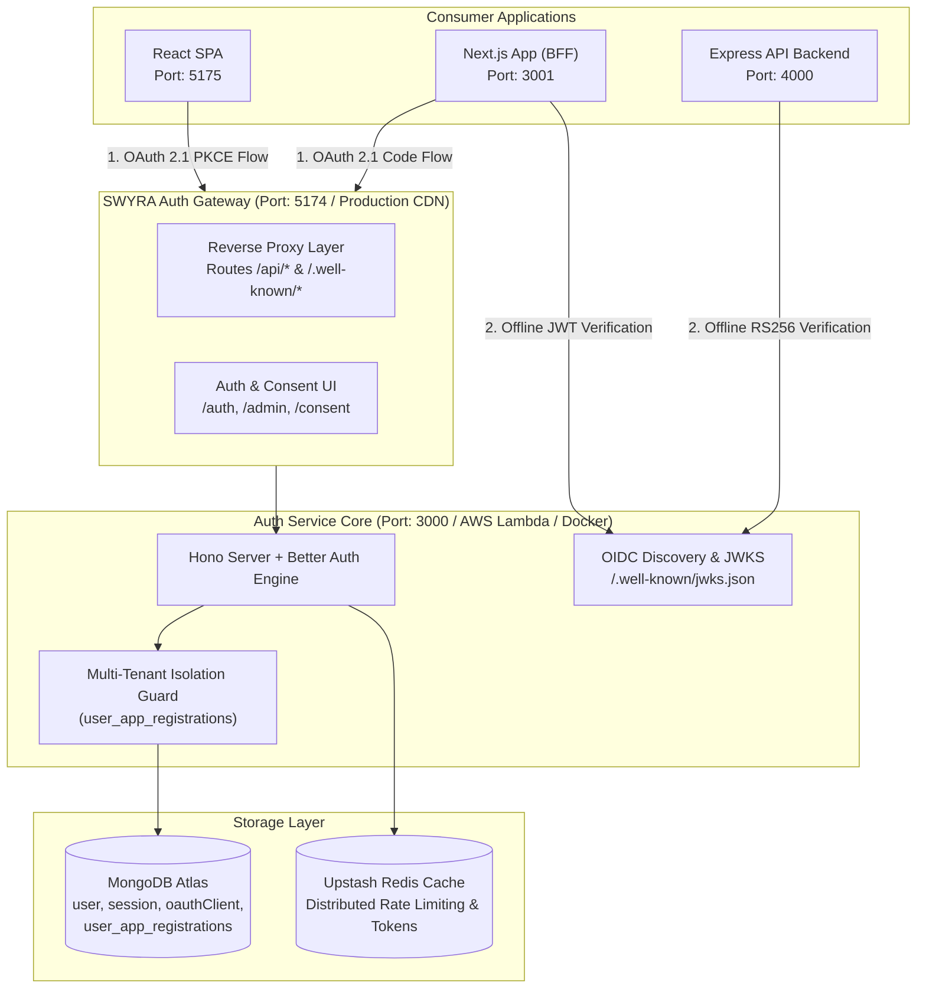

# SWYRA Auth — Self-Hosted OAuth 2.1 / OIDC Identity Provider

> A production-ready, config-only OAuth 2.1 / OpenID Connect identity provider you deploy once and own forever — with zero always-on infrastructure costs.

Built with **Hono**, **MongoDB Atlas**, and the **Better Auth** identity engine. Features a high-aesthetic Admin Console for managing OAuth 2.1 clients, dynamic CORS whitelists, and scoped application administrators with built-in multi-tenant isolation.

---

## System Architecture



---

## 📚 Complete Documentation Hub

Detailed technical guides, protocol specifications, and deployment runbooks are modularized in the [`docs/`](docs/) directory:

| Document | Description |
|---|---|
| 🏛️ **[System Architecture](docs/ARCHITECTURE.md)** | Multi-tenant isolation, cryptographic token binding, OIDC discovery, and PKCE sequence flows. |
| 🚀 **[Multi-Cloud Deployment Guide](docs/DEPLOYMENT.md)** | Step-by-step guides for AWS Lambda, EC2/VPS, Azure, GCP Cloud Run, Vercel, Netlify, Railway, and Docker. |
| ⚙️ **[Admin Console & App Management](docs/ADMIN_GUIDE.md)** | Registering applications, CORS origin management, Development Mode switch, and scoped admin roles. |
| 🔌 **[Consumer Integration Guide](docs/INTEGRATION_GUIDE.md)** | Code examples and patterns for Next.js 14 BFF, React SPA + Express, and pure PKCE frontends. |
| 🛡️ **[Security & Abuse Defense](docs/SECURITY.md)** | Threat model, target-keyed rate limiting, constant-time hashing, token family rotation, and WAF boundaries. |
| 📋 **[Environment Variables Reference](docs/ENVIRONMENT_VARIABLES.md)** | Complete specification of all backend, frontend, and consumer client configuration flags. |

---

## Quickstart (3 Steps to Production)

### 1. Database & Cache
Create a free database at [MongoDB Atlas](https://www.mongodb.com/atlas) (allow `0.0.0.0/0`) and an [Upstash Redis](https://upstash.com) instance:
```bash
cd hono
cp .env.example .env
# Set MONGO_URI and BETTER_AUTH_SECRET in hono/.env
npm run db:setup
```

### 2. Deploy to Your Chosen Provider
- **AWS Lambda**: `./deploy.sh`
- **Linux VPS / EC2**: `npm run build:node && pm2 start dist/index.js`
- **Docker Compose**: `docker compose up -d --build`
- **Railway / Vercel / GCP / Azure**: See the **[Multi-Cloud Deployment Guide](docs/DEPLOYMENT.md)**.

### 3. Create Super-Admin Account
```bash
cd hono
npm run admin:create -- "admin@yourdomain.com" "YourStrongPassword@2026!" "Super Admin"
```
Log into your Admin Console at `https://<your-frontend-domain>/admin/login`.

---

## Local Development & Ports

| Service | Port | Description |
|---|---|---|
| **SWYRA Auth Gateway (Frontend)** | `http://localhost:5174` | Unified Auth UI, Consent, Admin Console, and API Reverse Proxy |
| **SWYRA Auth API (Backend)** | `http://localhost:3000` | Hono Core Identity Engine, Token Endpoint, JWKS |
| **Next.js Demo App** | `http://localhost:3001` | Full-stack Next.js 14 App Router OAuth 2.1 client |
| **Express Backend Demo** | `http://localhost:4000` | Resource server with offline RS256 JWKS verification |
| **React Frontend Demo** | `http://localhost:5175` | React SPA client consuming Express protected telemetry |

### Starting All Services Locally
```bash
# 1. Start Auth Core (Backend)
cd hono && npm run dev

# 2. Start Auth Gateway (Frontend)
cd frontend && npm run dev

# 3. Optional Consumer Demos
cd test/next-app && npm run dev
cd test/react-express-app/backend && npm run dev
cd test/react-express-app/frontend && npm run dev
```

---

## Key Security Guarantees

- **OAuth 2.1 Strictness**: No implicit grant, mandatory PKCE, single-use authorization codes.
- **Fail-Closed Token Rotation**: Token reuse triggers immediate multi-generation revocation via authoritative MongoDB checks.
- **Constant-Time Timing Balance**: Matched scrypt dummy hashing for non-existent users ($p > 0.05$ timing equivalence).
- **Target-Keyed Rate Limiting**: 15 attempts / 300s window per account to defend against distributed IP-rotation attacks.
- **Dynamic CORS & Loopback Switch**: Whitelist-cached allowed origins with a strict loopback-only `isDev` development switch.

---

## Troubleshooting Guide

| Symptom | Root Cause | Solution |
|---|---|---|
| **"Invalid client secret" during token exchange** | Stored hashed secret in consumer app `.env`. | Place the raw **plaintext client secret** in the consumer `.env`, not the hash from MongoDB. |
| **"User is not registered for this application"** | Strict App Isolation guard triggered. | Switch to the **Sign Up** tab on the Auth UI to register the user for that specific `client_id`. |
| **502 Bad Gateway / Lambda Timeout** | MongoDB Atlas IP whitelist blocking Lambda. | Add `0.0.0.0/0` under Network Access in MongoDB Atlas. |
| **404 NOT_FOUND on Vercel sub-routes** | Missing SPA rewrite rules. | Verify `vercel.json` contains `"source": "/(.*)", "destination": "/index.html"`. |
| **`EADDRINUSE: :::3000`** | Previous Node/WSL process holding port. | Run `taskkill /F /PID <pid>` (Windows) or `fuser -k 3000/tcp` (WSL). |

---

*Built with [Hono](https://hono.dev), [MongoDB](https://www.mongodb.com), and the [Better Auth](https://better-auth.com) OAuth 2.1 / OIDC identity engine.*
