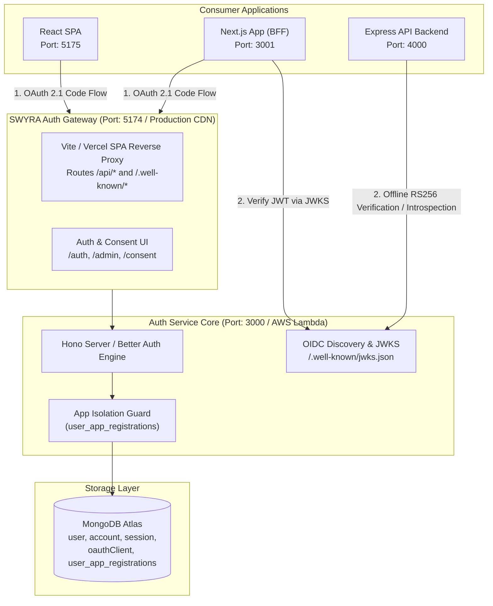
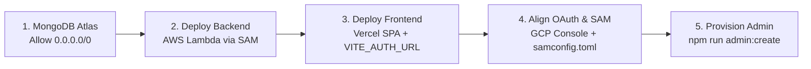

# SWYRA Auth — Self-Hosted OAuth 2.1 / OIDC Identity Provider

> A production-ready, config-only OAuth 2.1 / OpenID Connect identity provider you deploy once and own forever — with zero always-on infrastructure costs.

Built with **Hono**, **MongoDB Atlas**, and the **Better Auth** identity engine. Includes a high-aesthetic Admin Console for managing OAuth clients, configuring dynamic CORS, and provisioning App Admin accounts with built-in multi-tenant app isolation.

---

## System Architecture



---

## Key Architectural Principles

1. **Strict Multi-Tenant App Isolation**:
   - Users are registered on a per-client basis via `user_app_registrations`.
   - A user registered on App A cannot authenticate or authorize on App B without explicitly completing registration for App B.
   - Access tokens are cryptographically bound to the issuing `client_id`, preventing cross-application token replay attacks.
2. **Unified Single-Origin Gateway**:
   - In local development, the frontend dev server (`http://localhost:5174`) reverse-proxies `/api/*` and `/.well-known/*` to the Hono backend (`http://localhost:3000`), matching production CDN / Vercel behavior.
   - All consumer apps configure `AUTH_ISSUER=http://localhost:5174`.
3. **Plaintext Client Secret Rule**:
   - Better Auth stores client secrets in MongoDB as encrypted/hashed ciphertext (`oauthClient` collection).
   - Consumer application `.env` files must always contain the original **plaintext client secret** issued upon client creation in the Admin Dashboard.

---

## Turnkey 5-Step Deployment Guide

Follow these steps to deploy your backend (AWS Lambda) and frontend (Vercel) with zero configuration errors.



### Step 1 — Database Setup (MongoDB Atlas)
1. Sign up at [mongodb.com/atlas](https://www.mongodb.com/atlas) and create an **M0 (Free)** cluster.
2. Under **Database Access**, create a user with **Read and Write** privileges.
3. Under **Network Access**, click **+ Add IP Address** → **ALLOW ACCESS FROM ANYWHERE** (`0.0.0.0/0`).
   > ⚠️ **Critical for Serverless (AWS Lambda):** Because AWS Lambda uses dynamic outbound IPs, you must allow `0.0.0.0/0` in Atlas or Lambda will time out with `MongoServerSelectionError`.
4. Copy your connection string:
   ```text
   mongodb+srv://<user>:<password>@cluster0.abc123.mongodb.net/oauthservice?retryWrites=true&w=majority
   ```
5. Initialize database indexes:
   ```bash
   cd hono
   cp .env.example .env
   # Set MONGO_URI and BETTER_AUTH_SECRET in hono/.env
   npm run db:setup
   ```

### Step 2 — Backend Deployment (AWS Lambda via SAM)
The backend is pre-configured to bundle into CommonJS (`dist/index.cjs`) for clean AWS Lambda Node.js runtime execution.

1. Install dependencies in `hono/`:
   ```bash
   cd hono
   npm install
   ```
2. Deploy using the single-command deployment script:
   ```bash
   ./deploy.sh
   ```
   *(Or if running for the first time without a config: `sam deploy --guided --profile aws`)*
3. Note the **Lambda Function URL** output at the end of deployment (e.g. `https://<lambda-id>.lambda-url.<region>.on.aws/`).

### Step 3 — Frontend Deployment (Vercel)
1. Connect your repository to [Vercel](https://vercel.com).
2. Set the **Root Directory** to `frontend` (or repository root; `vercel.json` rewrite rules are provided in both locations).
3. Set the Environment Variable in Vercel:
   ```text
   VITE_AUTH_URL=https://<your-lambda-id>.lambda-url.<region>.on.aws
   ```
4. Deploy the frontend and copy your production URL (e.g., `https://oauth21.vercel.app`).

### Step 4 — Align OAuth & Cloud Configurations
#### A. Google Cloud Console (if using Google OAuth)
In your GCP OAuth 2.0 Client ID settings:
- **Authorized JavaScript origins**: `https://<your-frontend-domain>` (e.g., `https://oauth21.vercel.app`)
- **Authorized redirect URIs**: `https://<your-lambda-id>.lambda-url.<region>.on.aws/api/auth/callback/google`

#### B. Backend Configuration (`hono/samconfig.toml`)
Update `parameter_overrides` in `hono/samconfig.toml` so `BetterAuthUrl` and `FrontendUrl` match your live domains:
```toml
parameter_overrides = "BetterAuthUrl=\"https://<your-lambda-id>.lambda-url.<region>.on.aws/api/auth\" GoogleClientId=\"<your-google-client-id>\" FrontendUrl=\"https://<your-frontend-domain>\""
```
> ⚠️ **Important:** `FrontendUrl` must be strictly the origin (`https://oauth21.vercel.app`), **never** append paths like `/auth`.

Redeploy the backend configuration:
```bash
./deploy.sh
```

### Step 5 — Provision Your Admin Account
Because public registration is disabled by default in production (`AUTH_PUBLIC_SIGNUP_ENABLED=false`), use the admin provisioning CLI script:

```bash
cd hono
npm run admin:create -- "your-admin-email@example.com" "YourStrongPassword@123!" "Your Name"
```

> **Password Requirements:** Must be 12–128 characters and contain at least one uppercase letter, one lowercase letter, one number, and one special character.

Log into your Admin Console at:
```text
https://<your-frontend-domain>/admin/login
```

---

## Local Development & Ports Overview

| Service | Port | Description |
|---|---|---|
| **SWYRA Auth Gateway (Frontend)** | `http://localhost:5174` | Unified Auth UI, Consent, Admin Console, and API Reverse Proxy |
| **SWYRA Auth API (Backend)** | `http://localhost:3000` | Hono Core Identity Engine, Token Endpoint, JWKS |
| **Next.js Demo App** | `http://localhost:3001` | Full-stack Next.js 14 App Router OAuth 2.1 client |
| **Express Backend Demo** | `http://localhost:4000` | Resource server with offline RS256 JWKS verification |
| **React Frontend Demo** | `http://localhost:5175` | React SPA client consuming Express protected telemetry |

### Starting All Services Locally

```bash
# 1. Start Auth Core (Backend)
cd hono
npm run dev

# 2. Start Auth Gateway (Frontend)
cd frontend
npm run dev

# 3. Start Next.js Demo App (Optional)
cd test/next-app
npm run dev

# 4. Start React-Express Demo App (Optional)
cd test/react-express-app/backend && npm run dev
cd test/react-express-app/frontend && npm run dev
```

---

## Consumer Application Integration Guide

All consumer applications communicate with the Auth Server using standard **OAuth 2.1 (PKCE + Authorization Code Flow)**.

### Environment Variable Reference for Consumer Apps

| Variable | Description | Local Value | Production Value |
|---|---|---|---|
| `AUTH_ISSUER` | Base URL of the Auth Gateway | `http://localhost:5174` | `https://oauth21.vercel.app` |
| `JWKS_URL` | Public keys for offline RS256 JWT validation | `http://localhost:5174/.well-known/jwks.json` | `https://oauth21.vercel.app/.well-known/jwks.json` |
| `CLIENT_ID` | OAuth Client ID from Admin Dashboard | `your_client_id` | `your_client_id` |
| `CLIENT_SECRET` | Plaintext Client Secret (backend only) | `your_plaintext_secret` | `your_plaintext_secret` |
| `REDIRECT_URI` | Whitelisted callback route | `http://localhost:3001/api/auth/callback` | `https://app.example.com/api/auth/callback` |

---

### Use Case 1: Full-Stack Next.js Application (BFF Pattern)
*Located in [`test/next-app/`](file:///d:/WORK/OAuth2.1/test/next-app)*

**1. Register the Client in Admin Console (`/admin/dashboard`):**
- **Client Name**: `Next.js Consumer`
- **Redirect URIs**: `http://localhost:3001/api/auth/callback`
- **Allowed Origins**: `http://localhost:3001`
- **Client Type**: Confidential (Server-Side)

**2. Configure `test/next-app/.env`:**
```env
AUTH_ISSUER=http://localhost:5174
JWKS_URL=http://localhost:5174/.well-known/jwks.json
CLIENT_ID=qMoXkZwvWnZJRmFhpiTyzLMozZYrwvlF
CLIENT_SECRET=HQEFWhArRpYvjySBrzSbtBBlOpeZDpHY
REDIRECT_URI=http://localhost:3001/api/auth/callback
PORT=3001
```

**3. Architectural Flow:**
- User clicks "Sign In with SWYRA M Auth" $\rightarrow$ redirects to `${AUTH_ISSUER}/auth?client_id=${CLIENT_ID}&redirect_uri=${REDIRECT_URI}&response_type=code&scope=openid+profile+email`.
- Next.js API Route (`/api/auth/callback`) receives authorization `code`.
- Next.js exchanges code with Basic Auth at `${AUTH_ISSUER}/api/auth/oauth2/token`.
- Access tokens and user profiles are stored in secure `HttpOnly` session cookies.
- Server-side routes fetch protected telemetry with Bearer tokens.

---

### Use Case 2: Decoupled React SPA + Express API Backend
*Located in [`test/react-express-app/`](file:///d:/WORK/OAuth2.1/test/react-express-app)*

**1. Register the Client in Admin Console (`/admin/dashboard`):**
- **Client Name**: `React Express Suite`
- **Redirect URIs**: `http://localhost:4000/auth/callback`, `http://localhost:5175`
- **Allowed Origins**: `http://localhost:5175`, `http://localhost:4000`
- **Client Type**: Confidential / BFF

**2. Configure Express Backend (`test/react-express-app/backend/.env`):**
```env
PORT=4000
AUTH_ISSUER=http://localhost:5174
JWKS_URL=http://localhost:5174/.well-known/jwks.json
CLIENT_ID=VyhlDhjmztsAsFphQjBsmXiSXjfpFoug
CLIENT_SECRET=HSqJGpkNCkMJqUicZLFIoNdDyCsNOABI
REDIRECT_URI=http://localhost:4000/auth/callback
FRONTEND_URL=http://localhost:5175
```

**3. Configure React Frontend (`test/react-express-app/frontend/.env`):**
```env
VITE_AUTH_ISSUER=http://localhost:5174
VITE_CLIENT_ID=VyhlDhjmztsAsFphQjBsmXiSXjfpFoug
VITE_BACKEND_URL=http://localhost:4000
```

**4. Express Token Verification Middleware:**
Express verifies incoming Bearer tokens or session cookies offline using `jose` and `JWKS_URL`:
```typescript
import { createRemoteJWKSet, jwtVerify } from 'jose';

const jwks = createRemoteJWKSet(new URL(process.env.JWKS_URL!));

export async function requireAuth(req, res, next) {
  const token = req.headers.authorization?.replace('Bearer ', '') || req.cookies?.app_session?.access_token;
  if (!token) return res.status(401).json({ error: 'unauthorized' });

  try {
    const { payload } = await jwtVerify(token, jwks);

    // Enforce Audience & Client ID binding (Prevent cross-app token replay)
    const tokenClientId = payload.client_id || payload.azp || payload.aud;
    if (tokenClientId && tokenClientId !== process.env.CLIENT_ID) {
      return res.status(403).json({ error: 'forbidden', message: 'Token not issued for this client' });
    }

    req.user = payload;
    next();
  } catch (err) {
    return res.status(401).json({ error: 'invalid_token' });
  }
}
```

---

### Use Case 3: Standalone React Frontend (Adding a Backend in Future)

1. **Phase 1 (Frontend Only with PKCE)**:
   - Configure React SPA with `VITE_AUTH_ISSUER` and `VITE_CLIENT_ID`.
   - React exchanges authorization codes directly with PKCE code verifier.
2. **Phase 2 (When Backend is Built)**:
   - The new backend requires **only 1 environment variable**:
     ```env
     JWKS_URL=http://localhost:5174/.well-known/jwks.json
     ```
   - Validates Bearer tokens offline via public RS256 keys with **zero database coupling**.

---

## Security Specifications & Boundary Checklist

| Security Feature | Implementation Details |
|---|---|
| **OAuth 2.1 Compliance** | Disallows Implicit Flow and Resource Owner Password Credentials. Requires PKCE for all authorization code exchanges. |
| **Password Boundary** | Enforced 12–128 character policy with uppercase, lowercase, digit, and symbol validation. |
| **Multi-Tenant App Isolation** | Tracks user registrations per `client_id`. Blocks cross-app authorization and token replay. |
| **Cookie Hardening** | `SameSite=None; Secure; HttpOnly; Partitioned` across all session tokens. |
| **XXE / XML Protection** | Exclusively parses `application/json` and `application/x-www-form-urlencoded`. No XML parsers loaded. |
| **CSRF & Rate Limiting** | Custom CSRF middleware on admin routes; MongoDB-backed sliding window rate limiter on auth routes. |
| **CORS Protection** | Dynamic origin reflection against registered OAuth client whitelists. |

---

## Database Management & Maintenance

### Creating / Resetting Admin Accounts
```bash
cd hono
npm run admin:create -- "admin@example.com" "SecurePassword@2026!" "System Admin"
```

### Initializing MongoDB TTL Indexes
```bash
cd hono
npm run db:setup
```

---

## Troubleshooting Guide

| Symptom | Root Cause | Solution |
|---|---|---|
| **"Invalid client secret" during token exchange** | Stored hashed secret in consumer app `.env`. | Place the raw **plaintext client secret** in the consumer `.env`, not the hash from MongoDB. |
| **"User is not registered for this application"** | Strict App Isolation guard triggered. | Switch to the **Sign Up** tab on the Auth UI to register the user for that specific `client_id`. |
| **502 Bad Gateway / Lambda Timeout** | MongoDB Atlas IP whitelist blocking Lambda. | Add `0.0.0.0/0` under Network Access in MongoDB Atlas. |
| **404 NOT_FOUND on Vercel sub-routes** | Missing SPA rewrite rules. | Verify `vercel.json` contains `"source": "/(.*)", "destination": "/index.html"`. |
| **`EADDRINUSE: :::3000`** | Previous Node/WSL process holding port. | Run `taskkill /F /PID <pid>` (Windows) or `fuser -k 3000/tcp` (WSL). |

---

*Built with [Hono](https://hono.dev), [MongoDB](https://www.mongodb.com), and the [Better Auth](https://better-auth.com) OAuth 2.1 / OIDC identity engine.*
