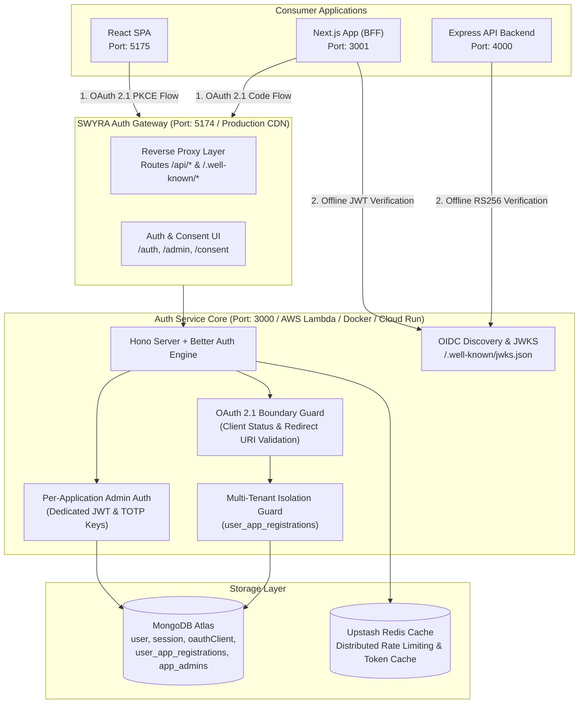

# SWYRA Auth — Self-Hosted OAuth 2.1 / OIDC Identity Provider

> A production-ready, configuration-only OAuth 2.1 / OpenID Connect identity provider you deploy once and own forever — with zero always-on infrastructure costs.

Built with **Hono**, **MongoDB Atlas**, and the **Better Auth** identity engine. Features a high-aesthetic Admin Console for managing OAuth 2.1 clients, dynamic CORS whitelists, private application tenant isolation, and dedicated Per-Application Administrators with cryptographically isolated JWT verification and built-in TOTP multi-factor authentication.

---

## 🏛️ System Architecture



---

## 🛡️ Core Security Architecture & Boundaries

- **Strict OAuth 2.1 & RFC 8252 Compliance**: Mandatory PKCE (`code_challenge_method=S256`), exact redirect URI matching (blocking wildcards and userinfo), and single-use authorization codes.
- **OAuth Boundary Private-App Isolation**: Validates client status, active state, and user authorization at the OAuth authorization boundary (`GET /api/auth/oauth2/authorize`), preventing global session bypass across tenant applications.
- **Dedicated Application Administrator Separation**: Per-Application Administrators operate with dedicated, cryptographically isolated signing (`APP_ADMIN_JWT_SECRET`) and encryption (`APP_ADMIN_TOTP_KEY`) keys with strict production fail-fast enforcement.
- **Token-Use Purpose Binding**: Explicit `token_use` claims (`app_admin` vs. `app_admin_mfa_pending`) prevent token substitution attacks across authentication phases.
- **Atomic MFA & Anti-Replay**: Atomic single-use backup code consumption via MongoDB `$pull` with concurrency protection, combined with brute-force rate limiting.
- **Target-Keyed Anti-Credential-Stuffing**: Sliding-window rate limiters keyed by both client IP and normalized target email to survive distributed botnet attacks.
- **Migration-Safe Client Secret Hashing**: Transparent on-the-fly migration from legacy plaintext client secrets to SHA-256 base64url hashes upon successful authentication.
- **Fail-Closed Token Family Revocation**: Detects refresh token replay and instantly revokes all tokens within the compromised lineage.

---

## 📚 Documentation Hub

Complete technical documentation, integration guides, and operational runbooks are located in the [`docs/`](docs/) directory:

| Document | Description |
|---|---|
| 🏛️ **[System Architecture](docs/ARCHITECTURE.md)** | Multi-tenant isolation model, cryptographic token binding, OIDC discovery, and protocol sequence flows. |
| ⚙️ **[Configuration & Environment](docs/CONFIGURATION.md)** | Production security secrets, fail-fast rules, public vs. private app modes, and rate limiting specs. |
| 🚀 **[Multi-Cloud Deployment Guide](docs/DEPLOYMENT.md)** | Production deployment runbooks for AWS Lambda (SAM), Linux VPS/EC2, Docker Compose, GCP, Azure, Vercel, and Railway. |
| 👑 **[Admin Console & App Management](docs/ADMIN_GUIDE.md)** | Registering applications, CORS management, private user assignment, App Admin provisioning, CLI utilities, and troubleshooting. |
| 🔌 **[Consumer Integration Guide](docs/INTEGRATION_GUIDE.md)** | End-to-end integration patterns and code samples for Next.js 14 BFF, React SPA + Express, and App Admin verification. |
| 🛡️ **[Security & Abuse Defense](docs/SECURITY.md)** | Threat model, rate limiting algorithms, constant-time hashing, and reverse proxy boundaries. |
| 🔄 **[CI/CD & Auto Deployment](docs/CICD.md)** | Automated GitHub Actions pipelines for AWS Lambda (SAM) and Vercel edge deployment. |
| 📋 **[Environment Variables Reference](docs/ENVIRONMENT_VARIABLES.md)** | Complete table of all backend, frontend, and consumer client configuration flags. |

---

## ⚡ Quickstart (Local Development)

### 1. Prerequisites
- **Node.js 20+**
- **MongoDB Atlas** database connection string (or local MongoDB instance)
- *(Optional)* **Upstash Redis** credentials for distributed rate limiting

### 2. Configure Backend Environment
```bash
cd backend
cp .env.example .env
# Edit backend/.env with your MONGO_URI, BETTER_AUTH_SECRET, and FRONTEND_URL
npm run db:setup
```

### 3. Start All Services with One Command
From the project root:
```bash
./start-all.sh
```

| Service | Port / URL | Description |
|---|---|---|
| **SWYRA Auth Gateway (Frontend)** | `http://localhost:5174` | Unified Auth UI, Consent Screen, Admin Console, and Reverse Proxy |
| **SWYRA Auth API (Backend)** | `http://localhost:3000` | Hono Core Identity Engine, Token Endpoint, JWKS |
| **Next.js Demo App** | `http://localhost:3001` | Full-stack Next.js 14 App Router OAuth 2.1 client (BFF Pattern) |
| **Express Backend Demo** | `http://localhost:4000` | Resource server with offline RS256 JWKS verification |
| **React Frontend Demo** | `http://localhost:5175` | React SPA client consuming Express protected telemetry |

---

## 🧪 Security Test Suite

SWYRA Auth includes an automated security test suite covering OAuth 2.1 boundary checks, private application isolation, App Admin cross-app token rejection, TOTP MFA challenge flows, token purpose enforcement, atomic backup code consumption, and production environment schema validation:

```bash
cd backend
npm run test:security
```

---

*Built with [Hono](https://hono.dev), [MongoDB Atlas](https://www.mongodb.com/atlas), and [Better Auth](https://better-auth.com).*
