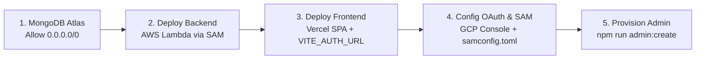

# Self-Hosted OAuth 2.1 / OIDC Identity Provider

> A pre-written, config-only auth service you deploy once and own forever — with zero always-on infrastructure costs.

This is a complete, self-hosted OAuth 2.1 / OpenID Connect identity provider. Point it at a MongoDB database and deploy it anywhere — from serverless AWS Lambda to long-lived containers. Built with **Hono**, **MongoDB**, and the **Better Auth** identity engine. Includes a full-featured Admin Dashboard for managing OAuth clients, configuring dynamic CORS, and provisioning App Admin accounts.

---

## Quick Deployment & Setup Guide (Turnkey 5-Step Process)

Follow these exact steps to get your backend and frontend live and connected with zero errors.



---

### Step 1 — Database Setup (MongoDB Atlas)

1. Sign up at [mongodb.com/atlas](https://www.mongodb.com/atlas) and create a free **M0 cluster**.
2. Under **Database Access**, create a user with **Read and Write** privileges.
3. Under **Network Access**, click **+ Add IP Address** → **ALLOW ACCESS FROM ANYWHERE** (`0.0.0.0/0`).
   > ⚠️ **Critical for Serverless (AWS Lambda):** Because AWS Lambda uses dynamic outbound IPs, you must allow `0.0.0.0/0` in Atlas or Lambda will time out with `MongoServerSelectionError`.
4. Copy your connection string:
   ```text
   mongodb+srv://<user>:<password>@cluster0.abc123.mongodb.net/oauth?retryWrites=true&w=majority
   ```
5. Initialize database indexes:
   ```bash
   cd hono
   cp .env.example .env
   # Add your MONGO_URI and BETTER_AUTH_SECRET to hono/.env
   npm run db:setup
   ```

---

### Step 2 — Backend Deployment (AWS Lambda via SAM)

The backend is pre-configured to bundle into CommonJS (`dist/index.cjs`) for clean AWS Lambda Node.js runtime execution.

1. Install dependencies in `hono/`:
   ```bash
   cd hono
   npm install
   ```
2. Deploy using the single-command deployment script:
   ```bash
   ./deploy.sh
   ```
   *(Or if running for the first time without a config: `sam deploy --guided --profile aws`)*
3. Note the **Lambda Function URL** output at the end of deployment (e.g. `https://<lambda-id>.lambda-url.<region>.on.aws/`).

---

### Step 3 — Frontend Deployment (Vercel)

1. Connect your repository to [Vercel](https://vercel.com).
2. Set the **Root Directory** to `frontend` (or repository root; `vercel.json` rewrite rules are provided in both locations).
3. Set the Environment Variable in Vercel:
   ```text
   VITE_AUTH_URL=https://<your-lambda-id>.lambda-url.<region>.on.aws
   ```
4. Deploy the frontend and copy your production URL (e.g., `https://oauth21.vercel.app`).

---

### Step 4 — Align OAuth & Cloud Configurations

Now that both frontend and backend URLs exist:

#### A. Google Cloud Console (if using Google OAuth)
In your GCP OAuth 2.0 Client ID settings:
- **Authorized JavaScript origins**: `https://<your-frontend-domain>` (e.g., `https://oauth21.vercel.app`)
- **Authorized redirect URIs**: `https://<your-lambda-id>.lambda-url.<region>.on.aws/api/auth/callback/google`

#### B. Backend Configuration (`hono/samconfig.toml`)
Update `parameter_overrides` in `hono/samconfig.toml` so `BetterAuthUrl` and `FrontendUrl` match your live domains:
```toml
parameter_overrides = "BetterAuthUrl=\"https://<your-lambda-id>.lambda-url.<region>.on.aws/api/auth\" GoogleClientId=\"<your-google-client-id>\" FrontendUrl=\"https://<your-frontend-domain>\""
```
> ⚠️ **Important:** `FrontendUrl` must be strictly the origin (`https://oauth21.vercel.app`), **never** append paths like `/auth`.

Redeploy the backend configuration:
```bash
./deploy.sh
```

---

### Step 5 — Provision Your Admin Account

Because public registration is disabled by default in production (`AUTH_PUBLIC_SIGNUP_ENABLED=false`), use the admin provisioning CLI script:

```bash
cd hono
npm run admin:create -- "your-admin-email@example.com" "YourStrongPassword@123!" "Your Name"
```

> **Password Requirements:** Must be 12–128 characters and contain at least one uppercase letter, one lowercase letter, one number, and one special character.

Log into your Admin Console at:
```text
https://<your-frontend-domain>/admin/login
```

---

## Troubleshooting & Key Deployment Rules

| Issue / Symptom | Root Cause | Solution |
|---|---|---|
| **502 Bad Gateway / Lambda Timeout** | MongoDB Atlas firewall is blocking Lambda's dynamic IP address. | Add `0.0.0.0/0` in MongoDB Atlas under **Network Access**. |
| **404 NOT_FOUND on Vercel sub-routes** (`/admin/login`, `/consent`) | Vercel searches for static files for non-root routes. | Ensure `vercel.json` with SPA rewrite rules (`"source": "/(.*)", "destination": "/index.html"`) is pushed to git. |
| **"Invalid Request" on `/auth`** | `FrontendUrl` had `/auth` appended or did not match browser `Origin`. | Set `FrontendUrl="https://your-domain.com"` (origin only, no trailing path) in `samconfig.toml`. |
| **401 Unauthorized on `/api/admin/stats`** | Cross-domain cookies missing `SameSite=None` or API requests missing base URL. | Backend uses `SameSite=None; Secure; Partitioned` in production. Frontend uses `apiFetch()` helper from `frontend/lib/api.ts` to attach credentials and `VITE_AUTH_URL`. |
| **401 on Admin Sign-In** | User record missing `account` credential or password length < 12 characters. | Use `npm run admin:create` which provisions both `user` and `account` collections with correct `ObjectId` links. |

---

## Repository Structure

```text
├── frontend/                   # React 18 + Vite + TailwindCSS Admin & Auth UI
│   ├── components/             # Reusable UI components & route guards
│   ├── lib/
│   │   ├── api.ts              # API client with VITE_AUTH_URL and credentials
│   │   ├── auth-client.ts      # Better Auth client SDK
│   │   └── adminStore.ts       # Zustand store for admin state management
│   ├── pages/                  # Auth, Consent, and Admin views
│   └── vercel.json             # SPA rewrites & API reverse proxy configuration
│
├── hono/                       # Backend API & Identity Engine
│   ├── src/
│   │   ├── config/             # Zod environment schema & validated config
│   │   ├── db/                 # MongoDB client & connection lifecycle
│   │   ├── middleware/         # Dynamic CORS, CSRF protection, rate limiting
│   │   ├── routes/             # /api/auth/* and /api/admin/* endpoints
│   │   ├── utils/              # Better Auth engine setup, password & URI security
│   │   └── lambda.ts           # AWS Lambda entry point
│   ├── scripts/
│   │   ├── create-admin.ts     # CLI script to provision/update admin accounts
│   │   └── db-setup.ts         # Database TTL index initializer
│   ├── deploy.sh               # One-step AWS SAM bundle & deploy script
│   ├── samconfig.toml          # AWS SAM deployment parameters
│   └── template.yaml           # AWS CloudFormation Serverless template
```

---

## Backend Deployment Options

### Option A: AWS Lambda (via SAM) — *Recommended Serverless*

```bash
cd hono
./deploy.sh
```

### Option B: Railway / Render / Fly.io (Long-Lived Container)

```bash
cd hono
npm run build:node
node dist/index.js
```

### Option C: Vercel / Netlify (Serverless Functions)

```bash
cd hono
npm run build:vercel    # For Vercel
npm run build:netlify   # For Netlify
```

---

## Local Development

Run the full stack locally:

```bash
# Terminal 1 — Backend
cd hono && npm run dev

# Terminal 2 — Frontend
cd frontend && npm run dev
```

Local URLs:
- Frontend: `http://localhost:5174`
- Backend: `http://localhost:3000`
- Health check: `http://localhost:3000/`

---

## Documentation & Architecture

| Document | Description |
|---|---|
| [`architecture.md`](./architecture.md) | System shape, identity engine overview, deployment topology, and connection budget |
| [`boundaries.md`](./boundaries.md) | Hard constraints and security boundaries |
| [`decision.md`](./decision.md) | Architectural Decision Records (ADRs) |
| [`DEPLOY_CHECKLIST.md`](./DEPLOY_CHECKLIST.md) | Comprehensive pre/post-deployment verification checklist |

## Consumer Application Integration Guide

All consumer applications (clients) communicate with the Auth Server using standard OAuth 2.1 / OIDC. Consuming applications only need to configure the Auth Gateway and their client credentials.

### Overview of Configuration Variables

| Variable | Description | Example (Local Dev) | Example (Production) |
|---|---|---|---|
| `AUTH_ISSUER` | Public URL of the Auth Server | `http://localhost:5174` | `https://oauth21.vercel.app` |
| `JWKS_URL` | Cryptographic public keys for RS256 token verification | `http://localhost:5174/.well-known/jwks.json` | `https://oauth21.vercel.app/.well-known/jwks.json` |
| `CLIENT_ID` | Issued Client ID from the Admin Dashboard | `your_client_id` | `your_client_id` |
| `CLIENT_SECRET` | Issued Client Secret (keep private on backend only) | `your_client_secret` | `your_client_secret` |
| `REDIRECT_URI` | Whitelisted callback URL of the consumer app | `http://localhost:3001/api/auth/callback` | `https://app.example.com/api/auth/callback` |

---

### Use Case 1: Full-Stack App (Next.js / Remix / SvelteKit)
*Frontend and backend run in the same project on a single server (Confidential Client).*

**`.env.local` / `.env`:**
```env
AUTH_ISSUER=http://localhost:5174
JWKS_URL=http://localhost:5174/.well-known/jwks.json
CLIENT_ID=your_client_id
CLIENT_SECRET=your_client_secret
REDIRECT_URI=http://localhost:3001/api/auth/callback
```
* **Frontend**: Redirects user to `${AUTH_ISSUER}/auth?client_id=${CLIENT_ID}&redirect_uri=${REDIRECT_URI}&response_type=code&scope=openid+profile+email`.
* **Backend API Route (`/api/auth/callback`)**: Receives the `code`, exchanges it at `${AUTH_ISSUER}/api/auth/oauth2/token` using `CLIENT_ID` + `CLIENT_SECRET`, and verifies the returned JWT with `JWKS_URL`.

---

### Use Case 2: Separated Architecture (React SPA + Express/Node Backend)
*Frontend runs in the browser; Backend runs on a separate API server.*

**A. React Frontend (`.env`):**
```env
VITE_AUTH_ISSUER=http://localhost:5174
VITE_CLIENT_ID=your_client_id
VITE_REDIRECT_URI=http://localhost:5173/callback
VITE_BACKEND_URL=http://localhost:4000
```

**B. Express Backend (`.env`):**
```env
PORT=4000
AUTH_ISSUER=http://localhost:5174
JWKS_URL=http://localhost:5174/.well-known/jwks.json
CLIENT_ID=your_client_id
CLIENT_SECRET=your_client_secret
REDIRECT_URI=http://localhost:5173/callback
```
* **Flow**: React initiates login with PKCE $\rightarrow$ passes authorization `code` to Express backend $\rightarrow$ Express exchanges code for JWT tokens $\rightarrow$ Express verifies Bearer tokens on protected routes via `JWKS_URL`.

---

### Use Case 3: Standalone React Frontend (Adding a Backend in Future)

1. **Today (Frontend Only)**:
   * Create an OAuth Client in the Admin Dashboard with PKCE enabled.
   * In React `.env`:
     ```env
     VITE_AUTH_ISSUER=http://localhost:5174
     VITE_CLIENT_ID=your_client_id
     VITE_REDIRECT_URI=http://localhost:5173/callback
     ```
   * React handles PKCE exchange directly with the IDP and stores the RS256 Access Token.

2. **In the Future (When you build your Backend)**:
   * Your new backend needs **only 1 variable**:
     ```env
     JWKS_URL=http://localhost:5174/.well-known/jwks.json
     ```
   * The backend validates incoming `Authorization: Bearer <token>` headers offline against `JWKS_URL` using public keys (via `jose` or `jsonwebtoken`), with **zero database coupling**.

---

*Built with [Hono](https://hono.dev), [MongoDB](https://www.mongodb.com), and the [Better Auth](https://better-auth.com) OAuth 2.1 / OIDC identity engine.*
