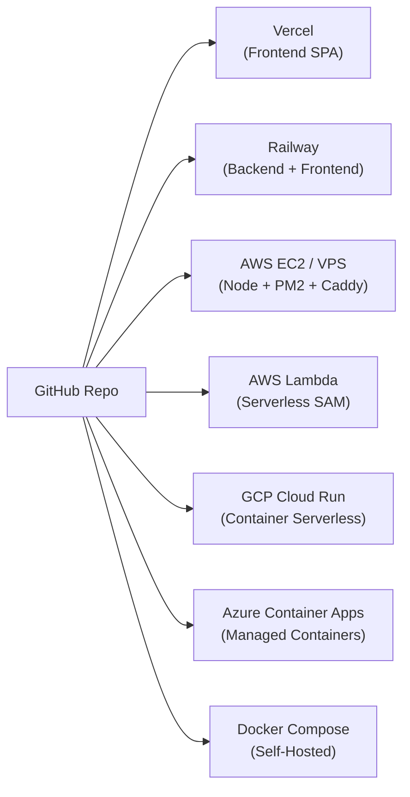

# SWYRA Auth — Self-Hosted OAuth 2.1 / OIDC Identity Provider

> A production-ready, config-only OAuth 2.1 / OpenID Connect identity provider you deploy once and own forever — with zero always-on infrastructure costs.

Built with **Hono**, **MongoDB Atlas**, and the **Better Auth** identity engine. Features a high-aesthetic Admin Console for managing OAuth 2.1 clients, dynamic CORS whitelists, and dedicated Per-Application Administrators with secure backend verification endpoints and built-in multi-tenant isolation.

---

## 🏛️ System Architecture


---

## 📚 Complete Documentation Hub

Detailed technical guides, protocol specifications, and integration runbooks are modularized in the [`docs/`](docs/) directory:

| Document | Description |
|---|---|
| 🏛️ **[System Architecture](docs/ARCHITECTURE.md)** | Multi-tenant isolation, cryptographic token binding, OIDC discovery, and PKCE sequence flows. |
| 🚀 **[Multi-Cloud Deployment Guide](docs/DEPLOYMENT.md)** | Step-by-step guides for AWS Lambda, EC2/VPS, Azure, GCP Cloud Run, Vercel, Netlify, Railway, and Docker. |
| ⚙️ **[Admin Console & App Management](docs/ADMIN_GUIDE.md)** | Registering applications, CORS origin management, Development Mode switch, and per-application admin provisioning. |
| 🔌 **[Consumer Integration Guide](docs/INTEGRATION_GUIDE.md)** | Code examples and patterns for Next.js 14 BFF, React SPA + Express, pure PKCE frontends, and App Admin verification. |
| 🛡️ **[Security & Abuse Defense](docs/SECURITY.md)** | Threat model, target-keyed rate limiting, constant-time hashing, token family rotation, and WAF boundaries. |
| 📋 **[Environment Variables Reference](docs/ENVIRONMENT_VARIABLES.md)** | Complete specification of all backend, frontend, and consumer client configuration flags. |

---

## ⚡ Quickstart (Local Development)

### 1. Prerequisites
- **Node.js 20+**
- **MongoDB Atlas** database connection string (or local MongoDB instance)
- *(Optional)* **Upstash Redis** credentials for distributed rate limiting

### 2. Configure Backend Environment
```bash
cd hono
cp .env.example .env
# Edit hono/.env with your MONGO_URI, BETTER_AUTH_SECRET, and FRONTEND_URL
npm run db:setup
```

### 3. Start All Services with One Command
From the project root:
```bash
./start-all.sh
```

| Service | Port / URL | Description |
|---|---|---|
| **SWYRA Auth Gateway (Frontend)** | `http://localhost:5174` | Unified Auth UI, Consent, Admin Console, and API Reverse Proxy |
| **SWYRA Auth API (Backend)** | `http://localhost:3000` | Hono Core Identity Engine, Token Endpoint, JWKS |
| **Next.js Demo App** | `http://localhost:3001` | Full-stack Next.js 14 App Router OAuth 2.1 client |
| **Express Backend Demo** | `http://localhost:4000` | Resource server with offline RS256 JWKS verification |
| **React Frontend Demo** | `http://localhost:5175` | React SPA client consuming Express protected telemetry |

---

## 🌐 Universal Deployment Guide

SWYRA Auth can be deployed to any major cloud platform or infrastructure model. Follow the dedicated instructions below for your target provider.



---

### 1. Database & Cache Prerequisites (All Providers)

Before deploying to any platform:

1. **MongoDB Atlas**:
   - Create a free **M0** or dedicated cluster at [MongoDB Atlas](https://www.mongodb.com/atlas).
   - Under **Security > Database Access**, create a user with read/write permissions.
   - Under **Security > Network Access**, add `0.0.0.0/0` (required for dynamic serverless/container egress IPs).
   - Copy your connection string: `mongodb+srv://<user>:<password>@cluster0.xyz.mongodb.net/oauthservice?retryWrites=true&w=majority`.

2. **Upstash Redis (Optional)**:
   - Create a free serverless Redis database at [Upstash](https://upstash.com).
   - Copy `UPSTASH_REDIS_REST_URL` and `UPSTASH_REDIS_REST_TOKEN`.
   - *(Note: If omitted, the service falls back automatically to MongoDB TTL sliding-window rate limiting).*

3. **Initialize Database Indexes**:
   ```bash
   cd hono
   npm install
   # Set MONGO_URI and BETTER_AUTH_SECRET in hono/.env
   npm run db:setup
   ```

4. **Generate Better Auth Secret**:
   ```bash
   openssl rand -base64 32
   ```

---

### 2. Platform-Specific Deployment Instructions

#### 🚀 Option A: Vercel (Frontend Gateway + Backend Proxy / Serverless)

##### Deploying the Frontend Gateway (Auth & Admin UI):
1. Import the repository into [Vercel](https://vercel.com).
2. Configure Project Settings:
   - **Framework Preset**: `Vite`
   - **Root Directory**: `frontend`
   - **Build Command**: `npm run build`
   - **Output Directory**: `dist`
   - **Install Command**: `npm install`
3. Configure Environment Variables in Vercel:
   - `VITE_AUTH_URL`: The URL of your deployed backend API (e.g., `https://api.auth.yourdomain.com`).
4. Ensure `frontend/vercel.json` contains the SPA route rewrites:
   ```json
   {
     "rewrites": [
       { "source": "/api/:path*", "destination": "https://<your-backend-domain>/api/:path*" },
       { "source": "/.well-known/:path*", "destination": "https://<your-backend-domain>/.well-known/:path*" },
       { "source": "/(.*)", "destination": "/index.html" }
     ]
   }
   ```
5. Click **Deploy**.

##### Deploying the Backend on Vercel:
The backend includes a Vercel serverless adapter in `src/vercel.ts`.
- Build command: `npm run build:vercel`
- Entrypoint: `dist/index.cjs`

---

#### 🚆 Option B: Railway (Zero-Config PaaS)

Railway allows deploying both the Hono backend API and the Vite frontend within a single project.

##### Step 1: Deploy Hono Backend API
1. Create a new project at [railway.app](https://railway.app) and connect your GitHub repo.
2. In service settings, configure:
   - **Root Directory**: `hono`
   - **Build Command**: `npm install && npm run build:node`
   - **Start Command**: `npm start` (or `node dist/index.cjs`)
3. Add Environment Variables:
   ```text
   NODE_ENV=production
   PORT=3000
   UV_THREADPOOL_SIZE=16
   MONGO_URI=mongodb+srv://<user>:<password>@cluster0.xyz.mongodb.net/oauthservice?retryWrites=true&w=majority
   BETTER_AUTH_SECRET=your_32_char_random_secret_here
   BETTER_AUTH_URL=https://<your-railway-backend-url>/api/auth
   FRONTEND_URL=https://<your-frontend-domain>
   TRUSTED_PROXY_CIDRS=10.0.0.0/8,172.16.0.0/12,192.168.0.0/16
   AUTH_PUBLIC_SIGNUP_ENABLED=false
   AUTH_EMAIL_VERIFICATION_ENABLED=false
   ```
4. Generate a public domain under **Settings > Networking > Generate Domain**.

##### Step 2: Deploy Frontend Gateway
1. In the same Railway project, add a new service from the same repo.
2. Set **Root Directory** to `frontend`.
3. Add Environment Variable:
   - `VITE_AUTH_URL`: `https://<your-railway-backend-url>`
4. Generate a public domain under **Settings > Networking**.

---

#### ☁️ Option C: AWS EC2 / Linux VPS / Bare Metal (Node.js + PM2 + Caddy / Nginx)

Ideal for high-throughput dedicated production deployments (Ubuntu 22.04 / 24.04, Debian 12, Amazon Linux 2023).

##### Step 1: Provision Server & Install Node.js 20+
```bash
# Update and install Node.js 20 LTS & PM2
curl -fsSL https://deb.nodesource.com/setup_20.x | sudo -E bash -
sudo apt-get install -y nodejs git
sudo npm install -g pm2
```

##### Step 2: Clone and Build Backend
```bash
git clone https://github.com/<your-org>/OAuth2.1.git /var/www/oauth21
cd /var/www/oauth21/hono

# Setup production environment
cp .env.example .env
nano .env # Configure MONGO_URI, BETTER_AUTH_SECRET, BETTER_AUTH_URL, FRONTEND_URL

# Install & Build
npm install
npm run db:setup
npm run build:node
```

##### Step 3: Start with PM2 Cluster Mode
```bash
# Run with max worker threads and cluster mode
UV_THREADPOOL_SIZE=16 PORT=3000 NODE_ENV=production pm2 start dist/index.cjs --name "swyra-auth-api" -i max

pm2 save
pm2 startup # Follow printed instructions to enable systemd service
```

##### Step 4: Configure Reverse Proxy with Automatic SSL

###### Option 1: Caddy (Recommended — Automatic Let's Encrypt HTTPS)
Install Caddy:
```bash
sudo apt install -y debian-keyring debian-archive-keyring apt-transport-https curl
curl -1sLf 'https://dl.cloudsmith.io/public/caddy/stable/gpg.key' | sudo gpg --dearmor -o /usr/share/keyrings/caddy-stable-archive-keyring.gpg
curl -1sLf 'https://dl.cloudsmith.io/public/caddy/stable/debian.deb.txt' | sudo tee /etc/apt/sources.list.d/caddy-stable.list
sudo apt update && sudo apt install caddy
```

Configure `/etc/caddy/Caddyfile`:
```caddy
api.auth.yourdomain.com {
    reverse_proxy localhost:3000 {
        header_up X-Forwarded-For {remote_host}
        header_up X-Forwarded-Proto {scheme}
    }
}

auth.yourdomain.com {
    root * /var/www/oauth21/frontend/dist
    file_server
    try_files {path} /index.html
}
```
Reload Caddy:
```bash
sudo systemctl reload caddy
```

###### Option 2: Nginx + Certbot
```nginx
server {
    server_name api.auth.yourdomain.com;

    location / {
        proxy_pass http://127.0.0.1:3000;
        proxy_http_version 1.1;
        proxy_set_header Host $host;
        proxy_set_header X-Real-IP $remote_addr;
        proxy_set_header X-Forwarded-For $proxy_add_x_forwarded_for;
        proxy_set_header X-Forwarded-Proto $scheme;
    }

    listen 80;
}
```
Run `sudo certbot --nginx -d api.auth.yourdomain.com` for free TLS.

---

#### ⚡ Option D: AWS Lambda (Serverless via AWS SAM)

The backend features zero-cold-start optimized bundling for AWS Lambda with dedicated Function URLs.

##### Step 1: Build & Deploy via SAM
```bash
cd hono
npm install
npm run build # Builds dist/index.cjs

# Deploy stack via AWS SAM
./deploy.sh
# Or for interactive first-time setup:
sam deploy --guided --profile aws
```

##### Step 2: Configure Parameters in `hono/samconfig.toml`
```toml
parameter_overrides = "BetterAuthUrl=\"https://<lambda-id>.lambda-url.<region>.on.aws/api/auth\" FrontendUrl=\"https://auth.yourdomain.com\""
```

##### Step 3: Verify Function URL
```bash
curl https://<lambda-id>.lambda-url.<region>.on.aws/
# Expected: {"message": "Health check", "status": "ok"}
```

---

#### 🌐 Option E: Google Cloud Platform (GCP) — Cloud Run & Compute Engine

##### Deploying to GCP Cloud Run (Serverless Container):
1. Authenticate and configure Google Cloud SDK:
   ```bash
   gcloud auth login
   gcloud config set project <YOUR_PROJECT_ID>
   ```

2. Build and submit container image:
   ```bash
   cd hono
   gcloud builds submit --tag gcr.io/<YOUR_PROJECT_ID>/swyra-auth:latest .
   ```

3. Deploy service with auto-scaling:
   ```bash
   gcloud run deploy swyra-auth \
     --image gcr.io/<YOUR_PROJECT_ID>/swyra-auth:latest \
     --platform managed \
     --region us-central1 \
     --allow-unauthenticated \
     --port 3000 \
     --set-env-vars "NODE_ENV=production,UV_THREADPOOL_SIZE=16,MONGO_URI=mongodb+srv://<user>:<password>@cluster0.xyz.mongodb.net/oauthservice,BETTER_AUTH_SECRET=your_32_char_secret,BETTER_AUTH_URL=https://<cloud-run-url>/api/auth,FRONTEND_URL=https://auth.yourdomain.com,TRUSTED_PROXY_CIDRS=10.0.0.0/8,172.16.0.0/12,192.168.0.0/16"
   ```

---

#### 🔷 Option F: Microsoft Azure — Container Apps & App Service

##### Deploying to Azure Container Apps:
1. Build container image in Azure Container Registry (ACR):
   ```bash
   az acr build --registry <yourRegistryName> --image swyra-auth:latest ./hono
   ```

2. Deploy Container App:
   ```bash
   az containerapp create \
     --name swyra-auth \
     --resource-group <yourResourceGroup> \
     --environment <yourManagedEnvironment> \
     --image <yourRegistryName>.azurecr.io/swyra-auth:latest \
     --target-port 3000 \
     --ingress external \
     --env-vars "NODE_ENV=production" "UV_THREADPOOL_SIZE=16" "MONGO_URI=secretref:mongo-uri" "BETTER_AUTH_SECRET=secretref:auth-secret" "BETTER_AUTH_URL=https://<app-fqdn>/api/auth" "FRONTEND_URL=https://auth.yourdomain.com" "TRUSTED_PROXY_CIDRS=10.0.0.0/8,172.16.0.0/12,192.168.0.0/16"
   ```

##### Deploying to Azure App Service (Linux Node.js 20):
- **Runtime Stack**: Node 20 LTS (Linux)
- **Startup Command**: `npm start` (or `node dist/index.cjs`)
- **Application Settings**: Set environment variables in the Azure Portal Configuration blade.

---

#### 🐳 Option G: Full-Stack Docker Compose (Self-Hosted)

Run both the Hono backend and React frontend with unified networking on any container host:

```bash
# 1. Clone repo
git clone https://github.com/<your-org>/OAuth2.1.git && cd OAuth2.1

# 2. Configure backend environment
cp hono/.env.example hono/.env
# Edit hono/.env with your MONGO_URI and BETTER_AUTH_SECRET

# 3. Start services
docker compose up -d --build

# Backend API: http://localhost:3000
# Frontend UI: http://localhost:8080
```

---

## 📋 Environment Variables Master Reference

### Backend Configuration (`hono/.env`)

| Variable | Required | Default | Description |
|---|---|---|---|
| `NODE_ENV` | **Yes** | `development` | Operating environment: `development`, `production`, or `test`. |
| `PORT` | No | `3000` | HTTP port for the standalone node server. |
| `MONGO_URI` | **Yes** | — | Full MongoDB connection string (including credentials and database name). |
| `BETTER_AUTH_SECRET` | **Yes** | — | Cryptographic secret key used to sign sessions and tokens (min 32 characters). |
| `BETTER_AUTH_URL` | **Yes** | — | Public URL of the auth backend API (e.g., `https://api.auth.domain.com/api/auth`). |
| `FRONTEND_URL` | **Yes** | — | Public origin of the frontend UI (e.g., `https://auth.domain.com`). Strictly origin, no trailing path. |
| `TRUSTED_PROXY_CIDRS` | In Prod | `""` | Comma-separated list of trusted load-balancer/proxy CIDRs (e.g., `10.0.0.0/8,172.16.0.0/12,192.168.0.0/16`). |
| `AUTH_PUBLIC_SIGNUP_ENABLED` | No | `false` (prod) | Set to `true` to allow open public registration, or `false` for invitation/admin-only. |
| `AUTH_EMAIL_VERIFICATION_ENABLED` | No | `false` | Set to `true` to require email confirmation before login. |
| `UPSTASH_REDIS_REST_URL` | No | — | Upstash Redis REST endpoint for distributed rate limiting & token caching. |
| `UPSTASH_REDIS_REST_TOKEN` | No | — | Upstash Redis REST Bearer token. |
| `GOOGLE_CLIENT_ID` | No | — | Google OAuth 2.0 Web Client ID for social login. |
| `GOOGLE_CLIENT_SECRET` | No | — | Google OAuth 2.0 Client Secret for social login. |
| `UV_THREADPOOL_SIZE` | No | `16` | libuv worker threadpool size for scrypt password hashing concurrency. |

### Frontend Configuration (`frontend/.env`)

| Variable | Required | Default | Description |
|---|---|---|---|
| `VITE_AUTH_URL` | **Yes** | `http://localhost:3000` | Base URL of the backend API used for authentication requests and OIDC endpoints. |

---

## 👑 Post-Deployment: Super-Admin Account Provisioning

Because public self-registration is disabled in production by default (`AUTH_PUBLIC_SIGNUP_ENABLED=false`), provision your initial Super-Admin account using the CLI command:

```bash
cd hono
npm run admin:create -- "admin@yourdomain.com" "YourStrongPassword@2026!" "Super Admin"
```

> 🔒 **Password Complexity Policy:** 12–128 characters, containing at least 1 uppercase letter, 1 lowercase letter, 1 number, and 1 special symbol.

Log into your Admin Console at:
```text
https://<your-frontend-domain>/admin/login
```

From the Admin Console, you can:
- Register new OAuth 2.1 client applications (BFFs, SPAs, Mobile Apps).
- Provision, edit, and revoke dedicated **Per-Application Administrators** for registered clients.
- Configure allowed Redirect URIs and Dynamic CORS Origins with origin auto-suggestion.
- Toggle the Development Mode switch (`isDev`) for local loopback testing.
- View real-time security logs, active sessions, and multi-tenant user registrations.

---

## 🔌 Connecting Client Applications

### 1. OAuth 2.1 Endpoints Summary

| Endpoint | Method | Description |
|---|---|---|
| `/.well-known/openid-configuration` | `GET` | OpenID Connect discovery metadata. |
| `/.well-known/jwks.json` | `GET` | Public RS256 JSON Web Key Set for offline JWT verification. |
| `/api/auth/oauth2/authorize` | `GET` | OAuth 2.1 authorization endpoint (mandates `state`, `code_challenge`, `code_challenge_method=S256`). |
| `/api/auth/oauth2/token` | `POST` | Token exchange endpoint (`authorization_code` and `refresh_token` flows). |
| `/api/auth/oauth2/userinfo` | `GET` | OpenID Connect standard user profile claims endpoint. |
| `/api/auth/oauth2/revoke` | `POST` | Token revocation endpoint. |

### 2. Next.js 14 App Router (BFF Code Flow)
```env
AUTH_ISSUER=https://auth.yourdomain.com
JWKS_URL=https://auth.yourdomain.com/.well-known/jwks.json
CLIENT_ID=your_client_id
CLIENT_SECRET=your_plaintext_client_secret
REDIRECT_URI=https://app.yourdomain.com/api/auth/callback
```

### 3. Resource Server Offline JWT Verification (Express / Node.js)
```typescript
import { createRemoteJWKSet, jwtVerify } from "jose";

const JWKS = createRemoteJWKSet(
  new URL("https://auth.yourdomain.com/.well-known/jwks.json")
);

export async function verifyAccessToken(token: string) {
  const { payload } = await jwtVerify(token, JWKS, {
    issuer: "https://auth.yourdomain.com",
  });
  return payload;
}
```

### 4. Per-Application Administrator Authentication & Verification
For securing the consumer application's own administrative dashboard using SWYRA Auth:

| Endpoint | Method | Description | Auth Required |
|---|---|---|---|
| `/api/auth/app-admin/login` | `POST` | Authenticate an application admin (`clientId`, `email`, `password`) and receive signed token + `redirectUrl`. | `client_id` + `client_secret` in body |
| `/api/auth/app-admin/verify` | `POST` | High-security backend verification endpoint to validate admin session tokens and check revocation. | `client_id` + `client_secret` + Bearer token |
| `/api/auth/app-admin/logout` | `POST` | Revoke an application administrator token session. | `client_id` + `client_secret` + Bearer token |

*Detailed examples and middleware implementation guides available in [Consumer Integration Guide](docs/INTEGRATION_GUIDE.md#5-per-application-administrator-authentication--verification).*

---

## ✅ Pre-Flight Verification & Health Checks

Run these tests against your deployed instance before sending live traffic:

```bash
# 1. Verify Core API Health Check
curl -I https://api.auth.yourdomain.com/
# Expected: HTTP/1.1 200 OK {"message": "Health check", "status": "ok"}

# 2. Verify OpenID Connect Discovery
curl -s https://api.auth.yourdomain.com/.well-known/openid-configuration | jq .issuer

# 3. Verify Public JWKS Endpoint
curl -s https://api.auth.yourdomain.com/.well-known/jwks.json | jq .keys

# 4. Verify Security Headers
curl -I https://api.auth.yourdomain.com/ | grep -E "strict-transport-security|x-frame-options|content-security-policy"

# 5. Run Security Test Suite Locally
cd hono
npm run security:self-check
```

---

## 🛠️ Troubleshooting & Diagnostic Matrix

| Symptom | Root Cause | Resolution |
|---|---|---|
| **502 Bad Gateway / Lambda Timeout** | MongoDB Atlas IP whitelist blocking requests. | In MongoDB Atlas under **Network Access**, add `0.0.0.0/0`. |
| **"Invalid client secret" during token exchange** | Stored hashed secret in consumer app `.env`. | Place the raw **plaintext client secret** in the consumer application `.env`, not the hash. |
| **"User is not registered for this application"** | Multi-tenant App Isolation guard triggered. | Switch to the **Sign Up** tab on the Auth UI to register the user for that specific `client_id`. |
| **CORS error on `/api/auth/*`** | Origin not in client whitelist or `FRONTEND_URL` mismatch. | In Admin Console, add the consumer origin to **Allowed Origins** (or enable Development Mode for `localhost`). |
| **404 on Vercel/Netlify sub-routes** | Missing SPA rewrite rule. | Ensure `vercel.json` has `{"source": "/(.*)", "destination": "/index.html"}` or Netlify `_redirects` has `/* /index.html 200`. |
| **`FATAL: TRUSTED_PROXY_CIDRS must be set in production`** | Safety check failed on startup. | Set `TRUSTED_PROXY_CIDRS=10.0.0.0/8,172.16.0.0/12,192.168.0.0/16` (or your proxy's CIDR) in the backend `.env`. |
| **`EADDRINUSE: :::3000`** | Port already held by a previous process. | Run `fuser -k 3000/tcp` (Linux/WSL) or `taskkill /F /PID <pid>` (Windows). |

---

## 🛡️ Key Security Features

- **Strict OAuth 2.1 RFC Compliance**: Mandatory PKCE (`S256`), exact redirect URI validation, single-use authorization codes.
- **Fail-Closed Multi-Generational Token Family Revocation**: Prevents refresh token replay and detects credential theft instantly.
- **Constant-Time Timing Equivalence**: Scrypt dummy hash simulation eliminates user enumeration timing leaks ($p > 0.05$).
- **Target-Keyed Rate Limiting**: Sliding-window rate limiter per target account and IP to neutralize distributed credential stuffing.
- **Dynamic CORS & Loopback Control**: Strictly isolated origin caches with a hardened `isDev` loopback exception.

---

*Built with [Hono](https://hono.dev), [MongoDB Atlas](https://www.mongodb.com/atlas), and [Better Auth](https://better-auth.com).*
