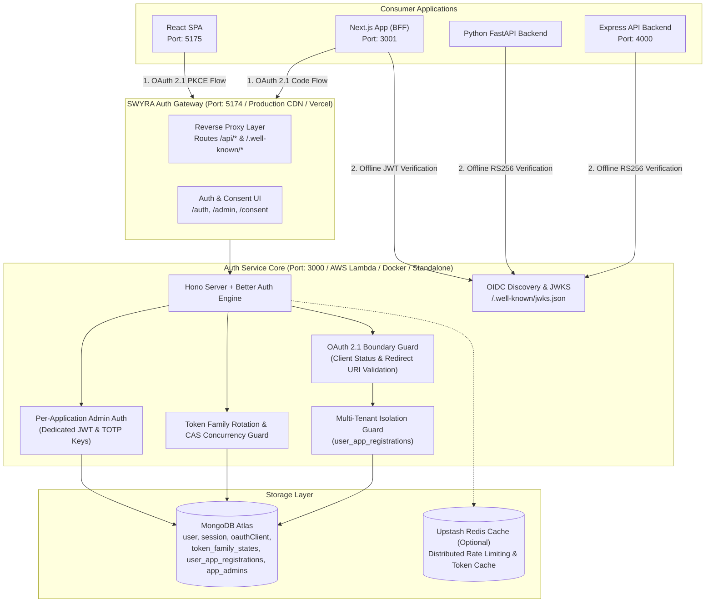

# SWYRA Auth — Self-Hosted OAuth 2.1 / OIDC Identity Provider

> A production-ready, configuration-only OAuth 2.1 / OpenID Connect identity provider you deploy once and own forever — with zero always-on infrastructure costs.

Built with **Hono**, **MongoDB Atlas**, and the **Better Auth** identity engine. Features a high-aesthetic Admin Console for managing OAuth 2.1 clients, dynamic CORS whitelists, private application tenant isolation, token family rotation with atomic CAS concurrency protection, and dedicated Per-Application Administrators with cryptographically isolated JWT verification and built-in TOTP multi-factor authentication.

---

## 🤖 For AI Coding Agents

If you are an AI coding agent (e.g., Google Antigravity, Claude Code, GitHub Copilot, Cursor, Devin) integrating a consumer application with SWYRA Auth, **start here**:

👉 **[AGENTS.md](AGENTS.md)** (Quick Reference)  
👉 **[docs/AI_AGENT_INTEGRATION_CONTRACT.md](docs/AI_AGENT_INTEGRATION_CONTRACT.md)** (Normative Integration Specification)

---

## 🏛️ System Architecture


```mermaid
flowchart TD
    subgraph Clients["Consumer Applications"]
        NextApp["Next.js App (BFF)<br/>Port: 3001"]
        ReactApp["React SPA<br/>Port: 5175"]
        ExpressApp["Express API Backend<br/>Port: 4000"]
        FastAPIApp["Python FastAPI Backend"]
    end

    subgraph Gateway["SWYRA Auth Gateway (Port: 5174 / Production CDN / Vercel)"]
        ViteProxy["Reverse Proxy Layer<br/>Routes /api/* & /.well-known/*"]
        AuthUI["Auth & Consent UI<br/>/auth, /admin, /consent"]
    end

    subgraph Core["Auth Service Core (Port: 3000 / AWS Lambda / Docker / Standalone)"]
        HonoApp["Hono Server + Better Auth Engine"]
        OAuthBoundary["OAuth 2.1 Boundary Guard<br/>(Client Status & Redirect URI Validation)"]
        AppIsolation["Multi-Tenant Isolation Guard<br/>(user_app_registrations)"]
        TokenFamily["Token Family Rotation & CAS Concurrency Guard"]
        AppAdminService["Per-Application Admin Auth<br/>(Dedicated JWT & TOTP Keys)"]
        JWKSEndpoint["OIDC Discovery & JWKS<br/>/.well-known/jwks.json"]
    end

    subgraph Data["Storage Layer"]
        MongoDB[("MongoDB Atlas<br/>user, session, oauthClient,<br/>token_family_states, user_app_registrations, app_admins")]
        Redis[("Upstash Redis Cache (Optional)<br/>Distributed Rate Limiting & Token Cache")]
    end

    NextApp -- "1. OAuth 2.1 Code Flow" --> Gateway
    ReactApp -- "1. OAuth 2.1 PKCE Flow" --> Gateway
    Gateway --> HonoApp
    HonoApp --> OAuthBoundary
    OAuthBoundary --> AppIsolation
    HonoApp --> TokenFamily
    AppIsolation --> MongoDB
    TokenFamily --> MongoDB
    HonoApp --> AppAdminService
    AppAdminService --> MongoDB
    HonoApp -.-> Redis
    ExpressApp -- "2. Offline RS256 Verification" --> JWKSEndpoint
    FastAPIApp -- "2. Offline RS256 Verification" --> JWKSEndpoint
    NextApp -- "2. Offline JWT Verification" --> JWKSEndpoint
```

---

## 🛡️ Core Security Architecture & Boundaries

- **Strict OAuth 2.1 Compliance**: Mandatory PKCE (`code_challenge_method=S256`), exact redirect URI matching, and single-use authorization codes.
- **Protocol Endpoint Integrity**: All authorization code flows target `/api/auth/oauth2/authorize` (never internal UI routes).
- **Token Family Rotation & CAS Concurrency**: Refresh tokens use atomic Compare-And-Swap (CAS) state tracking in MongoDB with a 2-second network grace window, preventing concurrent rotation race conditions and revoking compromised token families on reuse.
- **OAuth Boundary Private-App Isolation**: Validates client status, active state, and user authorization at the OAuth authorization boundary, preventing cross-tenant access.
- **Dedicated Application Administrator Separation**: Per-Application Administrators operate with dedicated, cryptographically isolated signing (`APP_ADMIN_JWT_SECRET`) and encryption (`APP_ADMIN_TOTP_KEY`) keys.
- **Internal Gateway Protection**: Dedicated `INTERNAL_GATEWAY_SECRET` protects internal backend endpoints from external direct invocation.
- **Atomic MFA & Anti-Replay**: Single-use backup code consumption via MongoDB `$pull` with concurrency protection and brute-force rate limiting.
- **Target-Keyed Anti-Credential-Stuffing**: Sliding-window rate limiters keyed by both client IP and normalized target email to survive distributed botnet attacks.

---

## 📚 Documentation Hub

Complete technical documentation, integration contracts, and operational runbooks are located in the [`docs/`](docs/) directory:

| Document | Description |
|---|---|
| 🛡️ **[Canonical Security Specification](docs/SECURITY_CANONICAL.md)** | **Normative standard** and single source of truth for security architecture, gateway trust, and authorization models. |
| 🤖 **[AI Agent Integration Contract](docs/AI_AGENT_INTEGRATION_CONTRACT.md)** | **Normative specification** for AI coding agents and automated integration systems. |
| ⚡ **[AGENTS.md](AGENTS.md)** | Quick-reference cheat sheet for AI agents and developers. |
| 🔌 **[Consumer Integration Guide](docs/INTEGRATION_GUIDE.md)** | Integration recipes for Next.js BFF, React SPA, React + FastAPI, Express, and App Admin auth. |
| 🏛️ **[System Architecture](docs/ARCHITECTURE.md)** | Multi-tenant isolation model, cryptographic token binding, OIDC discovery, and protocol sequence flows. |
| ⚙️ **[Configuration & Environment](docs/CONFIGURATION.md)** | Production security secrets, fail-fast rules, public vs. private app modes, and rate limiting specs. |
| 📋 **[Environment Variables Reference](docs/ENVIRONMENT_VARIABLES.md)** | Complete table of all backend, frontend, and consumer client configuration flags. |
| 🛡️ **[Security & Abuse Defense](docs/SECURITY.md)** | Threat model, rate limiting algorithms, constant-time hashing, test gates, and scope boundaries. |
| 👑 **[Admin Console & App Management](docs/ADMIN_GUIDE.md)** | Registering applications, CORS management, private user assignment, App Admin provisioning, and CLI utilities. |
| 🚀 **[Multi-Cloud Deployment Guide](docs/DEPLOYMENT.md)** | Production deployment runbooks for AWS Lambda (SAM), Linux VPS/EC2, Docker Compose, GCP, Azure, and Vercel. |
| 🔄 **[CI/CD & Auto Deployment](docs/CICD.md)** | Automated GitHub Actions pipelines for AWS Lambda (SAM) and Vercel edge deployment. |
| 🔍 **[Security Investigations Report](docs/SECURITY_INVESTIGATIONS.md)** | *Non-normative / Historical* post-mortem analysis of past consumer integration behaviors. |

---

## ⚡ Quickstart (Local Development)

### 1. Prerequisites
- **Node.js 20+**
- **MongoDB Atlas** database connection string (or local MongoDB instance)
- *(Optional)* **Upstash Redis** credentials for distributed rate limiting

### 2. Configure Backend Environment
```bash
cd backend
cp .env.example .env
# Edit backend/.env with your MONGO_URI, BETTER_AUTH_SECRET, and FRONTEND_URL
npm run db:setup
```

### 3. Start All Services with One Command
From the project root:
```bash
./start-all.sh
```

| Service | Port / URL | Description |
|---|---|---|
| **SWYRA Auth Gateway (Frontend)** | `http://localhost:5174` | Unified Auth UI, Consent Screen, Admin Console, and Reverse Proxy |
| **SWYRA Auth API (Backend)** | `http://localhost:3000` | Hono Core Identity Engine, Token Endpoint, JWKS |
| **Next.js Demo App** | `http://localhost:3001` | Full-stack Next.js 14 App Router OAuth 2.1 client (BFF Pattern) |
| **Express Backend Demo** | `http://localhost:4000` | Resource server with offline RS256 JWKS verification |
| **React Frontend Demo** | `http://localhost:5175` | React SPA client consuming Express protected telemetry |

---

## 🧪 Security Test Suite & Documentation Consistency

SWYRA Auth includes an automated security gate with **14 blocking security test suites** defined in [`docs/security/security-suite-manifest.json`](docs/security/security-suite-manifest.json) executing against the complete production authorization, tenant isolation, CAS rotation, and gateway perimeter models:

```bash
cd backend
# Execute the full 14-suite master security gate
npm run test:all-security

# Execute automated documentation and route manifest consistency verification
npm run security:docs-check
```

---

*Built with [Hono](https://hono.dev), [MongoDB Atlas](https://www.mongodb.com/atlas), and [Better Auth](https://better-auth.com).*
