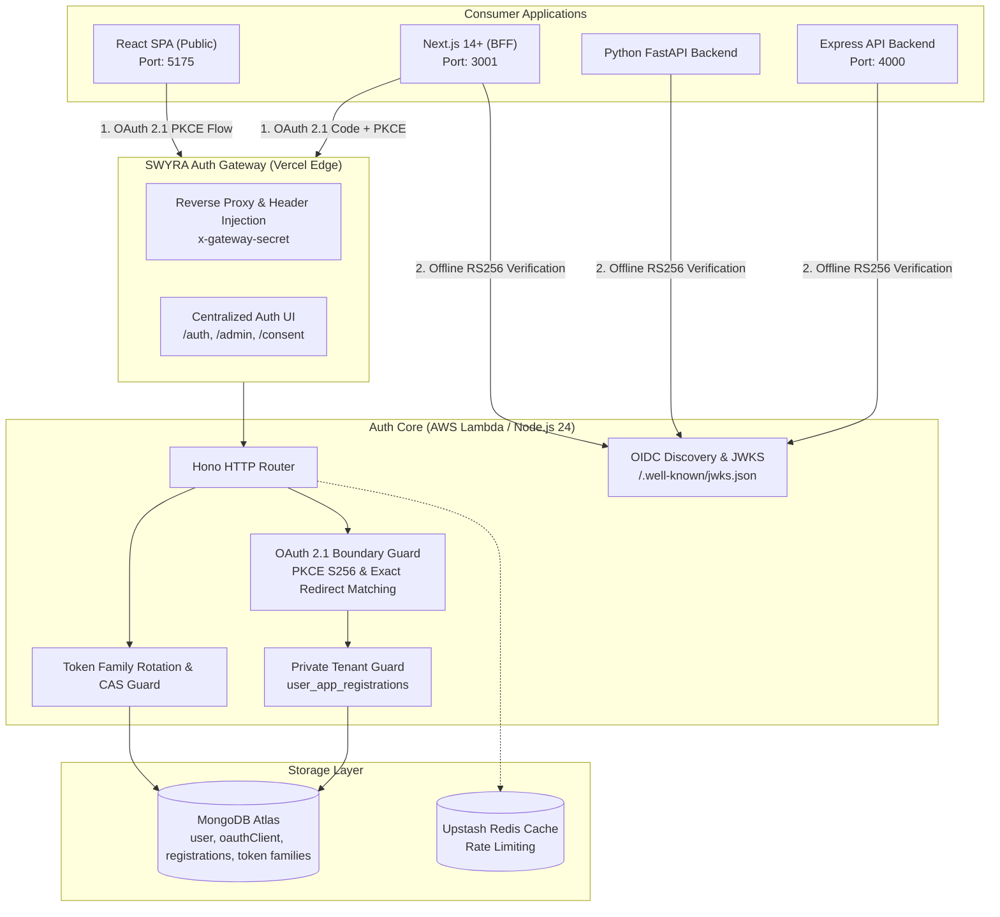

# SWYRA Auth — Self-Hosted OAuth 2.1 / OIDC Identity Provider

> A production-grade, centralized OAuth 2.1 / OpenID Connect identity provider you deploy once and own forever — with zero always-on infrastructure costs.

Built with **Hono**, **MongoDB Atlas**, and the **Better Auth** identity engine. Features a modern Admin Console for managing OAuth 2.1 clients, dynamic CORS whitelists, private application tenant isolation, token family rotation with atomic CAS concurrency protection, and application-scoped administration.

---

## 🤖 For AI Coding Agents & Developers

If you are an AI coding agent (e.g., Google Antigravity, Claude Code, GitHub Copilot, Cursor, Devin) or a human developer integrating a consumer application with SWYRA Auth, **start here**:

👉 **[AGENTS.md](AGENTS.md)** (AI Agent Guidance & Fast Protocol Reference)  
👉 **[docs/INTEGRATION.md](docs/INTEGRATION.md)** (Normative Integration Specification & Framework Recipes)  

---

## 🏛️ System Architecture Overview

All consumer applications—regardless of public access or restricted enterprise multi-tenancy—authenticate users through **ONE centralized protocol**:  
**OAuth 2.1 Authorization Code Flow with PKCE (`S256`).**


```mermaid
flowchart TD
    subgraph Consumers["Consumer Applications"]
        NextApp["Next.js 14+ (BFF)<br/>Port: 3001"]
        ReactApp["React SPA (Public)<br/>Port: 5175"]
        ExpressApp["Express API Backend<br/>Port: 4000"]
        FastAPIApp["Python FastAPI Backend"]
    end

    subgraph Edge["SWYRA Auth Gateway (Vercel Edge)"]
        VercelEdge["Reverse Proxy & Header Injection<br/>x-gateway-secret"]
        AuthUI["Centralized Auth UI<br/>/auth, /admin, /consent"]
    end

    subgraph Core["Auth Core (AWS Lambda / Node.js 24)"]
        HonoApp["Hono HTTP Router"]
        OAuthBoundary["OAuth 2.1 Boundary Guard<br/>PKCE S256 & Exact Redirect Matching"]
        TenantGuard["Private Tenant Guard<br/>user_app_registrations"]
        TokenEngine["Token Family Rotation & CAS Guard"]
        JWKSEngine["OIDC Discovery & JWKS<br/>/.well-known/jwks.json"]
    end

    subgraph Persistence["Storage Layer"]
        MongoDB[("MongoDB Atlas<br/>user, oauthClient, registrations, token families")]
        Redis[("Upstash Redis Cache<br/>Rate Limiting")]
    end

    NextApp -- "1. OAuth 2.1 Code + PKCE" --> Edge
    ReactApp -- "1. OAuth 2.1 PKCE Flow" --> Edge
    Edge --> HonoApp
    HonoApp --> OAuthBoundary
    OAuthBoundary --> TenantGuard
    TenantGuard --> MongoDB
    HonoApp --> TokenEngine
    TokenEngine --> MongoDB
    HonoApp -.-> Redis
    ExpressApp -- "2. Offline RS256 Verification" --> JWKSEngine
    FastAPIApp -- "2. Offline RS256 Verification" --> JWKSEngine
    NextApp -- "2. Offline RS256 Verification" --> JWKSEngine
```

---

## 🛡️ Core Security Architecture & Guarantees

- **Zero In-App Password Handling**: Consumer applications NEVER collect, proxy, transmit, or store IdP user passwords. All credentials terminate at the centralized IdP.
- **Strict OAuth 2.1 Compliance**: Mandatory PKCE (`code_challenge_method=S256`), cryptographically random `state`, exact redirect URI matching, and single-use authorization codes.
- **Private Tenant Isolation (`isPublic = false`)**: Unauthenticated users are sent to the centralized IdP login with sign-up disabled. Authenticated users are verified against `user_app_registrations`. Unassigned users receive HTTP 302 `error=access_denied`.
- **Token Family Rotation with Atomic CAS**: Refresh tokens rotate atomically on every exchange. Replay attacks trigger immediate cascade revocation across the compromised token family.
- **Scoped vs Super Administration**: Application Administrators (`role: "admin"`, `scopedClientId: "<clientId>"`) can only manage their own client; platform operations require Super Admin (`scopedClientId: null`).
- **Gateway Trust Boundary**: Direct external invocation of backend management endpoints is blocked by `x-gateway-secret` perimeter validation.

---

## 📚 Canonical Documentation Hub

The documentation for SWYRA Auth is consolidated into the following canonical specifications in [`docs/`](docs/):

| Canonical Document | Description |
|---|---|
| 🔌 **[docs/INTEGRATION.md](docs/INTEGRATION.md)** | **Authoritative Integration Contract:** The 4 app configurations, zero password relay, flow diagrams, and copy-pasteable recipes for Next.js, React SPA, FastAPI, and Express. |
| 🛡️ **[docs/SECURITY.md](docs/SECURITY.md)** | **Normative Security Architecture:** Trust model, P0 invariants, fail-closed design principles, cryptographic key pinning, and automated security test matrix. |
| 🏛️ **[docs/ARCHITECTURE.md](docs/ARCHITECTURE.md)** | **System Design & Topology:** IdP infrastructure, OAuth 2.1 boundary, multi-tenant isolation, user identity vs app membership, and CAS token rotation engine. |
| ⚙️ **[docs/CONFIGURATION.md](docs/CONFIGURATION.md)** | **Configuration Reference:** Complete reference for IdP server variables, consumer client variables, public vs private flags, and fail-closed environment rules. |
| 🚀 **[docs/DEPLOYMENT.md](docs/DEPLOYMENT.md)** | **Production Deployment Guide:** Deploying AWS Lambda (SAM) and Vercel edge proxy, secret rotation runbooks, and pre-flight checklist. |
| 🔧 **[docs/TROUBLESHOOTING.md](docs/TROUBLESHOOTING.md)** | **Diagnostics & Error Catalog:** Standard OAuth 2.1 machine-readable error codes, common symptoms, safe resolutions, and debugging rules. |

---

## ⚡ Quickstart (Local Development)

### 1. Prerequisites
- Node.js 20+ (Node 24 recommended)
- MongoDB Atlas instance or local replica set

### 2. Installation & Setup
```bash
# Clone repository
git clone https://github.com/SGOD-pro/OAuth2.1.git
cd OAuth2.1

# Install backend & frontend dependencies
cd backend && npm install
cd ../frontend && npm install
cd ..

# Configure backend environment
cp backend/.env.example backend/.env
# Edit backend/.env with your MONGO_URI and secrets
```

### 3. Running Test Suites
```bash
# Execute all 15 automated security and adversarial suites
npm run test:all-security

# Execute documentation consistency linter
npm run security:docs-check

# Execute integration contract linter
npm run security:integration-check
```

---

## 📄 License

MIT © SWYRA Auth Maintainers
