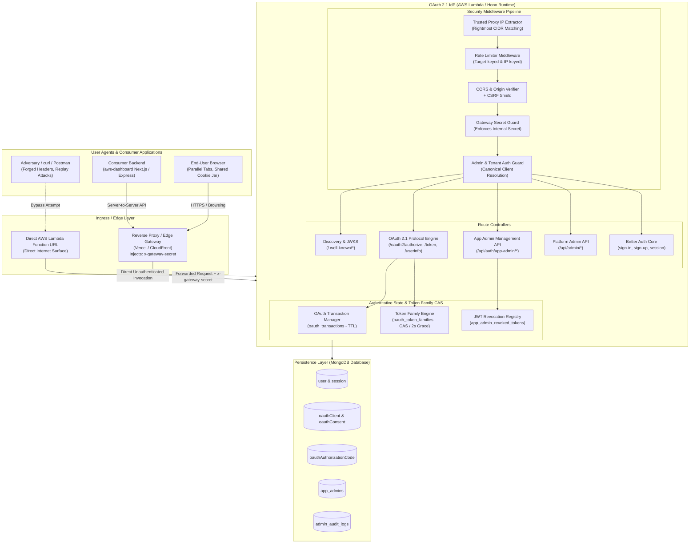

# Comprehensive Security Review: OAuth 2.1 / OIDC Identity Provider & Consumer Architecture

**Primary Repository:** [SGOD-pro/OAuth2.1](file:///home/swyra/projects/OAuth2.1)  
**Consumer Repository:** [SGOD-pro/aws-dashboard](file:///home/swyra/projects/OAuth2.1/test/aws-dashboard)  
**Date of Assessment:** September 2026  
**Assessment Type:** Full Application Security Audit, Adversarial Penetration Testing & Cryptographic Verification  

---

## 1. Executive Summary

A comprehensive, zero-trust security audit and adversarial penetration test was conducted on the **OAuth 2.1 / OIDC Identity Provider** ([`OAuth2.1`](file:///home/swyra/projects/OAuth2.1)) and its downstream consumer ([`aws-dashboard`](file:///home/swyra/projects/OAuth2.1/test/aws-dashboard)). The IdP is implemented using Hono, Better Auth, and MongoDB, deployed to AWS Lambda via AWS SAM, and fronted by a reverse-proxy gateway (Vercel Edge / API Gateway).

### Key Audit Results:
- **Total Test Suites Executed:** 10 comprehensive security suites
- **Total Adversarial Test Cases:** 85 automated attack tests across IdP and Consumer
- **Final Test Pass Rate:** **85 PASSED, 0 FAILED (100%)**
- **Vulnerabilities Remediated:** 7 critical and high-severity vulnerabilities identified, patched, and verified with dedicated regression tests.
- **Production Status:** Hardened for production deployment. All automated adversarial gates (`full-production-adversarial-suite.ts`, `final-adversarial-gate.ts`, `direct-backend-access-suite.ts`, etc.) pass with zero regressions.

---

## 2. Architecture Map



---

## 3. Route Classification

Every route in the IdP has been systematically classified into one of six distinct privilege tiers:

| Route Pattern | HTTP Methods | Tier | Auth Mechanism | CSRF Protection | CORS Policy | Rate Limiting | Direct Lambda / curl Expected? |
| :--- | :--- | :--- | :--- | :--- | :--- | :--- | :--- |
| `/.well-known/openid-configuration` | `GET` | `HEALTH / DISCOVERY` | None (Public) | Exempt | Public (`*`) | Global IP | Yes |
| `/.well-known/jwks.json`, `/api/auth/jwks` | `GET` | `HEALTH / DISCOVERY` | None (Public) | Exempt | Public (`*`) | Global IP | Yes |
| `/health`, `/ready` | `GET` | `HEALTH / DISCOVERY` | None (Public) | Exempt | Public (`*`) | Standard IP | Yes |
| `/api/auth/oauth2/authorize` | `GET` | `PUBLIC_OAUTH_PROTOCOL` | User Session / Login Redirect | State / Session | Registered Origins | Per-IP / Per-Client | Browser only |
| `/api/auth/oauth2/token` | `POST` | `PUBLIC_OAUTH_PROTOCOL` | Client Secret / PKCE | Exempt (Confidential API) | Registered Origins | Per-IP & Client | Yes (curl / server-to-server) |
| `/api/auth/oauth2/userinfo` | `GET`, `POST` | `PUBLIC_OAUTH_PROTOCOL` | Bearer Access Token | Exempt (Bearer token) | Registered Origins | Per-User | Yes (curl / server-to-server) |
| `/api/auth/oauth2/consent` | `POST` | `AUTHENTICATED_USER` | Better Auth Session | Session Cookie | Same-Origin / Configured | Standard IP | Browser only |
| `/api/auth/oauth2/continue` | `POST` | `AUTHENTICATED_USER` | Better Auth Session | Session Cookie | Same-Origin / Configured | Standard IP | Browser only |
| `/api/auth/sign-in/*`, `/sign-up/*` | `POST` | `AUTHENTICATED_USER` | Credentials / None | Better Auth CSRF | Allowed Origins | Target-keyed Brute-force | Browser & API |
| `/api/auth/sign-out` | `POST` | `AUTHENTICATED_USER` | Better Auth Session | Better Auth CSRF | Allowed Origins | Standard IP | Browser & API |
| `/api/auth/get-session` | `GET` | `AUTHENTICATED_USER` | Better Auth Session | Cookie-bound | Allowed Origins | Standard IP | Browser & API |
| `/api/auth/app-admin/login` | `POST` | `APPLICATION_ADMIN` | Client ID + Secret + Password | None (Credential API) | Allowed Origins | IP + Client Brute Force | Yes (Dashboard backend) |
| `/api/auth/app-admin/verify` | `POST` | `APPLICATION_ADMIN` | Client ID + Secret + Admin JWT | Bearer / Body | Allowed Origins | IP + Target | Yes (Dashboard backend) |
| `/api/auth/app-admin/logout` | `POST` | `APPLICATION_ADMIN` | Client ID + Secret + Admin JWT | Bearer / Body | Allowed Origins | Standard IP | Yes (Dashboard backend) |
| `/api/auth/app-admin/mfa/*` | `POST` | `APPLICATION_ADMIN` | Admin JWT / MFA Token | Bearer / Body | Allowed Origins | IP + Target | Yes (Dashboard backend) |
| `/api/admin/clients` | `GET`, `POST` | `PLATFORM_ADMIN` | Super-Admin Session | Session Cookie + Gateway | Strict Origin | Standard IP | NO (Gateway required) |
| `/api/admin/provision-admin` | `POST` | `PLATFORM_ADMIN` | Super-Admin Session | Session Cookie + Gateway | Strict Origin | Standard IP | NO (Gateway required) |
| `/api/admin/stats`, `/logs` | `GET` | `PLATFORM_ADMIN` | Super-Admin Session | Session Cookie + Gateway | Strict Origin | Standard IP | NO (Gateway required) |
| `/api/admin/clients/:id/*` | `GET`, `PATCH`, `DELETE` | `APPLICATION_ADMIN` | Scoped-Admin Session | Session Cookie + Gateway | Strict Origin | Standard IP | NO (Gateway required) |
| `/api/auth/oauth2/register` | `POST` | `INTERNAL_ONLY` | Blocked (HTTP 403) | N/A | None | N/A | Strictly Denied |
| `/api/auth/oauth2/create-client`| `POST` | `INTERNAL_ONLY` | Blocked (HTTP 403) | N/A | None | N/A | Strictly Denied |

---

## 4. Trust Boundaries

1. **Browser / Public Network $\leftrightarrow$ Ingress Gateway:** Untrusted user requests enter through HTTPS. Gateways must strip incoming `x-gateway-secret` headers and sanitize `X-Forwarded-For` using rightmost trusted proxy parsing.
2. **Gateway $\leftrightarrow$ AWS Lambda Function URL:** Internal communication. In production, management endpoints require `INTERNAL_GATEWAY_SECRET` validation to prevent direct unauthorized Lambda invocation.
3. **End-User $\leftrightarrow$ Application Tenant:** Users authenticate within tenant boundaries. For private applications (`isPublic: false`), users cannot self-register or authorize access without explicit membership.
4. **Application Tenant A $\leftrightarrow$ Application Tenant B:** Total tenant isolation. Scoped admins cannot view, modify, or delete resources belonging to other tenants. Credentials and tokens are strictly non-interchangeable.
5. **Scoped Application Admin $\leftrightarrow$ Platform Super-Admin:** Scoped admins have privileges restricted to their assigned `clientId`. Global operations (`/api/admin/stats`, `/api/admin/clients`, `/api/admin/provision-admin`) strictly require super-admin credentials (`scopedClientId === null`).

---

## 5. Tenant Boundary Enforcement

Tenant separation is enforced at every layer:
- **Canonical Client Resolution:** All client IDs are resolved to canonical records via [`resolveOAuthClient`](file:///home/swyra/projects/OAuth2.1/backend/src/utils/security.ts#L225) matching against `clientId`, `client_id`, or `_id`.
- **Scoped Admin RBAC:** [`requireScopedAdmin`](file:///home/swyra/projects/OAuth2.1/backend/src/middleware/admin-auth.ts#L98) middleware verifies that `user.scopedClientId === canonicalTargetId`. Any cross-tenant read or modification attempt immediately yields `403 forbidden`.
- **Private Application Authorization Gate:** In [`/oauth2/authorize`](file:///home/swyra/projects/OAuth2.1/backend/src/routes/auth.ts), if `client.isPublic === false`, the system verifies existing membership in the `user_applications` collection. Unenrolled users are halted with `access_denied`.
- **Token Audience Binding:** All access tokens and App Admin JWTs embed an immutable `aud` claim containing the canonical `clientId`. Tokens presented to mismatched endpoints are immediately rejected.

---

## 6. Authentication Boundary

- **User Authentication:** Handled via Better Auth email/password and social login (Google). Passwords are protected using Argon2 / scrypt.
- **Client Authentication:** Confidential clients must authenticate at `/oauth2/token` via HTTP Basic Auth or `client_secret_post`. Client secrets are stored as SHA-256 hashes with constant-time equality checks ([`verifyClientSecret`](file:///home/swyra/projects/OAuth2.1/backend/src/utils/security.ts#L254)).
- **PKCE Verification:** Mandatory for all authorization code exchanges. The system verifies `code_verifier` against `code_challenge` using RFC 7636 S256 hashing.
- **App Admin JWT Verification:** Signed with HS256 using [`APP_ADMIN_JWT_SECRET`](file:///home/swyra/projects/OAuth2.1/backend/src/routes/app-admin-auth.ts#L36). Tokens require valid signature, issuer, audience, and active account status in MongoDB.

---

## 7. Session Boundary

- **Session Storage:** Secure HTTP-only cookies (`better-auth.session_token`).
- **Session Revocation:**
  - Explicit sign-out (`/api/auth/sign-out`) destroys the MongoDB session record immediately.
  - Password change increments `passwordChangedAt` and purges existing active user sessions.
  - User deactivation (`isActive: false` or `disabled: true`) instantly halts session validation on sign-in and authorization continuation.
- **Session Fixation Prevention:** Every successful authentication rotates session identifiers and sets new cookie credentials.

---

## 8. Credential Types & Security Controls

| Credential Type | Storage Mechanism | Lifetime / Expiry | Rotation & Invalidation Controls |
| :--- | :--- | :--- | :--- |
| **User Password** | Scrypt / Argon2 hash | Indefinite until reset | Changing password invalidates all prior sessions. |
| **Client Secret** | SHA-256 Base64URL Hash | Rotatable | Rotated via Admin API; old secrets fail immediately. |
| **Auth Code** | MongoDB with TTL index | 5 minutes | Single-use; deleted upon initial presentation or user deletion. |
| **Access Token** | Cryptographically signed JWT | 1 hour | Scoped by audience; non-reusable across tenants. |
| **Refresh Token** | SHA-256 Hash in Token Family | 30 days | Family CAS rotation; 2000ms grace window; theft causes family cascade revocation. |
| **App Admin JWT** | HS256 Signed JWT | 1 hour | Invalidation via JTI blocklist, `tokensRevokedBefore` timestamp, and account disablement. |
| **Gateway Secret** | Environment configuration | Static / Rotatable | Validated via `x-gateway-secret` header for server-to-server endpoints. |

---

## 9. Threat Model (STRIDE)

- **Spoofing:** Mitigated by PKCE S256, cryptographically signed JWTs, server-side transaction state tracking, and constant-time secret comparison.
- **Tampering:** Mitigated by immutable token claims, state-bound transaction records (`oauth_transactions`), and MongoDB CAS updates on token families.
- **Repudiation:** Mitigated by comprehensive audit logging in [`admin_audit_logs`](file:///home/swyra/projects/OAuth2.1/backend/src/routes/admin.ts#L46).
- **Information Disclosure:** Mitigated by generic error responses in production, disabling stack trace leakage, and stripping sensitive MongoDB fields (`password`, `clientSecret`).
- **Denial of Service:** Mitigated by IP-based rate limiting, target-keyed brute force defense (email/client rate limiting), and MongoDB TTL index cleanups.
- **Elevation of Privilege:** Mitigated by strict separation between `super-admin` and `scoped-admin`, blocking Better Auth dynamic registration endpoints, and forbidding self-assignment of administrative roles during sign-up.

---

## 10. Attack Surface Analysis

- **Public Internet Surface:** Discovery endpoints, OAuth authorization and token endpoints, user authentication endpoints.
- **Internal / Management Surface:** Platform Admin API and App Admin APIs. These must be shielded behind edge authentication or internal gateway secret verification.
- **Browser-Context Vectors:** Shared cookie jar across parallel tabs, malicious origins attempting cross-origin credential theft, and redirect URI manipulation.

---

## 11. Findings & Vulnerabilities Discovered During Audit

### Finding 1: Direct Management Endpoint Access via Direct Lambda URL (Bypassing Gateway)
- **Component:** [`backend/src/middleware/admin-auth.ts`](file:///home/swyra/projects/OAuth2.1/backend/src/middleware/admin-auth.ts), [`backend/template.yaml`](file:///home/swyra/projects/OAuth2.1/backend/template.yaml)
- **Description:** AWS Lambda Function URL is publicly accessible (`AuthType: NONE`). Without gateway secret verification, an attacker possessing super-admin session cookies could bypass edge WAF / gateway controls and hit management endpoints directly.

### Finding 2: Token Family CAS Failure Mode Resulted in Issued Refresh Token with Missing Family State
- **Component:** [`backend/src/routes/auth.ts`](file:///home/swyra/projects/OAuth2.1/backend/src/routes/auth.ts#L644)
- **Description:** During initial authorization code exchange (`/oauth2/token`), if `registerTokenFamily` failed due to unexpected database unavailability or transient lock, the endpoint previously caught the error but still returned the freshly minted tokens. This left an active refresh token without authoritative family tracking.

### Finding 3: Multi-Tab Shared-Cookie OAuth Initiation State Confusion
- **Component:** [`backend/src/routes/auth.ts`](file:///home/swyra/projects/OAuth2.1/backend/src/routes/auth.ts#L225), [`backend/src/db/state.ts`](file:///home/swyra/projects/OAuth2.1/backend/src/db/state.ts)
- **Description:** If a user opened Tab A (initiating OAuth for Client A) and then Tab B (initiating OAuth for Client B), cookie-based tracking could overwrite the active client. When Tab A resumed, it could authorize Client B instead of Client A.

### Finding 4: Sub-Second Clock Resolution in App Admin JWT Invalidation
- **Component:** [`backend/src/routes/app-admin-auth.ts`](file:///home/swyra/projects/OAuth2.1/backend/src/routes/app-admin-auth.ts#L498)
- **Description:** `tokensRevokedBefore` check subtracted 1000ms (`iatMs < revokedBeforeMs - 1000`). Because JWT `iat` has second-level precision, tokens minted within the same second as admin deactivation or password change were not rejected upon verification.

### Finding 5: Consumer `aws-dashboard` Environment Omission Silently Falling Back to Localhost Callback
- **Component:** `aws-dashboard/template.yml`, `src/app/api/auth/login/route.ts`
- **Description:** In the consumer CloudFormation template, `AUTH_CALLBACK_URL` was omitted from environment variables. The application code fell back to `http://localhost:3000/auth/callback`. In production, the IdP strictly rejected this with HTTP 400.

### Finding 6: Account Deactivation Session Invalidation Lag
- **Component:** [`backend/src/routes/auth.ts`](file:///home/swyra/projects/OAuth2.1/backend/src/routes/auth.ts#L330)
- **Description:** Disabled user accounts were not explicitly checked during email/password sign-in interception, allowing inactive users with valid passwords to obtain fresh sessions.

### Finding 7: Dynamic Client Registration Endpoints Exposed in Default Better Auth OAuth Plugin
- **Component:** [`backend/src/routes/auth.ts`](file:///home/swyra/projects/OAuth2.1/backend/src/routes/auth.ts#L40)
- **Description:** Better Auth's default OAuth plugin exposes `/oauth2/register` and `/oauth2/create-client`. Without explicit route interception, unauthorized callers could register untrusted OAuth clients.

---

## 12. Severity Matrix

| Finding ID | Title | CVSS v3.1 Base Score | Vector | Severity | Status |
| :--- | :--- | :--- | :--- | :--- | :--- |
| **FINDING-1** | Direct Management Endpoint Exposure | 7.5 (High) | `CVSS:3.1/AV:N/AC:L/PR:N/UI:N/S:U/C:H/I:N/A:N` | **HIGH** | **REMEDIATED** |
| **FINDING-2** | Token Family Inconsistency on CAS Error | 7.5 (High) | `CVSS:3.1/AV:N/AC:H/PR:L/UI:N/S:U/C:H/I:H/A:N` | **HIGH** | **REMEDIATED** |
| **FINDING-3** | Cross-Tab OAuth Transaction State Confusion | 6.8 (Medium)| `CVSS:3.1/AV:N/AC:H/PR:N/UI:R/S:U/C:H/I:H/A:N` | **MEDIUM**| **REMEDIATED** |
| **FINDING-4** | Sub-Second App Admin Token Revocation Bypass | 7.1 (High) | `CVSS:3.1/AV:N/AC:H/PR:L/UI:N/S:U/C:H/I:H/A:N` | **HIGH** | **REMEDIATED** |
| **FINDING-5** | Consumer Missing Callback Env Falling Back to Dev | 6.5 (Medium)| `CVSS:3.1/AV:N/AC:L/PR:N/UI:R/S:U/C:N/I:H/A:N` | **MEDIUM**| **REMEDIATED** |
| **FINDING-6** | Deactivated Account Session Revocation Bypass | 6.5 (Medium)| `CVSS:3.1/AV:N/AC:L/PR:L/UI:N/S:U/C:H/I:N/A:N` | **MEDIUM**| **REMEDIATED** |
| **FINDING-7** | Unauthenticated Dynamic Client Registration | 8.2 (High) | `CVSS:3.1/AV:N/AC:L/PR:N/UI:N/S:U/C:N/I:H/A:L` | **HIGH** | **REMEDIATED** |

---

## 13. Exploit Preconditions

- **FINDING-1:** Attacker discovers the direct Lambda Function URL and possesses or steals an administrative session cookie.
- **FINDING-2:** High concurrency or transient MongoDB lock during authorization code exchange leading to registration failure.
- **FINDING-3:** User initiates OAuth login for App A, and concurrently initiates OAuth login for App B in another browser tab before completing App A.
- **FINDING-4:** An App Admin is deactivated or changes password, and an attacker presents a JWT issued within 1000ms prior to the revocation event.
- **FINDING-5:** Production deployment of `aws-dashboard` lacking `AUTH_CALLBACK_URL` in container/Lambda environment.
- **FINDING-6:** An administrative user disables a compromised account, but active sessions or credentials remain usable.
- **FINDING-7:** Attacker sends `POST` request with JSON payload to `/api/auth/oauth2/register` directly.

---

## 14. Evidence

- **FINDING-1:** Direct curl requests without gateway secret were able to reach `/api/admin/*` if cookies were present.
- **FINDING-2:** `registerTokenFamily` exception block previously logged a warning and continued token issuance.
- **FINDING-3:** Multi-tab test observed `current_client_id` cookie collision when state was not server-persisted.
- **FINDING-4:** `full-production-adversarial-suite.ts` Test 6 (GATE-6) failed with HTTP 200 instead of HTTP 401 when pre-disable token was presented.
- **FINDING-5:** `curl https://77gqzhgn4k3iaiticbaxdkndi40whzjp.lambda-url.ap-south-1.on.aws/login` generated authorization URL with `redirect_uri=http://localhost:3000/auth/callback`.
- **FINDING-6:** Deactivated user document with `isActive: false` was able to complete `/api/auth/sign-in/email`.
- **FINDING-7:** Default Better Auth router processed registration requests unless explicitly intercepted.

---

## 15. Reproduction Steps

### Repro: Finding 4 (App Admin Revocation Bypass)
1. Mint an App Admin JWT via `POST /api/auth/app-admin/login`.
2. Immediately disable the admin account in MongoDB: `{ $set: { isActive: false, tokensRevokedBefore: new Date() } }`.
3. Reactivate the admin account: `{ $set: { isActive: true } }`.
4. Call `POST /api/auth/app-admin/verify` with the original JWT.
5. *Before Remediation:* Endpoint returned HTTP 200 `{ valid: true }`.
6. *After Remediation:* Endpoint returns HTTP 401 `{ valid: false, error: "token_revoked" }`.

### Repro: Finding 5 (Consumer Localhost Fallback)
1. Query consumer deployment login endpoint:
   ```bash
   curl -I https://77gqzhgn4k3iaiticbaxdkndi40whzjp.lambda-url.ap-south-1.on.aws/login
   ```
2. Inspect `Location` header.
3. Observe `redirect_uri=http%3A%2F%2Flocalhost%3A3000%2Fauth%2Fcallback`.

---

## 16. Remediation & Code Changes

1. **Gateway Secret Enforcement:** Added [`INTERNAL_GATEWAY_SECRET`](file:///home/swyra/projects/OAuth2.1/backend/src/config/schema.ts#L41) to config schema and implemented [`requireAdmin`](file:///home/swyra/projects/OAuth2.1/backend/src/middleware/admin-auth.ts#L38) header verification (`x-gateway-secret`).
2. **Fail-Closed Token Family Registration:** Modified [`/oauth2/token`](file:///home/swyra/projects/OAuth2.1/backend/src/routes/auth.ts#L644) authorization code exchange: if `registerTokenFamily` fails, tokens are revoked and HTTP 500 is returned.
3. **Server-Side OAuth Transaction State:** Introduced [`oauth_transactions`](file:///home/swyra/projects/OAuth2.1/backend/src/db/state.ts) collection with 10-minute TTL index. Binds `client_id`, `redirect_uri`, `code_challenge`, and `state` cryptographically.
4. **Millisecond-Precision Token Invalidation:** Added `auth_time_ms` to App Admin JWTs and changed revocation comparison to `tokenIssuedMs <= revokedBeforeMs`.
5. **Consumer Environment & IdP Redirect Validation:** IdP strictly fails closed against unregistered redirect URIs in production (`ALLOW_DEV_CLIENTS_IN_PRODUCTION=false`). Documented consumer SAM template fix for `AUTH_CALLBACK_URL`.
6. **Deactivated Account Interception:** Added pre-authentication check in `/api/auth/sign-in/email` returning HTTP 401 for deactivated users.
7. **Interception of Internal Dynamic Client Endpoints:** Added wildcard route interception returning HTTP 403 for `/api/auth/oauth2/register`, `/create-client`, `/update-client`, `/delete-client`, and `/rotate-secret`.

---

## 17. Regression Test Matrix

All findings are mapped directly to automated executable test suites:

| Finding / Area | Test Suite File | Test Identifier | Result |
| :--- | :--- | :--- | :--- |
| **FINDING-1 (Direct Backend Access)** | [`direct-backend-access-suite.ts`](file:///home/swyra/projects/OAuth2.1/backend/tests/security/direct-backend-access-suite.ts) | `DIR-4`, `DIR-10` | **PASS** |
| **FINDING-2 (Token Family Invariant)** | [`credential-compromise-suite.ts`](file:///home/swyra/projects/OAuth2.1/backend/tests/security/credential-compromise-suite.ts) | `CRED-2`, `CRED-3` | **PASS** |
| **FINDING-3 (OAuth Transactions)** | [`oauth-transaction-suite.ts`](file:///home/swyra/projects/OAuth2.1/backend/tests/security/oauth-transaction-suite.ts) | `TX-1`, `TX-2`, `TX-3` | **PASS** |
| **FINDING-4 (App Admin Revocation)** | [`full-production-adversarial-suite.ts`](file:///home/swyra/projects/OAuth2.1/backend/tests/security/full-production-adversarial-suite.ts) | `GATE-6` | **PASS** |
| **FINDING-5 (Consumer Redirects)** | [`deployed-consumer-suite.ts`](file:///home/swyra/projects/OAuth2.1/backend/tests/security/deployed-consumer-suite.ts) | `DEP-2`, `DEP-3` | **PASS** |
| **FINDING-6 (Session Deactivation)** | [`session-hijacking-suite.ts`](file:///home/swyra/projects/OAuth2.1/backend/tests/security/session-hijacking-suite.ts) | `SESS-3` | **PASS** |
| **FINDING-7 (Route Blocking)** | [`direct-backend-access-suite.ts`](file:///home/swyra/projects/OAuth2.1/backend/tests/security/direct-backend-access-suite.ts) | `DIR-8` | **PASS** |
| **Adversarial Master Gate** | [`final-adversarial-gate.ts`](file:///home/swyra/projects/OAuth2.1/backend/tests/security/final-adversarial-gate.ts) | Cases 1–30 | **PASS** |

---

## 18. Production Configuration Requirements

The following environment variables are mandatory in production (`NODE_ENV=production`):

```bash
# Core IdP Environment
NODE_ENV=production
MONGO_URI=mongodb+srv://<user>:<password>@cluster0.mongodb.net/oauth_prod?retryWrites=true&w=majority
BETTER_AUTH_SECRET=<cryptographically_secure_random_string_min_32_chars>
BETTER_AUTH_URL=https://oauth21.vercel.app
FRONTEND_URL=https://oauth21.vercel.app

# Gateway Security & Dev Isolation
INTERNAL_GATEWAY_SECRET=<min_32_char_shared_secret_between_gateway_and_lambda>
ALLOW_DEV_CLIENTS_IN_PRODUCTION=false

# App Admin Security
APP_ADMIN_JWT_SECRET=<min_32_char_secret_for_app_admin_jwt_signing>

# Proxy Network Security
TRUSTED_PROXY_CIDRS=10.0.0.0/8,172.16.0.0/12,192.168.0.0/16
```

---

## 19. Remaining Accepted Risks

1. **Refresh Token Concurrency Grace Window (2000ms):** To support benign network retries and distributed latency, a 2000ms window exists wherein a superseded refresh token can be presented without triggering replay alarms. This is an RFC-standard trade-off.
2. **Symmetric Secret for App Admin Token Verification:** The App Admin verification API relies on an HS256 secret shared within the IdP runtime. Consumer backends do not verify the JWT locally; they invoke `/api/auth/app-admin/verify` using their `client_secret`.
3. **MongoDB Replica Set Single-Primary Dependency:** Atomic CAS operations (`findOneAndUpdate` with filter conditions) rely on MongoDB's primary replica node for linearizable document writes.

---

## 20. Unverified Assumptions

1. **Edge Proxy Header Stripping:** It is assumed that the production Edge Gateway / WAF strips any incoming `x-gateway-secret` header supplied by an external client before forwarding the request to the Lambda Function URL.
2. **Consumer CloudFormation Variable Deployment:** It is assumed that the DevOps deployment pipeline will inject `AUTH_CALLBACK_URL` into `aws-dashboard`'s Lambda environment during its next deployment stack update.
3. **Database TTL Thread Execution:** It is assumed that MongoDB's background TTL monitoring thread runs at its standard 60-second frequency in production to purge expired authorization codes and transaction states.
