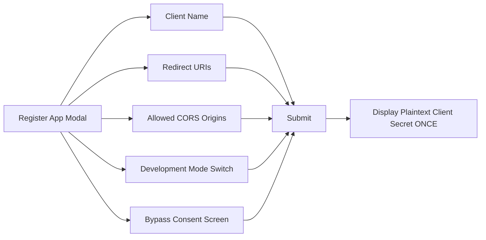
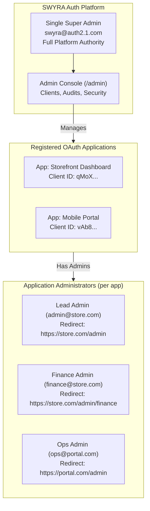

# Admin Console & Application Management Guide

The SWYRA Auth Admin Console provides an interface for registering OAuth 2.1 applications, managing allowed CORS origins, assigning scoped administrators, and monitoring real-time authentication events.

---

## 1. Accessing the Admin Console

- **Admin Login Route**: `/admin/login`
- **Dashboard Overview**: `/admin/dashboard`
- **Clients Registry**: `/admin/clients`
- **Audit Logs**: `/admin/logs`
- **Security & 2FA Settings**: `/admin/security`

---

## 2. Registering an Application (`RegisterAppModal`)

To create an OAuth 2.1 client, navigate to **Client Applications** $\rightarrow$ **Register Application**:

### Key Registration Fields:

1. **Client Name**: Human-readable identifier for your consumer application.
2. **Redirect URIs**: Callback routes whitelisted to receive authorization codes (e.g., `https://app.domain.com/api/auth/callback`).
3. **Allowed CORS Origins**: Web origins permitted to make cross-origin token requests (e.g., `https://app.domain.com`).
4. **Public Application Mode (`isPublic` / `is_public`)**:
   - **Public Mode (default)**: Any registered platform user can sign into the application.
   - **Private Mode**: Restricts application access to only users who are explicitly authorized and assigned to this specific application by an administrator. Self-registration for private applications is disabled (`403 registration_disabled`).
5. **Development Mode (`isDev` / `is_dev`)**:
   - **Switch ON**: Permits loopback hosts (`http://localhost:*`, `http://127.0.0.1:*`) for local testing while still strictly blocking intranet/private IPs against SSRF.
   - **Switch OFF**: Enforces strict `https://` across all hosts in production.
6. **Bypass Consent Screen**: Skips scope approval screen for trusted internal applications.

> [!IMPORTANT]
> **Plaintext Secret Rule**: The client secret is only returned **once** in the creation response. Copy it immediately and place it in the consumer backend `.env` file. It cannot be retrieved later because it is stored hashed in MongoDB.

---

## 3. Editing Application Settings (`EditAppModal`)

Existing clients can be modified at any time by clicking **Edit Config** on the client row:

- **Update Redirect URIs**: Add or remove callback URLs.
- **Update Allowed CORS Origins**: Add or remove permitted front-end origins (updates the active CORS whitelist cache automatically).
- **Toggle Public / Private Mode**: Change application between public multi-user mode and private isolated mode.
- **Toggle Development Mode**: Enable or disable loopback allowances.
- **Toggle Application Active**: Disabling a client instantly revokes all active access tokens, refresh tokens, authorization codes, and token families.

---

## 3.1 Managing Users in Private Applications

When an application is set to **Private Mode**, users must be explicitly granted access to sign in:

- **List Users**: `GET /api/admin/clients/:clientId/users` displays all platform users who currently have access.
- **Assign User**: `POST /api/admin/clients/:clientId/users` grants access to an existing platform user by email (`{ "email": "employee@company.com" }`).
- **Revoke User**: `DELETE /api/admin/clients/:clientId/users/:userId` immediately removes access. Attempts to sign in will receive `403 access_denied`.

---

## 4. Administrator Architecture & Per-Application Admins

SWYRA Auth implements a strict separation of administrative boundaries:

### 1. Platform Super Administrator
The SWYRA Auth IdP has **exactly one** Super Admin account (`role: "admin"`). The Super Admin has global control:
- Registering, updating, and deleting OAuth 2.1 client applications.
- Configuring allowed CORS origins and redirect URIs.
- Managing and provisioning per-application administrators.
- Monitoring security audit logs and configuring platform 2FA.

### 2. Application Administrators (`AppAdminManager`)
Each registered application can have multiple dedicated application administrators. These accounts are strictly for administering the **consumer application's own admin dashboard**, never the SWYRA Auth platform console.

#### Adding an Application Administrator:
1. Navigate to **Applications** (`/admin/clients`).
2. Click on the registered application's row to expand the detail drawer.
3. In the **Application Administrators** section, click **+ Add Admin**.
4. Fill in the required fields:
   - **Name / Title**: Human-readable name or role (e.g. `Security Lead`).
   - **Email Address**: Administrator's login email.
   - **Redirect URL**: The consumer app's administrative destination (e.g., `https://app.domain.com/admin/dashboard`).
   - **Password**: Strong password (minimum 12 characters, including uppercase, lowercase, number, and special symbol).
5. **Origin Matching & Quick-Fill**:
   - The Redirect URL's origin must match one of the application's registered **Allowed Origins** or **Redirect URIs** (or loopback in Development Mode).
   - The console provides **Quick-Fill Suggestion Pills** based on the registered origins. Click any pill to automatically format the redirect URL.

#### Managing Admins (Full CRUD):
- **Edit**: Update name, email, redirect URL, toggle active/inactive status, or update password (optional).
- **Delete**: Revokes the administrator with a confirmation modal.
- **Two-Factor Authentication (MFA)**: Status badges display `2FA Active` (emerald) or `2FA Off` (neutral) for every administrator.
- **Telemetry**: Real-time visibility into **Login Count**, **Last Login Date**, **2FA Status**, and **Active Status**.

---

## 5. Audit Logging & Security Tracking

All administrative actions produce immutable audit entries stored in the `admin_audit` collection:
- Client creation, modification, and deletion
- Admin provisioning and role changes
- Origin cache invalidation triggers
- IP address, actor user ID, and timestamp capture
