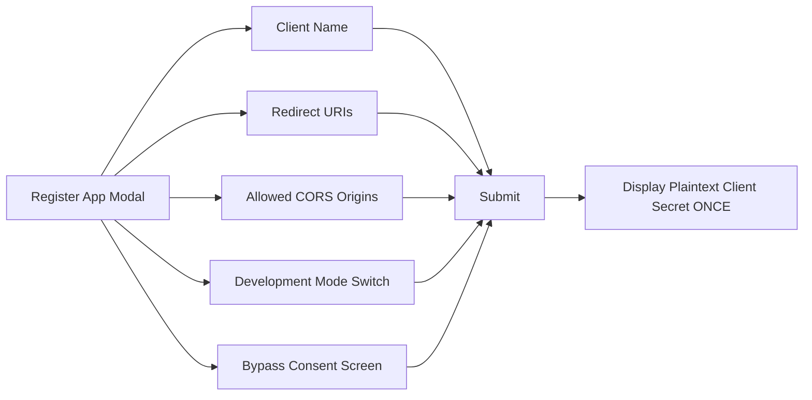

# Admin Console & Application Management Guide

The SWYRA Auth Admin Console provides an interface for registering OAuth 2.1 applications, managing allowed CORS origins, assigning scoped administrators, and monitoring real-time authentication events.

---

## 1. Accessing the Admin Console

- **Admin Login Route**: `/admin/login`
- **Dashboard Overview**: `/admin/dashboard`
- **Clients Registry**: `/admin/clients`
- **Audit Logs**: `/admin/logs`
- **Security & 2FA Settings**: `/admin/security`

---

## 2. Registering an Application (`RegisterAppModal`)

To create an OAuth 2.1 client, navigate to **Client Applications** $\rightarrow$ **Register Application**:



### Key Registration Fields:

1. **Client Name**: Human-readable identifier for your consumer application.
2. **Redirect URIs**: Callback routes whitelisted to receive authorization codes (e.g., `https://app.domain.com/api/auth/callback`).
3. **Allowed CORS Origins**: Web origins permitted to make cross-origin token requests (e.g., `https://app.domain.com`).
4. **Development Mode (`isDev` / `is_dev`)**:
   - **Switch ON**: Permits loopback hosts (`http://localhost:*`, `http://127.0.0.1:*`) for local testing while still strictly blocking intranet/private IPs against SSRF.
   - **Switch OFF**: Enforces strict `https://` across all hosts in production.
5. **Bypass Consent Screen**: Skips scope approval screen for trusted internal applications.

> [!IMPORTANT]
> **Plaintext Secret Rule**: The client secret is only returned **once** in the creation response. Copy it immediately and place it in the consumer backend `.env` file. It cannot be retrieved later because it is stored hashed in MongoDB.

---

## 3. Editing Application Settings (`EditAppModal`)

Existing clients can be modified at any time by clicking **Edit Config** on the client row:

- **Update Redirect URIs**: Add or remove callback URLs.
- **Update Allowed CORS Origins**: Add or remove permitted front-end origins (updates the active CORS whitelist cache automatically).
- **Toggle Development Mode**: Enable or disable loopback allowances.
- **Toggle Application Active**: Disabling a client instantly revokes all active access tokens, refresh tokens, authorization codes, and token families.

---

## 4. Administrator Role Hierarchy

| Role | Scope | Capabilities |
|---|---|---|
| **Super Admin** (`role: "super_admin"`) | Global | Register/delete OAuth clients, provision scoped admins, inspect system-wide audit logs, access platform telemetry. |
| **Scoped Admin** (`role: "admin"`, `scopedClientId: "<id>"`) | Single App | View and edit configuration for their assigned `client_id` only. Cannot modify global settings or other clients. |

### Provisioning Scoped Admins via CLI:
```bash
cd hono
npm run admin:create -- "app-admin@domain.com" "SecurePassword@123!" "App Admin"
```
Or use the **Provision Admin** button in the Admin Console client drawer.

---

## 5. Audit Logging & Security Tracking

All administrative actions produce immutable audit entries stored in the `admin_audit` collection:
- Client creation, modification, and deletion
- Admin provisioning and role changes
- Origin cache invalidation triggers
- IP address, actor user ID, and timestamp capture
