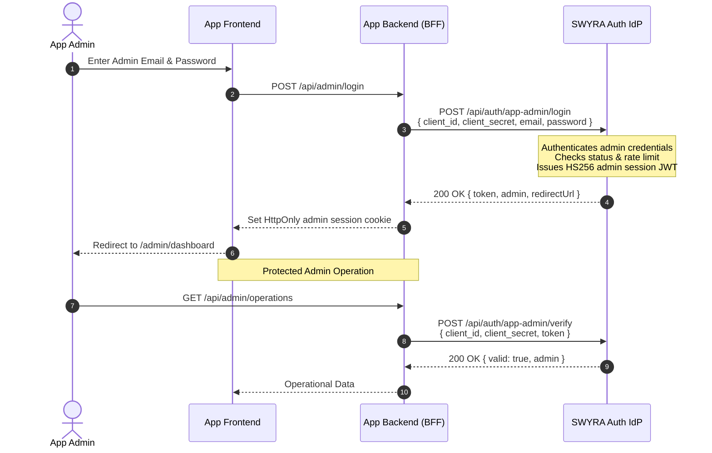

# SWYRA Auth — Framework-Agnostic AI Agent Integration Contract
**Version:** 2.1.0  
**Status:** Normative Specification  
**Authority:** Authoritative reference for AI coding agents and automated integration systems.  
**Companion Standard:** For the internal IdP security architecture, gateway trust boundary, and tenant isolation model, refer to [docs/SECURITY_CANONICAL.md](SECURITY_CANONICAL.md).

---

## 1. Specification Authority & Purpose

This contract specifies the **non-negotiable integration requirements** for any AI coding agent (e.g., Google Antigravity, Claude Code, GitHub Copilot Workspace, Cursor, Devin) or human developer integrating an existing or new consumer application with the **SWYRA Auth Identity Provider (IdP)**.

When acting on behalf of a consumer application, **AI agents MUST conform to this specification**. Agents must never guess authentication flows, install duplicate identity engines, attempt direct database connections, or invent proprietary protocols.

---

## 2. Core Philosophy & System Boundaries

SWYRA Auth is a centralized, multi-tenant **OAuth 2.1 and OpenID Connect (OIDC)** Identity Provider built on RFC 6749, RFC 7636 (PKCE), RFC 8414, and OpenID Connect Core 1.0.

```
┌────────────────────────────────────────────────────────────────────────┐
│                        SWYRA AUTH IDP BOUNDARY                         │
│                                                                        │
│  - User database & password hashes (MongoDB Atlas)                     │
│  - Session management & OAuth token state                              │
│  - Token Family Rotation engine with CAS concurrency protection        │
│  - Asymmetric RSA Key Pair & JWKS endpoint                             │
│  - Application Admin credential storage & TOTP MFA engine              │
│  - Abuse defense (target-keyed rate limiting, constant-time scrypt)   │
└────────────────────────────────────────────────────────────────────────┘
                                    │
                  STANDARD OAUTH 2.1 / OIDC PROTOCOL
                       (HTTP / JSON / RS256 JWTs)
                                    │
                                    ▼
┌────────────────────────────────────────────────────────────────────────┐
│                      CONSUMER APPLICATION BOUNDARY                     │
│                                                                        │
│  - Stores its OWN business domain data (e.g., PostgreSQL, DynamoDB)    │
│  - Validates incoming JWTs offline via SWYRA Auth JWKS endpoint        │
│  - Manages its own local session cookies or passes Bearer tokens       │
│  - Zero knowledge of SWYRA Auth database credentials                   │
│  - Zero duplicate user password hashes or local auth libraries         │
└────────────────────────────────────────────────────────────────────────┘
```

### Responsibility Matrix

| Feature / Responsibility | SWYRA Auth IdP | Consumer Application |
|---|---|---|
| User sign-up & password storage | **Owns** (scrypt) | **Forbidden** (never store passwords) |
| OAuth 2.1 grant negotiation & PKCE | **Owns** | **Initiates / exchanges** |
| JWT signing & Key rotation (RS256) | **Owns** (private RSA key) | **Validates offline** (via JWKS) |
| Refresh token family rotation & CAS | **Owns** (MongoDB state) | **Stores & rotates** securely |
| User profile & identity claims | **Authoritative source** | **Caches / references** by `sub` |
| Application-specific business roles | Authenticates identity | **Owns** business permissions |
| App Admin credentials & TOTP MFA | **Owns & verifies** | **Relays via backend REST** |
| IdP MongoDB connection | **Exclusive access** | **STRICTLY FORBIDDEN** |

---

## 3. The 7 Golden Rules for AI Coding Agents

Every AI agent integrating an application with SWYRA Auth must abide by these 7 inviolable rules:

1. **RULE 1: NEVER connect to or query the SWYRA Auth MongoDB database.**  
   Consumer applications never receive `MONGO_URI` or database credentials. All interactions occur exclusively via standard HTTP OAuth 2.1/OIDC or App-Admin REST endpoints.
2. **RULE 2: NEVER install duplicate authentication frameworks in consumer apps.**  
   Do NOT install Better Auth, NextAuth / Auth.js, Passport.js, Supabase Auth, Lucia, or Firebase inside the consumer app. The consumer needs only a lightweight OAuth client or JWT validator (`jose`, `pyjwt`, `requests`, or standard `fetch`).
3. **RULE 3: NEVER route OAuth authorization requests to `/auth`.**  
   The protocol authorization endpoint is **`/api/auth/oauth2/authorize`**. The path `/auth` is an internal IdP frontend Single Page Application view. Pointing OAuth redirects to `/auth` is an architectural defect.
4. **RULE 4: NEVER expose `client_secret` to client-side code.**  
   Never prefix secrets with `NEXT_PUBLIC_`, `VITE_`, `REACT_APP_`, or embed them in browser bundles, mobile apps, or git commits. Public clients (SPAs) do not use a `client_secret`; confidential clients (Node, Python, Go backends) keep it in server-only environment variables.
5. **RULE 5: ALWAYS use PKCE (`code_challenge` + `code_verifier`) and `state`.**  
   OAuth 2.1 deprecates legacy authorization code flows without PKCE. Every authorization request MUST include a cryptographically random `state` (for CSRF defense) and an `S256` PKCE `code_challenge`.
6. **RULE 6: ALWAYS validate Access Tokens offline using the JWKS endpoint.**  
   Resource servers and backend APIs MUST verify RS256 signatures offline against `${AUTH_ISSUER}/.well-known/jwks.json`. Never call an introspect endpoint for every API request when offline JWT validation is available. Always verify `iss`, `aud` (matching consumer `CLIENT_ID`), and `exp`.
7. **RULE 7: Maintain clean separation of concerns.**  
   Do not modify the consumer app's primary data models, database schemas, or ORMs to accommodate SWYRA Auth. Store only the user's permanent subject identifier (`sub` claim) as a foreign key on your application's domain objects (e.g., `user_id = jwt.sub`).

---

## 4. OAuth Client Type vs Application Access Mode

A common point of confusion is conflating **OAuth Client Type** with **Application Access Mode**. They are independent dimensions:

```
                            APPLICATION ACCESS MODE (Multi-Tenancy)
                           ┌─────────────────────────┬─────────────────────────┐
                           │   Public (isPublic=true) │  Private (isPublic=false)│
┌──────────────────────────┼─────────────────────────┼─────────────────────────┤
│ Confidential Client      │ Any platform user       │ Only explicitly assigned│
│ (Backend with Secret)    │ can log in.             │ users can log in.       │
│ Examples: Next.js BFF,   │ Secret held securely    │ Secret held securely    │
│ FastAPI, Express, Django │ in server backend.      │ in server backend.      │
├──────────────────────────┼─────────────────────────┼─────────────────────────┤
│ Public Client            │ Any platform user       │ Only explicitly assigned│
│ (No Secret, PKCE only)   │ can log in.             │ users can log in.       │
│ Examples: React SPA,     │ PKCE S256 enforced;     │ PKCE S256 enforced;     │
│ Vue, Mobile, Desktop     │ NO secret stored.       │ NO secret stored.       │
└──────────────────────────┴─────────────────────────┴─────────────────────────┘
```

### Dimension 1: OAuth Client Confidentiality
* **Confidential Client**: Deployed on a server that can keep credentials confidential (e.g., Next.js BFF, Express backend, FastAPI, AWS Lambda). Authenticates to token endpoints using `client_id` + `client_secret`.
* **Public Client**: Executed in an environment that cannot protect secrets (e.g., Browser Single-Page Applications, mobile apps). Uses `client_id` and PKCE (`code_challenge_method=S256`). Does **not** possess a `client_secret`.

### Dimension 2: Application Access Mode (`isPublic` in IdP Database)
* **Public Application (`isPublic: true`)**: Any registered user in SWYRA Auth can authenticate and access the application. User assignment to the application is automatically recorded upon first login.
* **Private Application (`isPublic: false`)**: Strict enterprise tenant isolation. Only users who have been explicitly provisioned or assigned to the application via the Super Admin API (`POST /api/admin/clients/:clientId/users`) are permitted to authenticate. Unassigned users receive `403 Forbidden` (`registration_disabled`).

---

## 5. Authoritative Protocol Endpoints Directory

All protocol URLs are rooted at `${AUTH_ISSUER}` (e.g., `https://oauth21.vercel.app` or custom domain).

| Endpoint | Method | Classification | Protocol Standard | Description |
|---|---|---|---|---|
| `/.well-known/openid-configuration` | `GET` | Discovery | RFC 8414 / OIDC | Machine-readable OpenID Provider metadata. |
| `/.well-known/jwks.json` | `GET` | Discovery | RFC 7517 | Public RS256 cryptographic keys for offline token verification. |
| `/api/auth/oauth2/authorize` | `GET` | OAuth Protocol | RFC 6749 / RFC 7636 | Initiates OAuth 2.1 login. Browser redirect. |
| `/api/auth/oauth2/token` | `POST` | OAuth Protocol | RFC 6749 / RFC 7636 | Exchanges authorization code or refresh token for JWTs. |
| `/api/auth/oauth2/userinfo` | `GET` | OIDC Protocol | OIDC Core 1.0 | Returns authenticated user claims via Bearer access token. |
| `/api/auth/oauth2/revoke` | `POST` | OAuth Protocol | RFC 7009 | Revokes an access or refresh token. |
| `/api/auth/app-admin/login` | `POST` | App Admin REST | Proprietary REST | Authenticates application administrator credentials. |
| `/api/auth/app-admin/verify` | `POST` | App Admin REST | Proprietary REST | Validates active app admin session and JTI revocation. |
| `/api/auth/app-admin/logout` | `POST` | App Admin REST | Proprietary REST | Revokes app admin token and adds JTI to revocation list. |
| `/api/auth/app-admin/mfa/verify-login` | `POST` | App Admin REST | RFC 6238 TOTP | Verifies 6-digit TOTP code during step-up MFA login. |

> [!CAUTION]
> **NEVER construct authorization URLs pointing to `/auth`**.  
> The path `/auth` is a frontend UI route. The ONLY valid OAuth 2.1 authorization endpoint is `/api/auth/oauth2/authorize`.

---

## 6. Token Lifecycle & Cryptographic Specifications

### 6.1 Token Types & Formats
1. **Access Token**: Compact RS256-signed JWT. Lifespan: typically **1 hour (3600 seconds)**. Validated offline by resource servers.
2. **ID Token**: OIDC-compliant RS256 JWT containing user profile claims (`sub`, `email`, `name`, etc.).
3. **Refresh Token**: Opaque, cryptographically random, high-entropy string. Single-use with Token Family Rotation.

### 6.2 Access Token Payload Structure
```json
{
  "iss": "https://oauth21.vercel.app",
  "sub": "usr_66e74b21d8b2a1a4567e8901",
  "aud": "qMoXkZwvWnZJRmFhpiTyzLMozZYrwvlF",
  "client_id": "qMoXkZwvWnZJRmFhpiTyzLMozZYrwvlF",
  "azp": "qMoXkZwvWnZJRmFhpiTyzLMozZYrwvlF",
  "scope": "openid profile email",
  "jti": "b479ca52-4467-4a0d-85f2-9e206f47738f",
  "iat": 1710590000,
  "exp": 1710593600
}
```

### 6.3 Offline Cryptographic Verification Invariants
Resource servers and backend services verifying tokens MUST enforce all of the following:
1. **Signature**: Validated using the public key downloaded from `${AUTH_ISSUER}/.well-known/jwks.json`.
2. **Algorithm**: Strictly pinned to `RS256`. Reject `none`, symmetric algorithms, or unexpected types.
3. **Issuer (`iss`)**: Must exactly match `${AUTH_ISSUER}` (no trailing slash discrepancies).
4. **Audience (`aud` or `client_id` or `azp`)**: Must match the consumer application's own registered `CLIENT_ID`. This prevents cross-application token replay attacks.
5. **Expiration (`exp`)**: Reject tokens where `now() > exp + clock_tolerance` (recommended tolerance: <= 60 seconds).

### 6.4 Refresh Token Rotation & Concurrency Guarantees
SWYRA Auth implements RFC 6749 Section 10.4 Token Family Rotation with atomic Compare-And-Swap (CAS) state tracking:
* Every refresh request consumes the current refresh token ($R_0$) and issues a successor ($R_1$).
* **Replay Detection**: If an already-consumed refresh token ($R_0$) is presented again outside the 2-second network-hazard grace window, SWYRA Auth treats it as an adversarial replay and **immediately revokes the entire token family**.
* **Concurrency Protection**: Under concurrent refresh bursts, SWYRA Auth executes an atomic in-flight CAS operation. Exactly one request succeeds; competing concurrent requests fail safely without corrupting the family tree.

---

## 7. Decision Tree: Choosing the Right Integration Architecture

```
Is the consumer application a...
│
├─► Full-Stack Web App with a Server Backend (Next.js, Remix, SvelteKit, Nuxt)
│   └─► USE: Recipe A (Backend-For-Frontend / BFF Pattern)
│       - Confidential Client
│       - OAuth flow handled in server route handlers
│       - Tokens stored in HttpOnly, Secure, SameSite=Lax cookies
│       - Browser never sees raw tokens or client secret
│
├─► Decoupled SPA (React, Vue, Vite, Angular) + Separate Backend API (Node, Python, Go)
│   ├─► Option 1 (Recommended): BFF Proxy in Backend
│   │   - Backend handles OAuth code exchange and manages cookie sessions
│   │   - Frontend calls backend with standard session cookies
│   │
│   └─► Option 2: Pure SPA Public Client + Bearer Token API
│       - SPA performs PKCE authorization flow directly with SWYRA Auth
│       - SPA stores Access Token in memory, passes as `Authorization: Bearer <token>`
│       - Backend validates Bearer token offline via JWKS
│
├─► Pure Backend API / Microservice / Resource Server
│   └─► USE: Recipe E (Stateless Offline JWT Verification)
│       - Validates incoming `Authorization: Bearer <token>`
│       - Caches JWKS keys from IdP
│       - Zero session state
│
└─► Dedicated Consumer Admin Portal (Staff / Operations)
    └─► USE: Recipe F (Application Administrator API)
        - Uses `/api/auth/app-admin/login`, `/verify`, and `/logout`
        - Authenticated via `client_id` + `client_secret` + admin email/password
        - Supports step-up RFC 6238 TOTP MFA
```

---

## 8. Concrete Integration Recipes

### Recipe A: Next.js 14+ (App Router) Backend-For-Frontend (BFF)

**Client Type:** Confidential Client  
**Required Environment Variables:**
```env
# Server-only (DO NOT prefix with NEXT_PUBLIC_)
AUTH_ISSUER="https://oauth21.vercel.app"
CLIENT_ID="your_registered_client_id"
CLIENT_SECRET="your_registered_client_secret"
REDIRECT_URI="https://your-app.com/api/auth/callback"
SESSION_SECRET="at-least-32-chars-random-secret-for-cookie-encryption"
```

#### Step 1: Initiate OAuth Login (`app/api/auth/login/route.ts`)
```typescript
import { NextResponse } from 'next/server';
import crypto from 'node:crypto';

export async function GET(request: Request) {
  // 1. Generate cryptographic state and PKCE verifier/challenge
  const state = crypto.randomBytes(32).toString('hex');
  const codeVerifier = crypto.randomBytes(32).toString('base64url');
  const codeChallenge = crypto
    .createHash('sha256')
    .update(codeVerifier)
    .digest('base64url');

  // 2. Build RFC-compliant authorization URL pointing to /api/auth/oauth2/authorize
  const authUrl = new URL(`${process.env.AUTH_ISSUER}/api/auth/oauth2/authorize`);
  authUrl.searchParams.set('client_id', process.env.CLIENT_ID!);
  authUrl.searchParams.set('redirect_uri', process.env.REDIRECT_URI!);
  authUrl.searchParams.set('response_type', 'code');
  authUrl.searchParams.set('code_challenge', codeChallenge);
  authUrl.searchParams.set('code_challenge_method', 'S256');
  authUrl.searchParams.set('scope', 'openid profile email');
  authUrl.searchParams.set('state', state);

  // 3. Store state and code_verifier in short-lived HttpOnly cookies
  const response = NextResponse.redirect(authUrl.toString());
  const cookieOptions = {
    httpOnly: true,
    secure: process.env.NODE_ENV === 'production',
    sameSite: 'lax' as const,
    maxAge: 300, // 5 minutes
    path: '/',
  };
  response.cookies.set('oauth_state', state, cookieOptions);
  response.cookies.set('oauth_code_verifier', codeVerifier, cookieOptions);

  return response;
}
```

#### Step 2: Handle OAuth Callback & Token Exchange (`app/api/auth/callback/route.ts`)
```typescript
import { NextResponse } from 'next/server';
import { cookies } from 'next/headers';
import { createRemoteJWKSet, jwtVerify } from 'jose';

const JWKS = createRemoteJWKSet(
  new URL(`${process.env.AUTH_ISSUER}/.well-known/jwks.json`)
);

export async function GET(request: Request) {
  const { searchParams } = new URL(request.url);
  const code = searchParams.get('code');
  const state = searchParams.get('state');
  const error = searchParams.get('error');

  if (error) {
    return NextResponse.redirect(new URL(`/login?error=${encodeURIComponent(error)}`, request.url));
  }

  const cookieStore = cookies();
  const storedState = cookieStore.get('oauth_state')?.value;
  const codeVerifier = cookieStore.get('oauth_code_verifier')?.value;

  // Verify state parameter to prevent CSRF
  if (!code || !state || !storedState || state !== storedState || !codeVerifier) {
    return NextResponse.json({ error: 'invalid_state', message: 'CSRF validation failed' }, { status: 400 });
  }

  // Confidential client token exchange with Basic Auth
  const basicAuth = Buffer.from(
    `${process.env.CLIENT_ID}:${process.env.CLIENT_SECRET}`
  ).toString('base64');

  const tokenResponse = await fetch(`${process.env.AUTH_ISSUER}/api/auth/oauth2/token`, {
    method: 'POST',
    headers: {
      'Content-Type': 'application/x-www-form-urlencoded',
      Authorization: `Basic ${basicAuth}`,
    },
    body: new URLSearchParams({
      grant_type: 'authorization_code',
      code,
      redirect_uri: process.env.REDIRECT_URI!,
      code_verifier: codeVerifier,
    }),
  });

  if (!tokenResponse.ok) {
    const errorBody = await tokenResponse.text();
    return NextResponse.json({ error: 'token_exchange_failed', details: errorBody }, { status: 400 });
  }

  const tokens = await tokenResponse.json();

  // Validate the received Access Token offline via JWKS
  const { payload } = await jwtVerify(tokens.access_token, JWKS, {
    issuer: process.env.AUTH_ISSUER,
    audience: process.env.CLIENT_ID,
  });

  // Set secure session cookie and clean up OAuth transient cookies
  const response = NextResponse.redirect(new URL('/dashboard', request.url));
  response.cookies.delete('oauth_state');
  response.cookies.delete('oauth_code_verifier');

  response.cookies.set('session_token', tokens.access_token, {
    httpOnly: true,
    secure: process.env.NODE_ENV === 'production',
    sameSite: 'lax',
    maxAge: tokens.expires_in || 3600,
    path: '/',
  });

  return response;
}
```

---

### Recipe B: Pure React SPA (Vite / CRA) with PKCE

**Client Type:** Public Client (No `client_secret`!)  
**Required Environment Variables:**
```env
VITE_AUTH_ISSUER="https://oauth21.vercel.app"
VITE_CLIENT_ID="your_registered_client_id"
VITE_REDIRECT_URI="http://localhost:5173/auth/callback"
```

#### Step 1: Utility for PKCE Generation (`src/lib/pkce.ts`)
```typescript
export async function generatePKCE() {
  const array = new Uint8Array(32);
  crypto.getRandomValues(array);
  const codeVerifier = Array.from(array, dec => dec.toString(16).padStart(2, '0')).join('');

  const encoder = new TextEncoder();
  const data = encoder.encode(codeVerifier);
  const digest = await crypto.subtle.digest('SHA-256', data);
  const codeChallenge = btoa(String.fromCharCode(...new Uint8Array(digest)))
    .replace(/\+/g, '-')
    .replace(/\//g, '_')
    .replace(/=+$/, '');

  const stateArray = new Uint8Array(16);
  crypto.getRandomValues(stateArray);
  const state = Array.from(stateArray, dec => dec.toString(16).padStart(2, '0')).join('');

  return { codeVerifier, codeChallenge, state };
}
```

#### Step 2: Login Initiation (`src/components/LoginButton.tsx`)
```typescript
import { generatePKCE } from '../lib/pkce';

export function LoginButton() {
  const handleLogin = async () => {
    const { codeVerifier, codeChallenge, state } = await generatePKCE();

    sessionStorage.setItem('oauth_verifier', codeVerifier);
    sessionStorage.setItem('oauth_state', state);

    const authUrl = new URL(`${import.meta.env.VITE_AUTH_ISSUER}/api/auth/oauth2/authorize`);
    authUrl.searchParams.set('client_id', import.meta.env.VITE_CLIENT_ID);
    authUrl.searchParams.set('redirect_uri', import.meta.env.VITE_REDIRECT_URI);
    authUrl.searchParams.set('response_type', 'code');
    authUrl.searchParams.set('code_challenge', codeChallenge);
    authUrl.searchParams.set('code_challenge_method', 'S256');
    authUrl.searchParams.set('scope', 'openid profile email');
    authUrl.searchParams.set('state', state);

    window.location.href = authUrl.toString();
  };

  return <button onClick={handleLogin}>Sign In with SWYRA</button>;
}
```

#### Step 3: SPA Callback Handler (`src/pages/Callback.tsx`)
```typescript
import { useEffect, useState } from 'react';
import { useNavigate, useSearchParams } from 'react-router-dom';

export function CallbackPage() {
  const [params] = useSearchParams();
  const navigate = useNavigate();
  const [error, setError] = useState<string | null>(null);

  useEffect(() => {
    async function exchangeToken() {
      const code = params.get('code');
      const state = params.get('state');
      const storedState = sessionStorage.getItem('oauth_state');
      const codeVerifier = sessionStorage.getItem('oauth_verifier');

      if (!code || state !== storedState || !codeVerifier) {
        setError('CSRF validation failed or invalid authorization code');
        return;
      }

      // Public client: NO client_secret sent
      const response = await fetch(`${import.meta.env.VITE_AUTH_ISSUER}/api/auth/oauth2/token`, {
        method: 'POST',
        headers: { 'Content-Type': 'application/x-www-form-urlencoded' },
        body: new URLSearchParams({
          grant_type: 'authorization_code',
          client_id: import.meta.env.VITE_CLIENT_ID,
          code,
          redirect_uri: import.meta.env.VITE_REDIRECT_URI,
          code_verifier: codeVerifier,
        }),
      });

      if (!response.ok) {
        setError('Token exchange failed');
        return;
      }

      const tokens = await response.json();
      sessionStorage.removeItem('oauth_state');
      sessionStorage.removeItem('oauth_verifier');

      // Store access token in memory or secure client state
      sessionStorage.setItem('access_token', tokens.access_token);
      navigate('/dashboard');
    }

    exchangeToken();
  }, [params, navigate]);

  if (error) return <div className="error-alert">{error}</div>;
  return <div>Completing sign in...</div>;
}
```

---

### Recipe C: React SPA + Python FastAPI Backend

**Architecture:** React SPA passes `Authorization: Bearer <access_token>` to FastAPI. FastAPI validates the token offline against SWYRA Auth JWKS.

#### FastAPI Token Verification Dependency (`server/auth.py`)
```python
import os
import jwt
from jwt import PyJWKClient
from fastapi import Depends, HTTPException, status
from fastapi.security import HTTPBearer, HTTPAuthorizationCredentials

AUTH_ISSUER = os.environ["AUTH_ISSUER"]
CLIENT_ID = os.environ["CLIENT_ID"]
JWKS_URL = f"{AUTH_ISSUER}/.well-known/jwks.json"

jwks_client = PyJWKClient(JWKS_URL)
security = HTTPBearer()

async def get_current_user(credentials: HTTPAuthorizationCredentials = Depends(security)):
    token = credentials.credentials
    try:
        signing_key = jwks_client.get_signing_key_from_jwt(token)
        payload = jwt.decode(
            token,
            signing_key.key,
            algorithms=["RS256"],
            issuer=AUTH_ISSUER,
            audience=CLIENT_ID,
            options={"require": ["exp", "iss", "aud", "sub"]}
        )
        return payload
    except jwt.ExpiredSignatureError:
        raise HTTPException(
            status_code=status.HTTP_401_UNAUTHORIZED,
            detail="Token has expired"
        )
    except jwt.InvalidTokenError as e:
        raise HTTPException(
            status_code=status.HTTP_401_UNAUTHORIZED,
            detail=f"Invalid token: {str(e)}"
        )
```

#### Protected Endpoint (`server/main.py`)
```python
from fastapi import FastAPI, Depends
from auth import get_current_user

app = FastAPI()

@app.get("/api/profile")
async def profile(user: dict = Depends(get_current_user)):
    return {
        "user_id": user["sub"],
        "client_id": user["aud"],
        "scope": user.get("scope", "")
    }
```

---

### Recipe D: React SPA + Node.js / Express Backend

**Express Middleware for Offline Verification (`middleware/requireAuth.ts`)**:
```typescript
import type { Request, Response, NextFunction } from 'express';
import { createRemoteJWKSet, jwtVerify } from 'jose';

const AUTH_ISSUER = process.env.AUTH_ISSUER!;
const CLIENT_ID = process.env.CLIENT_ID!;
const JWKS = createRemoteJWKSet(new URL(`${AUTH_ISSUER}/.well-known/jwks.json`));

export interface AuthenticatedRequest extends Request {
  user?: {
    sub: string;
    clientId: string;
    scope?: string;
  };
}

export async function requireAuth(
  req: AuthenticatedRequest,
  res: Response,
  next: NextFunction
) {
  const authHeader = req.headers.authorization;
  if (!authHeader?.startsWith('Bearer ')) {
    return res.status(401).json({ error: 'unauthorized', message: 'Missing Bearer token' });
  }

  const token = authHeader.slice(7);

  try {
    const { payload } = await jwtVerify(token, JWKS, {
      issuer: AUTH_ISSUER,
      audience: CLIENT_ID,
      algorithms: ['RS256'],
    });

    req.user = {
      sub: payload.sub as string,
      clientId: (payload.aud || payload.client_id) as string,
      scope: payload.scope as string,
    };
    next();
  } catch (err: any) {
    return res.status(401).json({ error: 'invalid_token', message: err.message });
  }
}
```

---

### Recipe E: Per-Application Administrator Authentication

For consumer applications that have designated administrators provisioned via the SWYRA Auth Admin Console (`/admin/clients`):



#### Step 1: Admin Login Endpoint (`server/admin.ts`)
```typescript
export async function authenticateAppAdmin(email: string, pass: string) {
  const res = await fetch(`${process.env.AUTH_ISSUER}/api/auth/app-admin/login`, {
    method: 'POST',
    headers: { 'Content-Type': 'application/json' },
    body: JSON.stringify({
      client_id: process.env.CLIENT_ID,
      client_secret: process.env.CLIENT_SECRET,
      email,
      password: pass,
    }),
  });

  const data = await res.json();
  if (!res.ok) {
    throw new Error(data.message || 'Admin authentication failed');
  }

  // If MFA is required, prompt for TOTP code
  if (data.mfa_required) {
    return { mfaRequired: true, mfaToken: data.mfa_token };
  }

  return { token: data.token, admin: data.admin, redirectUrl: data.redirectUrl };
}
```

---

## 9. Critical Anti-Patterns & Common Failure Modes

Avoid these specific implementation mistakes:

| Anti-Pattern | Severity | Why It Fails | Correct Solution |
|---|---|---|---|
| **Redirecting to `/auth`** | 🔴 Critical | `/auth` is an internal React SPA page. Unregistered clients load the page instead of returning protocol errors. | Always redirect to `/api/auth/oauth2/authorize`. |
| **`NEXT_PUBLIC_CLIENT_SECRET`** | 🔴 Critical | Exposes confidential client secret in browser JavaScript bundles. | Keep `CLIENT_SECRET` in server-only environment variables. |
| **Skipping `state` verification** | 🔴 Critical | Leaves callback endpoint vulnerable to CSRF login attacks. | Generate random `state` in cookie/session, verify upon callback. |
| **Omitting PKCE in code flow** | 🔴 Critical | Violates OAuth 2.1; tokens can be intercepted by malicious apps. | Generate `code_verifier` and SHA-256 `code_challenge` for all flows. |
| **Connecting to IdP MongoDB** | 🔴 Critical | Violates tenant isolation, exposes global user data, breaks architectural boundary. | Consumer app MUST NOT know or use `MONGO_URI`. |
| **Installing duplicate Auth engines** | 🟠 High | Installing Better Auth or NextAuth inside the consumer creates dual state and confuses sessions. | Consumer only requires standard HTTP calls and JWT verification. |
| **Accepting `none` or `HS256` for tokens** | 🔴 Critical | Algorithm confusion allows attackers to forge tokens using public keys. | Pin verification algorithm strictly to `RS256`. |
| **Ignoring `aud` claim validation** | 🔴 Critical | Allows token issued for App A to be accepted by App B (cross-tenant token replay). | Verify `payload.aud === CLIENT_ID` in all resource servers. |

---

## 10. AI Agent Phase 20 Verification Checklist

Before reporting completion of any SWYRA Auth integration, an AI agent MUST verify:

- [ ] **1. Clean Boundary**: No MongoDB connection strings, database drivers, or schema files belonging to SWYRA Auth exist in the consumer app.
- [ ] **2. No Duplicate Auth**: No Better Auth or redundant identity engines are installed in consumer `package.json` or `pyproject.toml`.
- [ ] **3. Protocol Endpoint Accuracy**: All authorization requests hit `${AUTH_ISSUER}/api/auth/oauth2/authorize` (NEVER `/auth`).
- [ ] **4. PKCE Implementation**: The authorization request provides `code_challenge` and `code_challenge_method=S256`.
- [ ] **5. CSRF State Protection**: A secure random `state` is generated, temporarily stored, and verified upon callback.
- [ ] **6. Secret Secrecy**: No client secrets exist in client-side bundles, `NEXT_PUBLIC_` vars, or version control.
- [ ] **7. Offline Verification**: Backend endpoints verify RS256 JWTs offline using `${AUTH_ISSUER}/.well-known/jwks.json`.
- [ ] **8. Audience Validation**: Backend verifies `aud` matches the consumer's registered `CLIENT_ID`.
- [ ] **9. Clean Local Test**: Integration passes build and unit/integration test gates without mock leakage.
