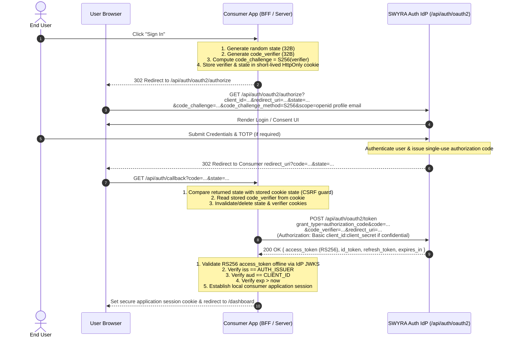

# SWYRA Auth — Canonical AI Agent Integration Contract
**Version:** 2.1.0  
**Status:** Normative Specification & Master Contract  
**Authority:** Single Source of Truth for AI Coding Agents and Human Developers integrating with SWYRA Auth IdP  
**Machine-Readable Policy:** [docs/security/integration-policy.json](security/integration-policy.json)  
**Companion Standards:** [docs/SECURITY_CANONICAL.md](SECURITY_CANONICAL.md) (Internal IdP Security Architecture & Perimeter Model)

---

## 1. Canonical Architecture

The integration architecture follows a strict centralized identity model:

```
                      CENTRALIZED IDENTITY PROVIDER
                               (SWYRA Auth)
                                    │
                         OAuth 2.1 / OpenID Connect
                        (HTTPS / JSON / RS256 JWTs)
                                    │
           ┌────────────────────────┼────────────────────────┐
           ▼                        ▼                        ▼
      Next.js BFF               React SPA                 Backend
     (Confidential)             (Public)           (Express / FastAPI /
                                                     Django Resource Server)
```

The consumer application does **NOT** become an Identity Provider. The boundaries of ownership are absolute:

### The IdP Owns:
- Centralized user identity and account credentials (scrypt hashes)
- User authentication and multi-factor authentication (RFC 6238 TOTP)
- OAuth 2.1 client registrations and policy enforcement
- Authorization code issuance and single-use invalidation
- RS256 Access Token and OIDC ID Token issuance
- Refresh token issuance and RFC 6749 Token Family Rotation with CAS concurrency
- JSON Web Key Sets (JWKS) and asymmetric RSA key pair management
- OpenID Connect Discovery metadata (`/.well-known/openid-configuration`)
- UserInfo endpoint (`/api/auth/oauth2/userinfo`)
- Centralized Single Sign-On (SSO) session state

### Consumer Applications Own:
- Local consumer application sessions (e.g., encrypted HttpOnly cookies)
- Local business domain authorization and role-based access control (RBAC/ABAC)
- Business domain tables and application databases (PostgreSQL, MySQL, DynamoDB, etc.)
- Application-specific roles, permissions, tenant workspaces, and feature entitlements

---

## 2. The 10 Golden Rules for AI Coding Agents

Every AI coding agent and developer integrating a consumer application MUST adhere strictly to these 10 inviolable rules:

1. **RULE 1: NEVER create another authentication system when the centralized IdP is already configured.**  
   Do not install or spin up local identity stores, user registration tables, or authentication engines in the consumer repository.
2. **RULE 2: NEVER connect a consumer directly to the IdP's MongoDB for normal authentication.**  
   Consumer applications never receive `MONGO_URI`. All communication occurs exclusively over standard HTTP OAuth 2.1, OIDC, or App-Admin REST endpoints.
3. **RULE 3: NEVER copy password/session/token tables from the IdP.**  
   Centralized credentials and token family state belong exclusively to SWYRA Auth. Do not duplicate or mirror IdP internal tables into consumer databases.
4. **RULE 4: NEVER expose CLIENT_SECRET to browser code.**  
   Confidential clients keep secrets in server-only environments. Public clients (SPAs, mobile apps) do not use or possess client secrets.
5. **RULE 5: NEVER put confidential secrets in public environment variables or client storage.**  
   Never place confidential credentials in `NEXT_PUBLIC_*`, `VITE_*`, `REACT_APP_*`, `localStorage`, `sessionStorage`, or frontend source code.
6. **RULE 6: NEVER create a localhost production fallback.**  
   Expressions such as `AUTH_CALLBACK_URL || "http://localhost:3000/callback"` or `CLIENT_ID || "dev-client"` are strictly forbidden. Missing configuration must fail closed.
7. **RULE 7: NEVER treat NODE_ENV=production as "all OAuth clients are production".**  
   The IdP server runtime environment (`NODE_ENV`) is distinct from the client mode (`isDev`). A production IdP hosts both production and development clients.
8. **RULE 8: NEVER treat isDev as isPublic.**  
   `isDev` governs loopback URI permissions; `isPublic` governs whether the client possesses a secret or has open tenant access. They are completely independent dimensions.
9. **RULE 9: NEVER treat authentication as application authorization.**  
   Authenticating "Who is this user?" via OAuth does not determine "What may this user do?" in the consumer app. Consumer apps must enforce their own business authorization.
10. **RULE 10: NEVER bypass the IdP's redirect URI / PKCE / state validation.**  
    OAuth 2.1 mandates PKCE (`S256`) and cryptographically random `state` on all flows. Never attempt to disable or bypass protocol parameters.

---

## 3. Client Type Decision Tree

To determine the exact integration profile, evaluate these three independent dimensions sequentially:

```
                           DIMENSION 1: CLIENT CONFIDENTIALITY
                       Is the runtime environment able to keep a secret?
                                       │
                      ┌────────────────┴────────────────┐
                      ▼                                 ▼
               PUBLIC CLIENT                   CONFIDENTIAL CLIENT
          Browser SPA, Mobile App,           Next.js BFF, Express Server,
          Desktop Native App                 FastAPI, Django, Backend Service
          - NO client_secret                 - REQUIRES client_secret
          - Mandatory PKCE (S256)            - Server-side token exchange
          - In-memory / transient tokens     - HttpOnly secure session cookies
                      │                                 │
                      └────────────────┬────────────────┘
                                       │
                         DIMENSION 2: CLIENT MODE
                   Is this client for development or production?
                                       │
                      ┌────────────────┴────────────────┐
                      ▼                                 ▼
          DEVELOPMENT (isDev: true)          PRODUCTION (isDev: false)
          - Allowed: http://localhost:*      - Allowed: https://<valid-fqdn>/*
          - Allowed: http://127.0.0.1:*      - FORBIDDEN: http://localhost
          - Allowed: http://[::1]:*          - FORBIDDEN: plaintext http://
          - FORBIDDEN: external domains      - FORBIDDEN: private/intranet IPs
                      │                                 │
                      └────────────────┬────────────────┘
                                       │
                    DIMENSION 3: APPLICATION ACCESS MODE
                   Who is permitted to authenticate to this app?
                                       │
                      ┌────────────────┴────────────────┐
                      ▼                                 ▼
            PUBLIC (isPublic: true)           PRIVATE (isPublic: false)
          Open to all registered IdP        Enterprise tenant isolation.
          users. Association recorded       Only explicitly assigned users
          on first login.                   can log in (403 for unassigned).
```

### Invariant: Dimension Independence
- `isDev` does **NOT** imply `isPublic`. A confidential development application remains confidential and requires a `client_secret`.
- A public production application (e.g. hosted React SPA on `https://app.example.com`) is `isDev: false, isPublic: true` and has **no secret**.
- A confidential production application (e.g. Next.js BFF on `https://app.example.com`) is `isDev: false, isPublic: false` (or `true` if public tenant) and **holds a secret**.

---

## 4. Production vs Development Separation

The IdP runtime environment (`NODE_ENV`) and the OAuth client mode (`isDev`) are separate concerns:

| Dimension | Managed By | Values | Meaning |
|---|---|---|---|
| **IdP Runtime** (`NODE_ENV`) | System DevOps | `production` / `development` | The execution environment of the SWYRA Auth server itself. The production IdP runs with `NODE_ENV=production`. |
| **OAuth Client Mode** (`isDev`) | Super-Admin Client Registration | `true` / `false` | The mode assigned to a specific consumer client record in the IdP database. |

A single production IdP instance (`NODE_ENV=production`) accommodates:
1. **Production Clients (`isDev: false`)**: Serving live end users over HTTPS.
2. **Development Clients (`isDev: true`)**: Permitting consumer app engineers to test locally on `http://localhost:*` against the production IdP without compromising production client boundaries.

---

## 5. Development Client Rules

For development clients (`isDev: true`):
- **Permitted Redirect URIs & Origins**:
  - `http://localhost:<port>/*`
  - `http://127.0.0.1:<port>/*`
  - `http://[::1]:<port>/*`
- **Strictly Prohibited**:
  - Lookalike or spoofed loopback domains (e.g., `http://localhost.evil.com`, `http://127.0.0.1.evil.com`)
  - Intranet / Private RFC 1918 IP addresses (`10.x.x.x`, `172.16.x.x`, `192.168.x.x`)
  - Cloud metadata service IPs (`169.254.169.254`)
  - Arbitrary external HTTP domains (`http://example.com`)
  - Wildcard redirect URIs (`http://localhost:*` as a literal wildcard entry)
- A development client registration does **NOT** mean "anything goes." URIs must be explicitly whitelisted loopback addresses.

---

## 6. Production Client Rules

For production clients (`isDev: false`):
- **Permitted Redirect URIs & Origins**:
  - Strictly public, fully qualified domain names with `https://` (e.g. `https://app.example.com/api/auth/callback`).
- **Strictly Prohibited**:
  - Any loopback address (`http://localhost`, `http://127.0.0.1`, `http://[::1]`)
  - Plaintext `http://` schemes
  - Wildcard domains (`https://*.example.com`) or wildcard paths (`https://app.example.com/*`)
  - IP addresses (public or private)

---

## 7. Local vs Production Consumer Configuration

Consumer applications must maintain strictly isolated configuration profiles between environments:

### Local Development (`.env.local` / `.env.development`)
```env
AUTH_ISSUER="http://localhost:3000"
CLIENT_ID="registered_dev_client_id"
CLIENT_SECRET="registered_dev_client_secret"
AUTH_CALLBACK_URL="http://localhost:3001/api/auth/callback"
```

### Production Deployment (Server Environment / Secret Store)
```env
AUTH_ISSUER="https://auth.example.com"
CLIENT_ID="registered_prod_client_id"
CLIENT_SECRET="registered_prod_client_secret"
AUTH_CALLBACK_URL="https://app.example.com/api/auth/callback"
```

Production environments **MUST NOT** inherit local development configuration or share development client credentials.

---

## 8. Zero Production Fallbacks (Fail Closed)

AI agents and developers **MUST NOT** write code containing fallback literals:

```typescript
// ❌ WRONG: Insecure fallback to localhost
const callbackUrl = process.env.AUTH_CALLBACK_URL || "http://localhost:3000/callback";
const clientId = process.env.CLIENT_ID || "dev-client";
const clientSecret = process.env.CLIENT_SECRET || "test-secret";
```

```typescript
// ✅ CORRECT: Fail-closed configuration assertion
function getRequiredEnv(name: string): string {
  const value = process.env[name];
  if (!value || value.trim() === '') {
    throw new Error(`[FATAL] Missing required security configuration: ${name}`);
  }
  return value.trim();
}

const callbackUrl = getRequiredEnv('AUTH_CALLBACK_URL');
const clientId = getRequiredEnv('CLIENT_ID');
const clientSecret = getRequiredEnv('CLIENT_SECRET');
```

If any security-critical environment variable is missing, the application **MUST fail to start or return an immediate HTTP 500 error**. Silent fallbacks are catastrophic security vulnerabilities.

---

## 9. Canonical OAuth 2.1 / OIDC Flow

All integrations must execute this exact protocol sequence:



---

## 10. State and PKCE Rules

OAuth 2.1 deprecates legacy authorization code flows without PKCE:
- **`code_verifier`**: Cryptographically random string between 43 and 128 characters from the unreserved character set `[A-Z] / [a-z] / [0-9] / "-" / "." / "_" / "~"`. Recommended: 32 random bytes, base64url-encoded.
- **`code_challenge`**: Strictly computed as `BASE64URL(SHA256(code_verifier))`.
- **`code_challenge_method`**: Strictly set to `S256`. The use of `plain` is **STRICTLY PROHIBITED**.
- **`state`**: Cryptographically random high-entropy token (minimum 128 bits of entropy) stored in a short-lived (`maxAge <= 300s`), HttpOnly, SameSite=Lax cookie or server session.
- **State Validation**: Upon callback, the returned `state` parameter must be compared using constant-time comparison against the stored state. If mismatched, missing, or empty, reject immediately with HTTP 400.
- **Transaction Invalidation**: Immediately delete the temporary `state` and `code_verifier` credentials once consumed. Never reuse them.

---

## 11. Confidential Client Rule

For server-side applications (Next.js BFF, Express, FastAPI, Django):
- **`CLIENT_SECRET`** is stored **ONLY** in server-side configuration.
- The browser never receives or transmits the `CLIENT_SECRET`.
- The token exchange (`POST /api/auth/oauth2/token`) occurs directly between the consumer server and the IdP over TLS.
- Client authentication is performed using HTTP Basic Auth (`Authorization: Basic base64(client_id:client_secret)`) or via secure POST body parameters.

---

## 12. Public Client Rule

For client-side applications (React SPA, Vite, mobile apps):
- Public clients cannot protect secrets. **Do NOT register or embed a `client_secret` in a public client.**
- Public clients rely exclusively on PKCE (`S256`) and cryptographically random `state` for token exchange integrity.
- Never prefix secrets with `NEXT_PUBLIC_` or `VITE_` pretending that an embedded secret provides confidential security.

---

## 13. JWT Validation Rule (Offline Verification)

Resource servers and backend APIs validating SWYRA Auth Access Tokens MUST follow these offline invariants:

1. **Algorithm Pinning**: Strictly pinned to `RS256`. Reject algorithm `none`, symmetric algorithms (`HS256`), and unexpected key types.
2. **Key Retrieval**: Fetch public keys from `${AUTH_ISSUER}/.well-known/jwks.json`. Cache the JWKS with a sensible TTL (e.g., 10 to 60 minutes) to avoid network overhead.
3. **Issuer (`iss`)**: Must exactly match `${AUTH_ISSUER}` without trailing slash discrepancies.
4. **Audience (`aud`)**: Must match the consumer application's own registered `CLIENT_ID`. Never treat audience mismatch as a warning.
5. **Expiration (`exp`)**: Reject tokens where `currentTime >= exp + clockTolerance` (maximum tolerance: 60 seconds).
6. **No Unverified Trust**: Never decode a JWT payload and trust its claims without cryptographic signature verification against the JWKS.

---

## 14. Session Rule

Distinguish the IdP OAuth token from the Consumer Application Session:
- **OAuth Token**: An IdP-issued credential used to access the UserInfo endpoint or resource servers.
- **Application Session**: A consumer-managed credential (e.g. encrypted session cookie) representing the user's active session in the consumer application.

In server-side architectures (BFF), the backend exchanges the authorization code for tokens, verifies the Access Token offline, extracts the permanent subject (`sub`), and establishes its own local application session. The browser does not need direct access to raw IdP tokens.

---

## 15. Logout Rule

Distinguish Local Application Logout from IdP SSO Logout:
- **Local Application Logout**: Purges the consumer app's local session cookie or stored tokens. The user remains authenticated at the IdP.
- **RP-Initiated IdP Logout**: Redirects the user's browser to the IdP logout endpoint to terminate the centralized SSO session across all connected applications.

Do not assume that deleting a local cookie terminates the IdP session. Follow the application's documented logout requirements.

---

## 16. Application Authorization vs Identity Authentication

Authentication and Authorization are separate concerns:
- **Authentication ("Who is this user?")**: Provided authoritatively by SWYRA Auth via the `sub`, `email`, and `profile` claims in the token.
- **Application Authorization ("What can this user do?")**: Managed exclusively by the consumer application.

An authenticated user is **NOT** automatically an application administrator. Consumer applications must query their own database to resolve permissions, tenant roles, and capabilities based on `jwt.sub`.

---

## 17. Application Admin Rule

Application Administrator credentials (`/api/auth/app-admin/login`) are separate from OAuth user identities:
- App Admin credentials authenticate delegated tenant staff via `{ client_id, client_secret, email, password }`.
- App Admin JWTs contain an individual JWT ID (`jti`) and are revocable via `/api/auth/app-admin/logout`.
- An App Admin JWT issued for Client A **MUST NOT** be accepted as an administrative credential for Client B.

---

## 18. Database Ownership Rule

The SWYRA Auth MongoDB cluster is an internal, private IdP datastore:
- Consumer applications **MUST NEVER** connect to the SWYRA Auth MongoDB database.
- Consumer applications **MUST NEVER** query or mutate `oauthClient`, `sessions`, `oauth_token_families`, `users`, or `oauth_codes` via direct database drivers (`mongodb`, `mongoose`).
- All interactions must occur via the official HTTP endpoints (`/api/auth/oauth2/*` and `/api/auth/app-admin/*`).

---

## 19. Redirect URI Rule

The `redirect_uri` is a critical security perimeter:
- Must be an **exact static match** with a URI registered in the IdP client profile.
- **NEVER** construct the `redirect_uri` dynamically using incoming request headers (`Host`, `X-Forwarded-Host`) or arbitrary user query parameters.
- **NEVER** use wildcards (`*`) or fragments (`#`) in registered redirect URIs.

---

## 20. Return-To Destination Rule

When redirecting users back to their requested page after successful login:
- The `returnTo` path must be strictly validated as a safe local relative path (e.g. `/dashboard` or `/settings`).
- **NEVER** permit absolute URLs (e.g., `https://evil.com`) or protocol-relative paths (e.g., `//evil.com`), as these create Open Redirect vulnerabilities.

```typescript
function getSafeReturnTo(returnTo: string | null | undefined): string {
  if (!returnTo || !returnTo.startsWith('/') || returnTo.startsWith('//')) {
    return '/dashboard';
  }
  return returnTo;
}
```

---

## 21. CORS Rule

Cross-Origin Resource Sharing (CORS) is distinct from redirect URIs:
- Do not configure wildcard origins (`Access-Control-Allow-Origin: *`) to "fix OAuth".
- The authorization endpoint `/api/auth/oauth2/authorize` is accessed via browser navigation (302 redirect), **not** via AJAX/Fetch, and therefore does not require CORS.
- Token and UserInfo endpoints strictly validate origins against the client's registered `allowed_origins`.

---

## 22. CSRF Rule

Browser state-changing endpoints in consumer applications must retain Cross-Site Request Forgery (CSRF) defenses:
- For OAuth authorization, CSRF protection is provided by the cryptographically random `state` parameter and SameSite cookie policies.
- Do not disable CSRF globally in consumer frameworks to accommodate OAuth.

---

## 23. Authorization Header Rule

When accessing protected backend APIs:
- Transmit the token in the standard HTTP header:  
  `Authorization: Bearer <access_token>`
- Never accept an arbitrary user-supplied `client_id` or `user_id` in request headers or bodies as proof of identity. The subject identity is derived exclusively from the cryptographically verified `sub` claim of the Bearer token.

---

## 24. Environment Variable Rules

Strictly isolate environment variables by security classification:

| Classification | Framework Prefixes | Permitted Variables | Forbidden Variables |
|---|---|---|---|
| **Server-Only (Confidential)** | (No public prefix) | `AUTH_ISSUER`, `CLIENT_ID`, `CLIENT_SECRET`, `AUTH_CALLBACK_URL`, `SESSION_SECRET` | None |
| **Client-Safe (Public)** | `NEXT_PUBLIC_*`, `VITE_*` | `NEXT_PUBLIC_AUTH_ISSUER`, `NEXT_PUBLIC_CLIENT_ID`, `VITE_AUTH_ISSUER`, `VITE_CLIENT_ID` | `*_CLIENT_SECRET`, `*_SESSION_SECRET`, `*_GATEWAY_SECRET` |

---

## 25. Error Handling & Fail-Closed Invariants

All authentication and token verification paths must fail closed:
- If token signature verification fails, reject immediately with HTTP 401.
- If audience or issuer does not match, reject immediately with HTTP 401.
- **NEVER** catch a token validation exception, log a warning, and proceed as authenticated.
- **NEVER** fall back to dummy mock users in production when IdP endpoints are unreachable.

---

## 26. Performance & Caching Rules

To ensure high performance and avoid denial-of-service on IdP endpoints:
- **Cache JWKS**: Use a caching JWKS client (e.g. `jose.createRemoteJWKSet` or `pyjwt.PyJWKClient`) that caches public keys in memory and rotates keys on unknown `kid`.
- **Do Not Introspect on Every Request**: Access tokens are self-contained RS256 JWTs designed for offline verification. Do not make network calls to `/userinfo` or an introspection endpoint on every API call.
- **Session Lifetimes**: Do not cache local authorization decisions beyond the token's remaining validity period.

---

## 27. Concrete Framework Integration Recipes

### Recipe A: Next.js 14+ (App Router) BFF

**Architecture:** Confidential client using Next.js Route Handlers. All token exchanges and secrets remain server-side.

#### Configuration (`lib/auth/config.ts`)
```typescript
function requireEnv(name: string): string {
  const value = process.env[name];
  if (!value || value.trim() === '') {
    throw new Error(`[Configuration Error] Missing required server environment variable: ${name}`);
  }
  return value.trim();
}

export const authConfig = {
  issuer: requireEnv('AUTH_ISSUER'),
  clientId: requireEnv('CLIENT_ID'),
  clientSecret: requireEnv('CLIENT_SECRET'),
  callbackUrl: requireEnv('AUTH_CALLBACK_URL'),
};
```

#### Step 1: Initiate OAuth Login (`app/api/auth/login/route.ts`)
```typescript
import { NextResponse, NextRequest } from 'next/server';
import crypto from 'node:crypto';
import { authConfig } from '@/lib/auth/config';

export async function GET(request: NextRequest) {
  const state = crypto.randomBytes(32).toString('hex');
  const codeVerifier = crypto.randomBytes(32).toString('base64url');
  const codeChallenge = crypto.createHash('sha256').update(codeVerifier).digest('base64url');

  const rawReturnTo = request.nextUrl.searchParams.get('returnTo');
  const returnTo = rawReturnTo && rawReturnTo.startsWith('/') && !rawReturnTo.startsWith('//')
    ? rawReturnTo
    : '/dashboard';

  const authUrl = new URL(`${authConfig.issuer}/api/auth/oauth2/authorize`);
  authUrl.searchParams.set('client_id', authConfig.clientId);
  authUrl.searchParams.set('redirect_uri', authConfig.callbackUrl);
  authUrl.searchParams.set('response_type', 'code');
  authUrl.searchParams.set('code_challenge', codeChallenge);
  authUrl.searchParams.set('code_challenge_method', 'S256');
  authUrl.searchParams.set('scope', 'openid profile email');
  authUrl.searchParams.set('state', state);

  const response = NextResponse.redirect(authUrl.toString());
  const cookieOptions = {
    httpOnly: true,
    secure: process.env.NODE_ENV === 'production',
    sameSite: 'lax' as const,
    maxAge: 300, // 5 minutes
    path: '/',
  };

  response.cookies.set('oauth_state', state, cookieOptions);
  response.cookies.set('oauth_code_verifier', codeVerifier, cookieOptions);
  response.cookies.set('oauth_return_to', returnTo, cookieOptions);

  return response;
}
```

#### Step 2: Handle Callback (`app/api/auth/callback/route.ts`)
```typescript
import { NextResponse, NextRequest } from 'next/server';
import { cookies } from 'next/headers';
import { createRemoteJWKSet, jwtVerify } from 'jose';
import { authConfig } from '@/lib/auth/config';

const JWKS = createRemoteJWKSet(new URL(`${authConfig.issuer}/.well-known/jwks.json`));

export async function GET(request: NextRequest) {
  const searchParams = request.nextUrl.searchParams;
  const code = searchParams.get('code');
  const state = searchParams.get('state');
  const error = searchParams.get('error');

  if (error) {
    return NextResponse.redirect(new URL(`/login?error=${encodeURIComponent(error)}`, request.url));
  }

  const cookieStore = await cookies();
  const storedState = cookieStore.get('oauth_state')?.value;
  const codeVerifier = cookieStore.get('oauth_code_verifier')?.value;
  const returnTo = cookieStore.get('oauth_return_to')?.value || '/dashboard';

  // State & PKCE validation
  if (!code || !state || !storedState || state !== storedState || !codeVerifier) {
    return NextResponse.json({ error: 'invalid_request', message: 'CSRF or PKCE validation failed' }, { status: 400 });
  }

  // Confidential client token exchange
  const basicAuth = Buffer.from(`${authConfig.clientId}:${authConfig.clientSecret}`).toString('base64');
  const tokenResponse = await fetch(`${authConfig.issuer}/api/auth/oauth2/token`, {
    method: 'POST',
    headers: {
      'Content-Type': 'application/x-www-form-urlencoded',
      Authorization: `Basic ${basicAuth}`,
    },
    body: new URLSearchParams({
      grant_type: 'authorization_code',
      code,
      redirect_uri: authConfig.callbackUrl,
      code_verifier: codeVerifier,
    }),
  });

  if (!tokenResponse.ok) {
    const errorBody = await tokenResponse.text();
    return NextResponse.json({ error: 'token_exchange_failed', details: errorBody }, { status: 400 });
  }

  const tokens = await tokenResponse.json();

  // Validate Access Token offline via JWKS
  const { payload } = await jwtVerify(tokens.access_token, JWKS, {
    issuer: authConfig.issuer,
    audience: authConfig.clientId,
    algorithms: ['RS256'],
  });

  const response = NextResponse.redirect(new URL(returnTo, request.url));
  response.cookies.delete('oauth_state');
  response.cookies.delete('oauth_code_verifier');
  response.cookies.delete('oauth_return_to');

  // Establish local application session cookie
  response.cookies.set('app_session', tokens.access_token, {
    httpOnly: true,
    secure: process.env.NODE_ENV === 'production',
    sameSite: 'lax',
    maxAge: tokens.expires_in || 3600,
    path: '/',
  });

  return response;
}
```

---

### Recipe B: Pure React SPA (Vite) Public Client with PKCE

**Architecture:** Public client running entirely in browser. No client secret. Uses PKCE `S256`.

#### Environment Setup (`.env.production`)
```env
VITE_AUTH_ISSUER=https://auth.example.com
VITE_CLIENT_ID=registered_spa_client_id
VITE_REDIRECT_URI=https://spa.example.com/callback
```

#### PKCE Utilities (`src/lib/pkce.ts`)
```typescript
export async function generatePKCE() {
  const array = new Uint8Array(32);
  crypto.getRandomValues(array);
  const codeVerifier = Array.from(array, dec => dec.toString(16).padStart(2, '0')).join('');

  const encoder = new TextEncoder();
  const data = encoder.encode(codeVerifier);
  const digest = await crypto.subtle.digest('SHA-256', data);
  const codeChallenge = btoa(String.fromCharCode(...new Uint8Array(digest)))
    .replace(/\+/g, '-')
    .replace(/\//g, '_')
    .replace(/=+$/, '');

  const stateArray = new Uint8Array(16);
  crypto.getRandomValues(stateArray);
  const state = Array.from(stateArray, dec => dec.toString(16).padStart(2, '0')).join('');

  return { codeVerifier, codeChallenge, state };
}
```

#### Callback Handler (`src/pages/Callback.tsx`)
```typescript
import { useEffect, useState } from 'react';
import { useNavigate, useSearchParams } from 'react-router-dom';

export function CallbackPage() {
  const [params] = useSearchParams();
  const navigate = useNavigate();
  const [error, setError] = useState<string | null>(null);

  useEffect(() => {
    async function exchangeToken() {
      const code = params.get('code');
      const state = params.get('state');
      const storedState = sessionStorage.getItem('oauth_state');
      const codeVerifier = sessionStorage.getItem('oauth_verifier');

      if (!code || !state || state !== storedState || !codeVerifier) {
        setError('CSRF validation failed or invalid authorization code');
        return;
      }

      const issuer = import.meta.env.VITE_AUTH_ISSUER;
      const clientId = import.meta.env.VITE_CLIENT_ID;
      const redirectUri = import.meta.env.VITE_REDIRECT_URI;

      if (!issuer || !clientId || !redirectUri) {
        setError('Missing required public OAuth configuration');
        return;
      }

      // Public client: NO client_secret is sent
      const response = await fetch(`${issuer}/api/auth/oauth2/token`, {
        method: 'POST',
        headers: { 'Content-Type': 'application/x-www-form-urlencoded' },
        body: new URLSearchParams({
          grant_type: 'authorization_code',
          client_id: clientId,
          code,
          redirect_uri: redirectUri,
          code_verifier: codeVerifier,
        }),
      });

      if (!response.ok) {
        setError('Token exchange failed');
        return;
      }

      const tokens = await response.json();
      sessionStorage.removeItem('oauth_state');
      sessionStorage.removeItem('oauth_verifier');

      // Store in memory or transient storage; pass as Authorization: Bearer <token>
      sessionStorage.setItem('access_token', tokens.access_token);
      navigate('/dashboard');
    }

    exchangeToken();
  }, [params, navigate]);

  if (error) return <div className="error">{error}</div>;
  return <div>Authenticating...</div>;
}
```

---

### Recipe C: React SPA + Python FastAPI Backend

**Architecture:** Frontend passes Bearer token. FastAPI verifies token offline against SWYRA Auth JWKS.

```python
import os
import jwt
from jwt import PyJWKClient
from fastapi import Depends, HTTPException, status
from fastapi.security import HTTPBearer, HTTPAuthorizationCredentials

def require_env(name: str) -> str:
    val = os.getenv(name)
    if not val:
        raise RuntimeError(f"Missing required environment variable: {name}")
    return val

AUTH_ISSUER = require_env("AUTH_ISSUER")
CLIENT_ID = require_env("CLIENT_ID")
JWKS_URL = f"{AUTH_ISSUER}/.well-known/jwks.json"

jwks_client = PyJWKClient(JWKS_URL)
security = HTTPBearer()

async def get_current_user(credentials: HTTPAuthorizationCredentials = Depends(security)):
    token = credentials.credentials
    try:
        signing_key = jwks_client.get_signing_key_from_jwt(token)
        payload = jwt.decode(
            token,
            signing_key.key,
            algorithms=["RS256"],
            issuer=AUTH_ISSUER,
            audience=CLIENT_ID,
            options={"require": ["exp", "iss", "aud", "sub"]}
        )
        return payload
    except jwt.ExpiredSignatureError:
        raise HTTPException(
            status_code=status.HTTP_401_UNAUTHORIZED,
            detail="Token has expired"
        )
    except jwt.InvalidTokenError as e:
        raise HTTPException(
            status_code=status.HTTP_401_UNAUTHORIZED,
            detail=f"Invalid token: {str(e)}"
        )
```

---

### Recipe D: React SPA + Node.js / Express Backend

**Architecture:** Express middleware for offline RS256 JWT validation using `jose`.

```typescript
import type { Request, Response, NextFunction } from 'express';
import { createRemoteJWKSet, jwtVerify } from 'jose';

function requireEnv(name: string): string {
  const val = process.env[name];
  if (!val) throw new Error(`Missing environment variable: ${name}`);
  return val;
}

const AUTH_ISSUER = requireEnv('AUTH_ISSUER');
const CLIENT_ID = requireEnv('CLIENT_ID');
const JWKS = createRemoteJWKSet(new URL(`${AUTH_ISSUER}/.well-known/jwks.json`));

export interface AuthenticatedRequest extends Request {
  user?: {
    sub: string;
    clientId: string;
    scope?: string;
  };
}

export async function requireAuth(req: AuthenticatedRequest, res: Response, next: NextFunction) {
  const authHeader = req.headers.authorization;
  if (!authHeader?.startsWith('Bearer ')) {
    return res.status(401).json({ error: 'unauthorized', message: 'Missing Bearer token' });
  }

  const token = authHeader.slice(7);

  try {
    const { payload } = await jwtVerify(token, JWKS, {
      issuer: AUTH_ISSUER,
      audience: CLIENT_ID,
      algorithms: ['RS256'],
    });

    req.user = {
      sub: payload.sub as string,
      clientId: (payload.aud || payload.client_id) as string,
      scope: payload.scope as string,
    };
    next();
  } catch (err: any) {
    return res.status(401).json({ error: 'invalid_token', message: err.message });
  }
}
```

---

### Recipe E: Per-Application Administrator Authentication

For designated application administrators provisioned via the SWYRA Auth Admin Console:

```typescript
export async function authenticateAppAdmin(email: string, pass: string) {
  const res = await fetch(`${process.env.AUTH_ISSUER}/api/auth/app-admin/login`, {
    method: 'POST',
    headers: { 'Content-Type': 'application/json' },
    body: JSON.stringify({
      client_id: process.env.CLIENT_ID,
      client_secret: process.env.CLIENT_SECRET,
      email,
      password: pass,
    }),
  });

  const data = await res.json();
  if (!res.ok) {
    throw new Error(data.message || 'Admin authentication failed');
  }

  if (data.mfa_required) {
    return { mfaRequired: true, mfaToken: data.mfa_token };
  }

  return { token: data.token, admin: data.admin, redirectUrl: data.redirectUrl };
}
```

---

## 28. Private Application Architecture & Dual-Strategy Integration Guide (`isPublic: false`)

When an OAuth client is configured with `isPublic: false` in SWYRA Auth, it operates in **Private Application Mode** (strict multi-tenant isolation).

### 28.1 The Two Authoritative Integration Strategies

AI agents integrating private consumer applications must select and implement one of two authoritative strategies:

| Dimension | Strategy 1: Centralized OAuth 2.1 Enterprise SSO | Strategy 2: In-App Dedicated Credential Relay |
|---|---|---|
| **Primary Use Case** | Multi-tenant SaaS, enterprise tools with centralized SSO, MFA, and audit logging. | Dedicated, branded administrative portals or custom white-labeled login screens. |
| **Login UI Location** | Centralized SWYRA Auth IdP (`/signin`). | **Consumer Application's Own Frontend** (e.g. `https://tenant.com/login`). |
| **Protocol Flow** | OAuth 2.1 Authorization Code Flow with PKCE (`S256`). | Server-to-Server REST Relay (`/api/auth/app-admin/login`). |
| **Client Requirement** | Confidential or Public Client (`isPublic: false`). | **Strictly Confidential Client** (requires `client_secret` on server backend). |
| **User Directory** | Identity Pool `users` + `user_app_registrations`. | Scoped `app_admins` directory for the specific `clientId`. |
| **Self-Registration** | **Strictly Forbidden** (`403 registration_disabled`). | **Forbidden** (Accounts provisioned by Admin via `/app-admins`). |
| **Unassigned Access** | **Strictly Blocked** (`403 access_denied`). | **Strictly Blocked** (`401 invalid_credentials`). |

---

### 28.2 Strategy 1 Deep Dive: Centralized OAuth 2.1 Private Tenant SSO

#### Why does the IdP serve the login page instead of blocking the request upfront?
When a private application redirects a browser to `/api/auth/oauth2/authorize`:
1. **Unauthenticated Browser (Initial Visit):**  
   The IdP does not know *who* the user is until credentials are provided. Because authorized enterprise employees assigned to this private tenant must be able to log in, the IdP must present the authentication challenge.
   - If an unauthorized user attempts to register: `POST /api/auth/sign-up/email` immediately fails with `403 {"error": "registration_disabled", "message": "Self-registration is disabled for this private application. An administrator must provision your account."}`.
   - If an unauthorized user logs in with existing credentials from another app: `POST /api/auth/sign-in/email` immediately fails with `403 {"error": "access_denied", "message": "Access restricted: This application is in private mode and your account has not been authorized. Please contact an administrator."}`.
   - If an authorized user logs in: Authentication succeeds, and the browser is redirected to the consumer's `redirect_uri` with the authorization `code`.
2. **Already Authenticated Browser (Existing IdP Session):**  
   If the user already has an active session cookie at SWYRA Auth and hits `/api/auth/oauth2/authorize` for a private application they are not assigned to, SWYRA Auth **blocks authorization immediately** without displaying the login page:
   ```
   HTTP/1.1 302 Found
   Location: https://consumer.com/callback?error=access_denied&error_description=Access+restricted%3A+Your+account+is+not+authorized+for+this+private+application&state=xyz
   ```

#### Managing Assigned Users (Admin API):
- **Assign User to Private App:**
  ```bash
  curl -X POST https://oauth21.vercel.app/api/admin/clients/{clientId}/users \
    -H "Cookie: better-auth.session_token={ADMIN_SESSION}" \
    -H "x-gateway-secret: {INTERNAL_GATEWAY_SECRET}" \
    -H "Content-Type: application/json" \
    -d '{"email": "employee@tenant.com"}'
  ```
- **List Assigned Users:**
  ```bash
  curl https://oauth21.vercel.app/api/admin/clients/{clientId}/users \
    -H "Cookie: better-auth.session_token={ADMIN_SESSION}" \
    -H "x-gateway-secret: {INTERNAL_GATEWAY_SECRET}"
  ```
- **Revoke User Access:**
  ```bash
  curl -X DELETE https://oauth21.vercel.app/api/admin/clients/{clientId}/users/{userId} \
    -H "Cookie: better-auth.session_token={ADMIN_SESSION}" \
    -H "x-gateway-secret: {INTERNAL_GATEWAY_SECRET}"
  ```

---

### 28.3 Strategy 2 Deep Dive: In-App Dedicated Credential Relay (`/api/auth/app-admin/login`)

For private consumer applications that must host **their own white-labeled login page**, SWYRA Auth provides a dedicated server-to-server credential verification API.

#### Security Invariant: Confidential Clients Only
Because this strategy requires relaying credentials alongside the confidential `client_secret`, it **MUST NEVER** be called from browser frontend code or public SPAs. It is strictly a server-to-server protocol between the consumer backend (Next.js BFF, Express, FastAPI) and SWYRA Auth.

#### Step 1: User Submits Credentials to Consumer App Backend
In the consumer application's frontend, render a custom login form:
```tsx
// Consumer App Frontend (e.g. app/login/page.tsx)
const res = await fetch('/api/auth/login', {
  method: 'POST',
  headers: { 'Content-Type': 'application/json' },
  body: JSON.stringify({ email, password }),
});
```

#### Step 2: Consumer Backend Relays Credentials to SWYRA Auth
The consumer application's backend route handler relays the credentials along with its server-side `CLIENT_ID` and `CLIENT_SECRET`:

```typescript
// Consumer App Backend (e.g. app/api/auth/login/route.ts in Next.js App Router)
import { NextResponse } from 'next/server';
import { cookies } from 'next/headers';

export async function POST(req: Request) {
  const { email, password } = await req.json();

  const authIssuer = process.env.AUTH_ISSUER;
  const clientId = process.env.CLIENT_ID;
  const clientSecret = process.env.CLIENT_SECRET;

  if (!authIssuer || !clientId || !clientSecret) {
    throw new Error('Missing server authentication configuration');
  }

  // Server-to-server call to SWYRA Auth
  const idpRes = await fetch(`${authIssuer}/api/auth/app-admin/login`, {
    method: 'POST',
    headers: { 'Content-Type': 'application/json' },
    body: JSON.stringify({
      client_id: clientId,
      client_secret: clientSecret,
      email,
      password,
    }),
  });

  const data = await idpRes.json();

  if (!idpRes.ok) {
    return NextResponse.json(
      { error: data.error || 'invalid_credentials', message: data.message || 'Authentication failed' },
      { status: idpRes.status }
    );
  }

  // Handle Two-Factor Authentication (TOTP)
  if (data.mfa_required) {
    return NextResponse.json({
      mfa_required: true,
      mfa_token: data.mfa_token,
      message: 'Two-factor authentication code required',
    });
  }

  // Authentication succeeded: Set secure HttpOnly session cookie
  const cookieStore = await cookies();
  cookieStore.set('admin_session', data.token, {
    httpOnly: true,
    secure: process.env.NODE_ENV === 'production',
    sameSite: 'lax',
    path: '/',
    maxAge: data.expiresIn || 3600,
  });

  return NextResponse.json({
    success: true,
    admin: data.admin,
    redirectUrl: data.redirectUrl || '/dashboard',
  });
}
```

#### Step 3: Consumer Backend Verifies Session on Subsequent Requests
The consumer app backend verifies the token using the IdP verification endpoint or offline HMAC verification:
```typescript
export async function verifyConsumerAdminSession(token: string) {
  const res = await fetch(`${process.env.AUTH_ISSUER}/api/auth/app-admin/verify`, {
    method: 'POST',
    headers: {
      'Content-Type': 'application/json',
      'Authorization': `Bearer ${token}`,
    },
    body: JSON.stringify({
      client_id: process.env.CLIENT_ID,
      client_secret: process.env.CLIENT_SECRET,
    }),
  });
  return res.ok;
}
```

#### Step 4: Provisioning App Admins (Admin API)
Accounts authenticating via Strategy 2 are provisioned by an administrator in the `app_admins` directory:
```bash
curl -X POST https://oauth21.vercel.app/api/admin/clients/{clientId}/app-admins \
  -H "Cookie: better-auth.session_token={ADMIN_SESSION}" \
  -H "x-gateway-secret: {INTERNAL_GATEWAY_SECRET}" \
  -H "Content-Type: application/json" \
  -d '{
    "email": "lead-admin@tenant.com",
    "password": "TemporarySecurePassword123!",
    "name": "Tenant Lead Admin",
    "redirectUrl": "/dashboard"
  }'
```

---

### 28.4 Decision Guide for AI Agents: Strategy 1 vs Strategy 2

| If your task requires... | Recommended Strategy |
|---|---|
| Standard OAuth 2.1 / OIDC compliance with PKCE | **Strategy 1 (Centralized OAuth 2.1)** |
| Single Sign-On (SSO) across multiple internal enterprise apps | **Strategy 1 (Centralized OAuth 2.1)** |
| End-users who should never share their password with the consumer application | **Strategy 1 (Centralized OAuth 2.1)** |
| A Single-Page Application (SPA) without a server-side backend | **Strategy 1 (Centralized OAuth 2.1)** |
| A completely custom, white-labeled login page hosted entirely inside the consumer app | **Strategy 2 (Direct Credential Relay)** |
| Dedicated tenant staff / application administrators with custom dashboards | **Strategy 2 (Direct Credential Relay)** |
| Strict server-to-server credential verification with consumer `client_secret` validation | **Strategy 2 (Direct Credential Relay)** |

---

## 29. Integration Implementation Checklist

### Phase 1: Pre-Flight Verification
- [ ] Determine client model (Public vs Confidential).
- [ ] Determine client mode (Development `isDev: true` vs Production `isDev: false`).
- [ ] Determine application access mode (Public `isPublic: true` vs Private `isPublic: false`).
- [ ] If private, choose integration strategy (Strategy 1: Centralized OAuth 2.1 vs Strategy 2: In-App Credential Relay).
- [ ] Register client in SWYRA Auth Admin Dashboard.
- [ ] Verify exact callback URI in client registration (HTTPS for prod, loopback for dev).
- [ ] Store credentials securely without public prefixes.

### Phase 2: Implementation Invariants
- [ ] Code flow implements PKCE with `code_challenge_method=S256`.
- [ ] State parameter is cryptographically random and verified on callback.
- [ ] Authorization requests hit `/api/auth/oauth2/authorize` (never `/auth`).
- [ ] Access Tokens are validated offline against `/.well-known/jwks.json`.
- [ ] Token validation pins algorithm to `RS256`.
- [ ] Token validation verifies `iss` and `aud`.
- [ ] Return-to paths are constrained to relative paths.
- [ ] Missing configuration fails closed with an immediate error.

---

## 30. Prohibited Integration Patterns

AI agents and developers **MUST NOT**:
1. Connect consumer apps to the SWYRA Auth MongoDB.
2. Install duplicate authentication engines (`better-auth`, `next-auth`, `passport`, `lucia`).
3. Copy password/session/token tables from the IdP.
4. Expose `CLIENT_SECRET` in client-side bundles or public environment variables.
5. Create localhost fallbacks in production configuration.
6. Treat `NODE_ENV=production` as "all OAuth clients are production".
7. Treat `isDev` as `isPublic`.
8. Treat authentication as application authorization.
9. Construct redirect URIs dynamically from the HTTP `Host` header.
10. Allow unconstrained external post-login redirects (`returnTo`).
11. Enable global CORS wildcards (`*`) to resolve OAuth integration issues.
12. Add `DISABLE_AUTH` or `NODE_ENV`-based authentication bypasses.
13. Accept algorithm `none` or `HS256` for IdP RS256 JWTs.
14. Skip audience verification during token validation.
15. Redirect users to `/auth` for OAuth authorization.

---

## 31. AI Agent Change Boundary

Before modifying any existing consumer application codebase:
1. **Inspect Existing Authentication**: Check for existing OAuth clients, cookies, and middleware.
2. **Smallest Secure Change**: Do not rebuild or rewrite the application's auth architecture if a secure integration exists.
3. **Preserve Business Logic**: Only touch identity exchange and session establishment; leave application business authorization intact.

---

## 32. The 18 Security Review Questions for Agents

Before declaring an integration task complete, every question must be answered with proof:

1. Is the client public or confidential?
2. Is this client development or production?
3. Is the callback URI exactly registered in the IdP?
4. Is the production callback HTTPS?
5. Is localhost used only for explicitly configured development?
6. Is `CLIENT_SECRET` strictly server-side?
7. Is PKCE `S256` enabled on all authorization code flows?
8. Is `state` generated randomly and verified upon callback?
9. Is `iss` validated against `AUTH_ISSUER`?
10. Is `aud` validated against `CLIENT_ID`?
11. Is the JWT cryptographically verified against the IdP JWKS?
12. Is `returnTo` constrained to safe relative paths?
13. Is local application logout distinguished from IdP logout?
14. Is application authorization enforced independently of authentication?
15. Is IdP MongoDB completely untouched?
16. Can authentication fail open on any code path?
17. Is there an environment bypass that could activate in production?
18. Are production and development configurations strictly isolated?

---

## 33. Canonical File Structure for Consumer Apps

A standard consumer application should organize auth integration cleanly:

```
lib/
  auth/
    config.ts      # Fail-closed environment configuration
    oauth.ts       # PKCE, state, and token exchange helpers
    session.ts     # Local application session cookie management
    jwt.ts         # Offline RS256 JWKS verification helper
app/
  api/
    auth/
      login/
        route.ts   # Initiates OAuth flow with PKCE & state
      callback/
        route.ts   # Handles callback, token exchange, and session
      logout/
        route.ts   # Clears local session
```

---

## 34. Documentation Consistency Rule

This document is the **normative master contract**. All other documentation in this repository must align with the definitions, rules, and terminology established here without contradiction or divergence.

---

## 35. Machine-Readable Integration Policy

This contract is accompanied by the machine-readable policy file:  
`docs/security/integration-policy.json`

Automated linters, CI gates, and AI verification tools validate integration code against this policy.

---

## 36. Integration Linter

The repository provides an automated integration contract checker:

```bash
npm run security:integration-check
```

Implemented in `scripts/security/check-integration-contract.ts`, this linter detects forbidden fallback patterns, exposed client secrets, bypass flags, and policy violations across documentation and consumer applications.

