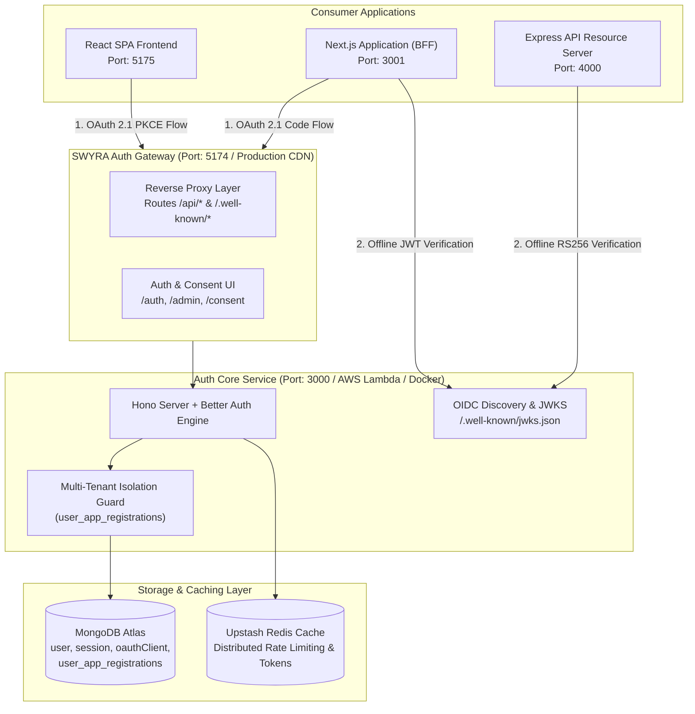
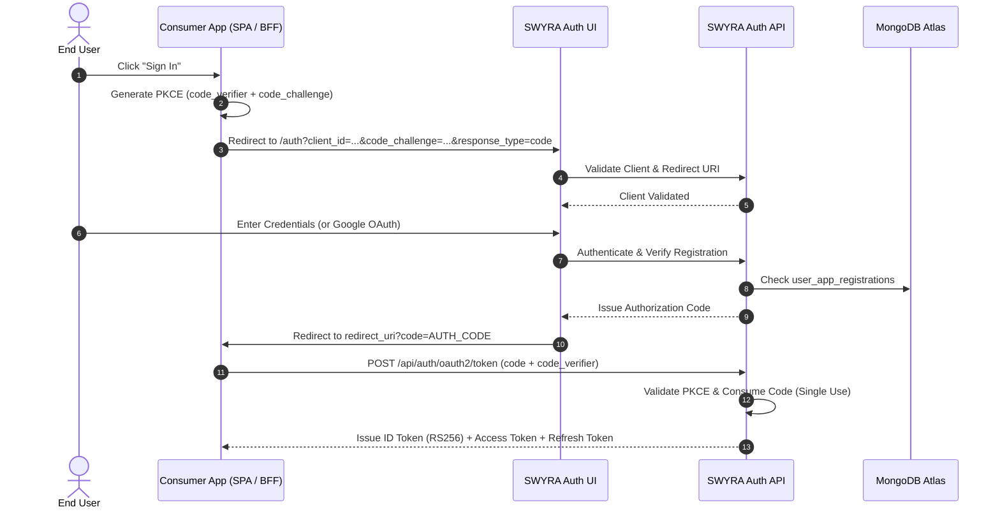

# System Architecture & Protocol Specification

SWYRA Auth is a self-hosted, production-ready OAuth 2.1 and OpenID Connect (OIDC) Identity Provider. It provides zero-coupling identity federation, centralized session management, multi-tenant application isolation, and cryptographic token verification.

---

## 1. High-Level System Architecture



---

## 2. Core Architectural Principles

### A. Strict Multi-Tenant Application Isolation
- **Per-Application User Registry**: Users are registered explicitly per client application via `user_app_registrations`.
- **Cross-App Authorization Guard**: A user registered on Application A cannot authorize or authenticate on Application B unless explicitly registered for Application B.
- **Cryptographic Token Binding**: Access tokens are cryptographically bound to the issuing `client_id` (enforced via JWT claims `client_id`, `azp`, and `aud`). This completely prevents cross-application token replay attacks.

### B. Unified Single-Origin Gateway Pattern
- In local development, the frontend dev server (`http://localhost:5174`) reverse-proxies `/api/*` and `/.well-known/*` to the Hono backend (`http://localhost:3000`), matching production CDN (e.g. Cloudflare/Vercel) behavior.
- All consumer applications configure `AUTH_ISSUER=http://localhost:5174` (or your production domain).

### C. Client Secret Plaintext Rule
- Better Auth stores client secrets in MongoDB as encrypted/hashed ciphertext in the `oauthClient` collection.
- Consumer applications must always use the **plaintext client secret** issued upon client creation in the Admin Dashboard, which is never stored in plaintext on the server.

---

## 3. OAuth 2.1 Protocol Implementation

SWYRA Auth strictly adheres to the **OAuth 2.1 Draft Specification** and **RFC 8252**:



### Protocol Guarantees:
1. **No Implicit Grant**: The insecure Implicit Grant (`response_type=token`) is disabled.
2. **Mandatory PKCE**: All Authorization Code exchanges require `code_challenge` (S256) and `code_verifier`.
3. **Single-Use Authorization Codes**: Authorization codes expire in 60 seconds and are immediately deleted upon redemption.
4. **Token Family Rotation**: Refresh tokens utilize strict family rotation. Replaying an older refresh token instantly invalidates the entire token family.

---

## 4. OIDC Discovery & JWKS Public Key Infrastructure

Resource servers and consumer backends verify JWT tokens offline without database roundtrips:

- **OpenID Configuration Endpoint**:
  ```text
  GET /.well-known/openid-configuration
  ```
  Returns standard discovery metadata (issuer, authorization endpoint, token endpoint, jwks URI, response types, subject types).

- **JSON Web Key Set (JWKS) Endpoint**:
  ```text
  GET /.well-known/jwks.json
  ```
  Exposes the public RS256 keys for offline cryptographic signature verification.
