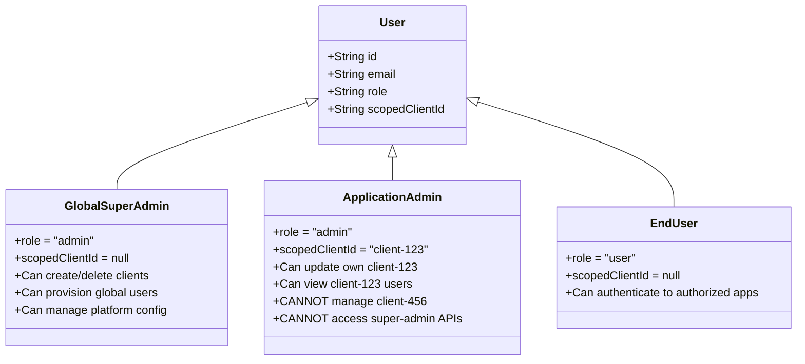

# SWYRA Auth -- System Architecture (ARCHITECTURE.md)

**Authority:** Normative Technical Architecture & System Design Specification  
**Scope:** SWYRA Auth Core IdP, Security Boundaries, and Multi-Tenant Topology  

---

## 1. System Topology & Infrastructure Layout

SWYRA Auth is structured as a resilient, multi-tier cloud-native identity service:

```
[ User Browser / Consumer Application ]
                 │
                 ▼ HTTPS
┌─────────────────────────────────────────────────────────┐
│              Vercel Edge & Reverse Proxy                │
│  - Static Asset Delivery (React SPA frontend)           │
│  - Edge Rewrites (/api/* -> AWS Lambda Function URL)   │
│  - Gateway Trust Header Injection (x-gateway-secret)    │
└────────────────────────┬────────────────────────────────┘
                         │ HTTPS + x-gateway-secret
                         ▼
┌─────────────────────────────────────────────────────────┐
│               AWS Lambda (Node.js 24)                   │
│  - Hono Framework HTTP Router                           │
│  - Gateway Trust Perimeter Middleware                   │
│  - Better-Auth Core + OAuth 2.1 / OIDC Plugin Engine    │
│  - RS256 JWT Token Minting & JWKS Engine                │
│  - Token Family CAS Rotation Engine                     │
└──────────────┬───────────────────────────┬──────────────┘
               │                           │
               ▼ MongoDB Driver            ▼ HTTP REST
┌─────────────────────────────┐  ┌────────────────────────┐
│      MongoDB Atlas          │  │     Upstash Redis      │
│  - Replica Set              │  │  - Sliding Window      │
│  - user & oauthClient docs  │  │    Rate Limiters       │
│  - user_app_registrations   │  │  - Origin Caching      │
│  - oauth_token_families     │  │                        │
└─────────────────────────────┘  └────────────────────────┘
```

---

## 2. Centralized Authentication Boundary

### The Single IdP Model
All consumer applications—regardless of their ownership, framework, or internal authorization model—rely on SWYRA Auth as the authoritative Identity Provider.

1. **Credentials Terminate at IdP:** User email and password pairs are submitted exclusively to the IdP login interface (`/auth`).
2. **Stateless Authorization Tokens:** Consumer backends receive standard OpenID Connect tokens (`id_token`, `access_token`, `refresh_token`).
3. **No Credential Relay:** Consumer applications never collect or transmit user credentials. The previous architecture of relaying credentials through `/api/auth/app-admin/login` has been retired.

---

## 3. Tenancy Model: Public vs Private Applications

SWYRA Auth implements multi-tenant isolation via the `isPublic` property on the `oauthClient` record:

```
                          OAuth /authorize Request
                                     │
                                     ▼
                        Is user authenticated at IdP?
                                     │
                         ┌───────────┴───────────┐
                        NO                       YES
                         │                        │
                         ▼                        ▼
                Redirect to IdP Login       Is client isPublic?
               (Sign-Up disabled if               │
                client.isPublic=false)   ┌────────┴────────┐
                         │              YES                NO
                         ▼               │                 │
                User authenticates       │                 ▼
                         │               │       Is user in user_app_registrations?
                         └───────────────┘                 │
                                                   ┌───────┴───────┐
                                                  YES              NO
                                                   │               │
                                                   ▼               ▼
                                            Issue Code       302 access_denied
```

### 3.1 Public Applications (`isPublic: true`)
- Open to all authenticated users of the SWYRA platform.
- When an authenticated user authorizes a public application, the IdP automatically records membership in `user_app_registrations` and issues the authorization code.
- Public self-registration is enabled on the IdP login page for public clients.

### 3.2 Private Applications (`isPublic: false`)
- Access is restricted exclusively to pre-authorized organizational users.
- An unauthenticated user hitting `/api/auth/oauth2/authorize` is redirected to the IdP login page (`/auth?is_public=false`), where the **Sign-Up tab is hidden and disabled**.
- Upon authenticating with their IdP account, the OAuth boundary queries `user_app_registrations`:
  - If registered (or user possesses app-admin bypass): OAuth authorization code is issued.
  - If NOT registered: Authorization is immediately denied with HTTP 302 to the consumer callback: `error=access_denied&error_description=Access restricted: Your account is not authorized for this private application`.
- Self-registration API (`POST /api/auth/sign-up/email?client_id=...`) strictly returns HTTP 403 `registration_disabled`.

---

## 4. Administrative Role Hierarchy

SWYRA Auth enforces a clear distinction between platform-level and application-level administrators:


```mermaid
classDiagram
    class User {
        +String id
        +String email
        +String role
        +String scopedClientId
    }

    class GlobalSuperAdmin {
        +role = "admin"
        +scopedClientId = null
        +Can create/delete clients
        +Can provision global users
        +Can manage platform config
    }

    class ApplicationAdmin {
        +role = "admin"
        +scopedClientId = "client-123"
        +Can update own client-123
        +Can view client-123 users
        +CANNOT manage client-456
        +CANNOT access super-admin APIs
    }

    class EndUser {
        +role = "user"
        +scopedClientId = null
        +Can authenticate to authorized apps
    }

    User <|-- GlobalSuperAdmin
    User <|-- ApplicationAdmin
    User <|-- EndUser
```

### Administrative Claims in Tokens
When an administrator completes the OAuth 2.1 flow, their administrative scope is emitted in the RS256 JWT ID token and UserInfo endpoint:
```json
{
  "sub": "6ac2611c1878f531c3f91a05",
  "email": "admin@tenant.com",
  "role": "admin",
  "scoped_client_id": "client-123"
}
```

---

## 5. Token Lifecycle & Family Revocation Engine

SWYRA Auth implements RFC 6749 Section 10.4 and RFC 6819 refresh token rotation with an atomic Compare-and-Swap (CAS) state machine:

```
[ Active Refresh Token R0 ]
          │
          │ POST /oauth2/token (grant_type=refresh_token)
          ▼
   CAS State Machine:
   - Validates client ownership
   - Marks R0 as consumed
   - Issues new Access Token A1 + new Refresh Token R1
          │
          ├─────────────────────────────────────────────────┐
          ▼                                                 ▼
[ Legitimate Client holds R1 ]                    [ Attacker replays R0 ]
          │                                                 │
          ▼                                                 ▼
Normal subsequent rotation                      REPLAY THEFT DETECTED:
                                                - CAS detects consumed R0
                                                - Cascade Revocation triggers
                                                - Family marked status: "revoked"
                                                - Active tokens A1, R1 purged
                                                - Returns 401 invalid_grant
```

### Invariants:
1. **Per-Client Scoping:** A token family is permanently bound to the `clientId` that created it. Replaying or presenting a token family across client boundaries is rejected (400 `invalid_grant`).
2. **Grace Window:** A strict 2000ms grace window accommodates concurrent in-flight network retries without false-positive family revocation.
3. **Private Tenant Eviction:** When a user is removed from a private application, subsequent refresh token exchanges fail immediately (401 `invalid_grant`), and all active access tokens for that client are invalidated.

---

## 6. Cryptographic Infrastructure (JWKS & PKI)

- **Algorithm:** Strictly `RS256` (RSA Signature with SHA-256). Algorithms `HS256`, `none`, or unpinned algorithms are rejected.
- **Key Storage:** RSA 2048-bit keypairs generated and stored securely in MongoDB collection `oauthKey`.
- **Public Metadata:** JWKS keys published at `/.well-known/jwks.json` and OpenID Discovery at `/.well-known/openid-configuration`.
- **Consumer Offline Verification:** Consumer applications never make per-request network calls to verify tokens. They cache JWKS keys and perform cryptographic verification locally.
