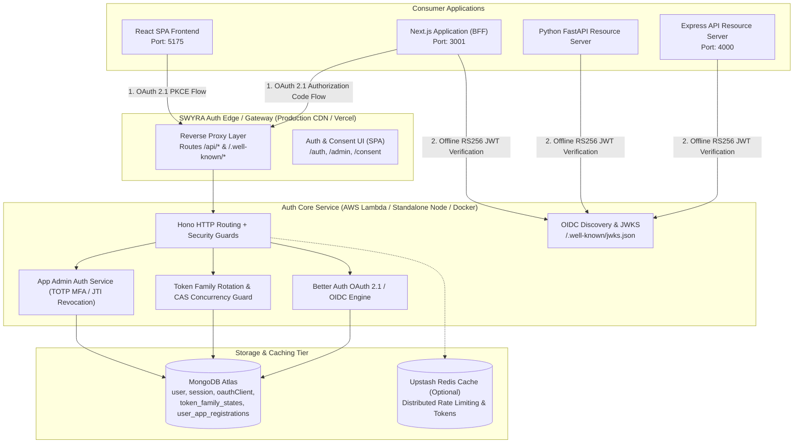
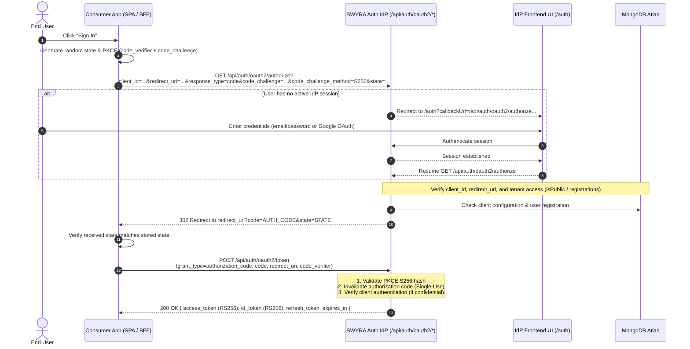

# System Architecture & Protocol Specification
**Version:** 2.1.0  
**Status:** Authoritative Architectural Design

SWYRA Auth is a self-hosted, multi-tenant OAuth 2.1 and OpenID Connect (OIDC) Identity Provider. It provides zero-coupling identity federation, centralized session management, multi-tenant application isolation, and cryptographic token verification.

---

## 1. High-Level System Architecture


```mermaid
flowchart TD
    subgraph Clients["Consumer Applications"]
        NextApp["Next.js Application (BFF)<br/>Port: 3001"]
        ReactApp["React SPA Frontend<br/>Port: 5175"]
        ExpressApp["Express API Resource Server<br/>Port: 4000"]
        FastAPIApp["Python FastAPI Resource Server"]
    end

    subgraph Gateway["SWYRA Auth Edge / Gateway (Production CDN / Vercel)"]
        ReverseProxy["Reverse Proxy Layer<br/>Routes /api/* & /.well-known/*"]
        AuthUI["Auth & Consent UI (SPA)<br/>/auth, /admin, /consent"]
    end

    subgraph Core["Auth Core Service (AWS Lambda / Standalone Node / Docker)"]
        HonoApp["Hono HTTP Routing + Security Guards"]
        BetterAuth["Better Auth OAuth 2.1 / OIDC Engine"]
        TokenFamily["Token Family Rotation & CAS Concurrency Guard"]
        AppAdminService["App Admin Auth Service (TOTP MFA / JTI Revocation)"]
        JWKSEndpoint["OIDC Discovery & JWKS<br/>/.well-known/jwks.json"]
    end

    subgraph Storage["Storage & Caching Tier"]
        MongoDB[("MongoDB Atlas<br/>user, session, oauthClient,<br/>token_family_states, user_app_registrations")]
        Redis[("Upstash Redis Cache (Optional)<br/>Distributed Rate Limiting & Tokens")]
    end

    NextApp -- "1. OAuth 2.1 Authorization Code Flow" --> ReverseProxy
    ReactApp -- "1. OAuth 2.1 PKCE Flow" --> ReverseProxy
    ReverseProxy --> HonoApp
    HonoApp --> BetterAuth
    HonoApp --> TokenFamily
    HonoApp --> AppAdminService
    BetterAuth --> MongoDB
    TokenFamily --> MongoDB
    AppAdminService --> MongoDB
    HonoApp -.-> Redis
    ExpressApp -- "2. Offline RS256 JWT Verification" --> JWKSEndpoint
    FastAPIApp -- "2. Offline RS256 JWT Verification" --> JWKSEndpoint
    NextApp -- "2. Offline RS256 JWT Verification" --> JWKSEndpoint
```

---

## 2. Core Architectural Principles & Boundaries

### A. Clear System Separation
The identity provider and consumer applications maintain strict boundaries:
- **No Database Sharing**: Consumer applications never access the SWYRA Auth MongoDB cluster. All data access occurs over standard HTTPS protocols.
- **No Duplicate Identity Engines**: Consumer apps do not run Better Auth, NextAuth, or custom user tables. They act as standard OAuth 2.1 clients or resource servers.

### B. Strict Multi-Tenant Application Isolation
- **Application Access Modes (`isPublic`)**:
  - `isPublic: true` (Public Mode): Any registered user in the identity pool can sign in. Application membership is recorded upon first login.
  - `isPublic: false` (Private Mode): Strict tenant isolation. Users must be explicitly granted access via `user_app_registrations` before login is allowed.
- **Cryptographic Token Binding**: Access tokens are bound to the client application via JWT claims (`client_id`, `azp`, and `aud`). Resource servers verify that the token's audience matches their own client ID, preventing cross-tenant token replay attacks.

### C. Unified Single-Origin Gateway Pattern
In production (and local development via the Vite proxy), the frontend UI and backend API can be served under a single origin or dedicated domain. The backend handles API and protocol traffic:
- Protocol routes: `/api/auth/oauth2/*`
- App Admin routes: `/api/auth/app-admin/*`
- Super Admin routes: `/api/admin/*`
- Discovery routes: `/.well-known/*`
- Frontend UI routes: `/auth`, `/admin`, `/consent`

---

## 3. OAuth 2.1 Protocol Execution Flow

SWYRA Auth strictly follows the **OAuth 2.1 Draft Specification** (RFC 6749 + RFC 7636 + RFC 8252):


```mermaid
sequenceDiagram
    autonumber
    actor User as End User
    participant Client as Consumer App (SPA / BFF)
    participant Server as SWYRA Auth IdP (/api/auth/oauth2/*)
    participant UI as IdP Frontend UI (/auth)
    participant DB as MongoDB Atlas

    User->>Client: Click "Sign In"
    Client->>Client: Generate random state & PKCE (code_verifier + code_challenge)
    Client->>Server: GET /api/auth/oauth2/authorize?<br/>client_id=...&redirect_uri=...&response_type=code&code_challenge=...&code_challenge_method=S256&state=...
    
    alt User has no active IdP session
        Server-->>UI: Redirect to /auth?callbackUrl=/api/auth/oauth2/authorize...
        User->>UI: Enter credentials (email/password or Google OAuth)
        UI->>Server: Authenticate session
        Server-->>UI: Session established
        UI-->>Server: Resume GET /api/auth/oauth2/authorize
    end

    Note over Server,DB: Verify client_id, redirect_uri, and tenant access (isPublic / registrations)
    Server->>DB: Check client configuration & user registration
    Server-->>Client: 302 Redirect to redirect_uri?code=AUTH_CODE&state=STATE

    Client->>Client: Verify received state matches stored state
    Client->>Server: POST /api/auth/oauth2/token<br/>(grant_type=authorization_code, code, redirect_uri, code_verifier)
    Note over Server: 1. Validate PKCE S256 hash<br/>2. Invalidate authorization code (Single-Use)<br/>3. Verify client authentication (if confidential)
    Server-->>Client: 200 OK { access_token (RS256), id_token (RS256), refresh_token, expires_in }
```

### Protocol Guarantees:
1. **Implicit Grant Disabled**: `response_type=token` is completely disabled.
2. **Mandatory PKCE**: All authorization code exchanges require `code_challenge` (S256) and `code_verifier`.
3. **Single-Use Authorization Codes**: Codes expire in 60 seconds and are immediately consumed upon exchange.
4. **Token Family Rotation**: Refresh tokens use atomic Compare-And-Swap (CAS) state tracking. Replaying an already-consumed refresh token revokes the entire token family.

---

## 4. Refresh Token Family Rotation & Concurrency Architecture

To guard against refresh token theft and race conditions in distributed or mobile clients:

```mermaid
stateDiagram-v2
    [*] --> Active_R0: Initial Token Issue
    Active_R0 --> Active_R1: Normal Rotation (R0 consumed)
    Active_R1 --> Active_R2: Normal Rotation (R1 consumed)

    state "Concurrency Handling (2s Window)" as Concur {
        Active_R0 --> InFlight_CAS: Concurrent Request A
        InFlight_CAS --> Active_R1: Success
        Active_R0 --> Replay_Grace: Concurrent Request B (< 2s)
    }

    state "Adversarial Token Reuse" as Replay {
        Active_R0 --> Revoked_Family: Stale R0 Replayed (> 2s)
        Active_R1 --> Revoked_Family: Stale R1 Replayed (> 2s)
    }

    Revoked_Family --> [*]: All tokens invalidated; forced re-authentication
```

### Invariants:
1. **Atomic CAS State**: Each rotation writes to `token_family_states` using MongoDB atomic operations (`findOneAndUpdate` with version check).
2. **Single-Flight Concurrency**: If multiple concurrent requests arrive with the same token, exactly one executes the rotation; competing requests fail closed or are handled within the 2-second in-flight grace window.
3. **Fail-Closed Revocation**: If a consumed token is replayed outside the grace window, the family is marked compromised, revoking all active child tokens.

---

## 5. Per-Application Administrator Architecture

SWYRA Auth decouples **Platform Administration** (Super Admins) from **Application Administration** (Per-Application Admins):

```
┌────────────────────────────────────────────────────────┐
│                   SUPER ADMIN CONSOLE                  │
│  - Endpoint: /api/admin/*                              │
│  - Authenticated via Better Auth session               │
│  - Provisions OAuth clients & assigns app admins       │
│  - Manages tenant access & user-to-app mapping         │
└────────────────────────────────────────────────────────┘
                           │
       ┌───────────────────┴───────────────────┐
       ▼                                       ▼
┌──────────────────────────────┐ ┌──────────────────────────────┐
│  APP A ADMINISTRATOR PORTAL  │ │  APP B ADMINISTRATOR PORTAL  │
│  - Dedicated App Admin JWT   │ │  - Dedicated App Admin JWT   │
│  - Signed with dedicated key │ │  - Signed with dedicated key │
│  - Bound to Client A         │ │  - Bound to Client B         │
│  - TOTP MFA with AES-GCM     │ │  - TOTP MFA with AES-GCM     │
└──────────────────────────────┘ └──────────────────────────────┘
```

### Cryptographic Guarantees for App Admins:
- **Dedicated Signing Secret**: App Admin JWTs are signed using `APP_ADMIN_JWT_SECRET` (HMAC-SHA256), completely separate from the OIDC RSA key pair.
- **Client Binding (`aud`)**: App Admin tokens contain `aud: client_id`. Even if an attacker steals an admin token from App A, presenting it to App B's backend results in immediate cryptographic rejection.
- **Stateful JTI Revocation**: Every admin token contains a unique `jti`. Logout immediately registers the JTI in the revocation database.
- **AES-256-GCM TOTP Encryption**: Admin TOTP secrets are encrypted at rest using `APP_ADMIN_TOTP_KEY`.

---

## 6. OIDC Discovery & JWKS Public Key Infrastructure

Resource servers and consumer backends verify JWT tokens offline without database roundtrips:

- **OpenID Configuration Endpoint**:
  ```text
  GET /.well-known/openid-configuration
  ```
  Returns standard discovery metadata (issuer, authorization endpoint, token endpoint, jwks URI, response types, subject types).

- **JSON Web Key Set (JWKS) Endpoint**:
  ```text
  GET /.well-known/jwks.json
  ```
  Exposes the public RS256 keys for offline cryptographic signature verification.
