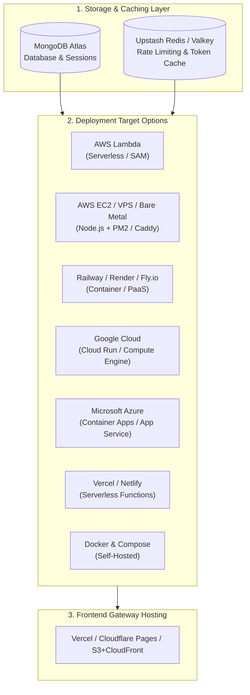

# Multi-Cloud & Server Deployment Guide

SWYRA Auth is designed to deploy seamlessly to any compute provider or infrastructure model — from serverless micro-functions to containerized PaaS platforms and dedicated Linux instances.

---

## 1. Universal Deployment Architecture



---

## 2. Common Prerequisites (All Providers)

### Step 1: Database Setup (MongoDB Atlas)
1. Sign up at [mongodb.com/atlas](https://www.mongodb.com/atlas) and create an **M0 (Free)** or Dedicated cluster.
2. Under **Database Access**, create a user with Read and Write permissions.
3. Under **Network Access**, add `0.0.0.0/0` (required for serverless/dynamic cloud IPs).
4. Connection URI format:
   ```text
   mongodb+srv://<user>:<password>@cluster0.abc123.mongodb.net/oauthservice?retryWrites=true&w=majority
   ```

### Step 2: Distributed Cache (Upstash Redis)
1. Create a free Redis database at [upstash.com](https://upstash.com).
2. Copy `UPSTASH_REDIS_REST_URL` and `UPSTASH_REDIS_REST_TOKEN`.
3. *(Note: If Redis is omitted, the service falls back automatically to MongoDB TTL sliding-window rate limiting).*

### Step 3: Initialize Database Indexes
```bash
cd hono
cp .env.example .env
# Set MONGO_URI and BETTER_AUTH_SECRET in hono/.env
npm run db:setup
```

---

## 3. Provider-Specific Deployment Guides

### Option 1: AWS Lambda (Serverless via AWS SAM)

The backend includes a dedicated serverless entrypoint in `src/lambda.ts` bundled into CommonJS `dist/index.cjs`.

1. **Install dependencies & build**:
   ```bash
   cd hono
   npm install
   npm run build
   ```
2. **Deploy via SAM**:
   ```bash
   ./deploy.sh
   # Or for guided first-time deployment:
   sam deploy --guided --profile aws
   ```
3. **Configure Environment in `hono/samconfig.toml`**:
   ```toml
   parameter_overrides = "BetterAuthUrl=\"https://<lambda-id>.lambda-url.<region>.on.aws/api/auth\" FrontendUrl=\"https://auth.yourdomain.com\""
   ```

---

### Option 2: AWS EC2 / Linux VPS / Dedicated Bare-Metal (Node.js + PM2 + Caddy / Nginx)

For high-throughput bare-metal or VM hosting (Ubuntu, Debian, RHEL, Amazon Linux 2023):

1. **Build the Standalone Node.js bundle**:
   ```bash
   cd hono
   npm install
   npm run build:node
   # Produces standalone dist/index.js powered by @hono/node-server
   ```
2. **Run with PM2 Cluster & Threadpool Scaling**:
   ```bash
   npm install -g pm2
   # Start with 16 worker threads per process for maximum scrypt hashing throughput:
   UV_THREADPOOL_SIZE=16 PORT=3000 NODE_ENV=production pm2 start dist/index.js --name "swyra-auth" -i max
   pm2 save
   pm2 startup
   ```
3. **Configure Reverse Proxy with TLS (Caddy or Nginx)**:

   *Option A: Caddy (`/etc/caddy/Caddyfile`)*:
   ```caddy
   api.auth.yourdomain.com {
       reverse_proxy localhost:3000 {
           header_up X-Forwarded-For {remote_host}
           header_up X-Forwarded-Proto {scheme}
       }
   }
   ```

   *Option B: Nginx (`/etc/nginx/sites-available/auth`)*:
   ```nginx
   server {
       server_name api.auth.yourdomain.com;
       location / {
           proxy_pass http://127.0.0.1:3000;
           proxy_http_version 1.1;
           proxy_set_header Host $host;
           proxy_set_header X-Real-IP $remote_addr;
           proxy_set_header X-Forwarded-For $proxy_add_x_forwarded_for;
           proxy_set_header X-Forwarded-Proto $scheme;
       }
       listen 443 ssl;
       # managed by Certbot (Let's Encrypt)
   }
   ```

---

### Option 3: Railway / Render / Fly.io (PaaS & Containers)

1. **Deploying on Railway**:
   - Create a new project on [railway.app](https://railway.app) connected to your GitHub repository.
   - **Root Directory**: `hono`
   - **Build Command**: `npm install && npm run build:node`
   - **Start Command**: `npm start` (runs `node dist/index.js`)
   - Add environment variables in the Railway dashboard (`MONGO_URI`, `BETTER_AUTH_SECRET`, `BETTER_AUTH_URL`, `FRONTEND_URL`, `UV_THREADPOOL_SIZE=16`).
2. **Deploying on Render**:
   - Create a **Web Service** on [render.com](https://render.com).
   - **Environment**: Node
   - **Build Command**: `npm install && npm run build:node`
   - **Start Command**: `npm start`
3. **Deploying on Fly.io**:
   ```bash
   cd hono
   fly launch --dockerfile Dockerfile
   fly secrets set MONGO_URI="..." BETTER_AUTH_SECRET="..." BETTER_AUTH_URL="..." FRONTEND_URL="..."
   fly deploy
   ```

---

### Option 4: Google Cloud Platform (GCP) — Cloud Run & Compute Engine

1. **GCP Cloud Run (Serverless Container)**:
   ```bash
   # 1. Build and push container to Google Artifact Registry
   cd hono
   gcloud builds submit --tag gcr.io/$PROJECT_ID/swyra-auth:latest .

   # 2. Deploy to Cloud Run with automatic HTTPS and concurrency scaling
   gcloud run deploy swyra-auth \
     --image gcr.io/$PROJECT_ID/swyra-auth:latest \
     --platform managed \
     --region us-central1 \
     --allow-unauthenticated \
     --port 3000 \
     --set-env-vars "NODE_ENV=production,UV_THREADPOOL_SIZE=16,MONGO_URI=...,BETTER_AUTH_SECRET=...,BETTER_AUTH_URL=https://<cloud-run-url>/api/auth,FRONTEND_URL=https://auth.domain.com"
   ```
2. **GCP Compute Engine (VM Instance)**:
   - Create an e2-standard-2 VM.
   - Follow the **Linux VPS (Option 2)** instructions with PM2 and Caddy.

---

### Option 5: Microsoft Azure — Container Apps & App Service

1. **Azure Container Apps**:
   ```bash
   # 1. Build container image in Azure Container Registry (ACR)
   az acr build --registry <yourRegistryName> --image swyra-auth:latest ./hono

   # 2. Create Azure Container App
   az containerapp create \
     --name swyra-auth \
     --resource-group <yourResourceGroup> \
     --environment <yourManagedEnvironment> \
     --image <yourRegistryName>.azurecr.io/swyra-auth:latest \
     --target-port 3000 \
     --ingress external \
     --env-vars "NODE_ENV=production" "UV_THREADPOOL_SIZE=16" "MONGO_URI=secretref:mongo-uri" "BETTER_AUTH_SECRET=secretref:auth-secret" "BETTER_AUTH_URL=https://<app-fqdn>/api/auth" "FRONTEND_URL=https://auth.domain.com"
   ```
2. **Azure App Service (Linux Node.js 20)**:
   - Set Startup Command in Azure Portal: `node dist/index.js`
   - Set Application Settings matching the Environment Variables Reference table.

---

### Option 6: Vercel (Full-Stack Backend + Frontend SPA)

1. **Backend Serverless Entrypoint**:
   - The backend includes `src/vercel.ts` and `npm run build:vercel` configured to export a Vercel Serverless Function handler.
2. **Frontend Deployment**:
   - Link the repo to [Vercel](https://vercel.com).
   - Set **Root Directory** to `frontend`.
   - Set Environment Variable: `VITE_AUTH_URL=https://<your-backend-domain>`.
   - The included `frontend/vercel.json` and root `vercel.json` configure SPA route rewrites automatically.

---

### Option 7: Netlify (Netlify Functions + SPA)

1. **Backend Serverless Functions**:
   - Build bundle: `npm run build:netlify` (generates handler from `src/netlify.ts`).
2. **Frontend SPA**:
   - Deploy `frontend/dist` with `_redirects` file: `/* /index.html 200`.

---

### Option 8: Full-Stack Docker Compose (Self-Hosted)

To run the complete stack (Hono Backend API + React Frontend Gateway) on a single server:

```bash
# 1. Clone repository and navigate to root
git clone <repo-url> && cd OAuth2.1

# 2. Configure environment
cp hono/.env.example hono/.env
# Edit hono/.env with your MongoDB Atlas URI, Better Auth Secret, and Domains

# 3. Start services in background
docker compose up -d --build

# Backend API will be available on http://localhost:3000
# Frontend Admin & Auth UI will be available on http://localhost:8080
```

---

## 4. Post-Deployment Admin Provisioning

Because public registration is disabled by default in production (`AUTH_PUBLIC_SIGNUP_ENABLED=false`), provision your initial Super-Admin account using the CLI utility:

```bash
cd hono
npm run admin:create -- "admin@yourdomain.com" "YourStrongPassword@2026!" "Super Admin"
```

> **Password Requirements:** 12–128 characters, containing at least one uppercase letter, one lowercase letter, one number, and one symbol.

Log into your Admin Console at:
```text
https://<your-frontend-domain>/admin/login
```
