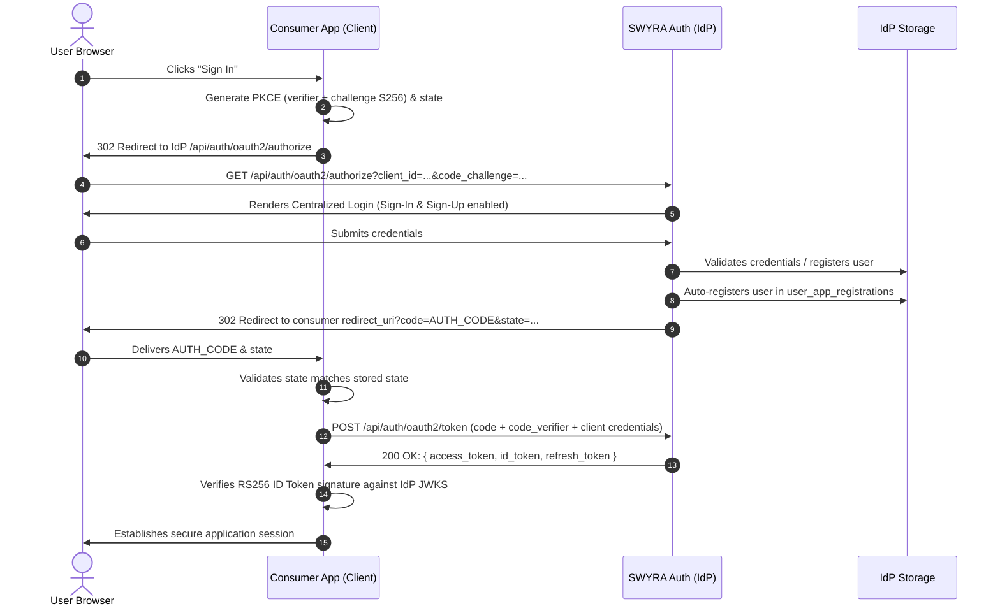
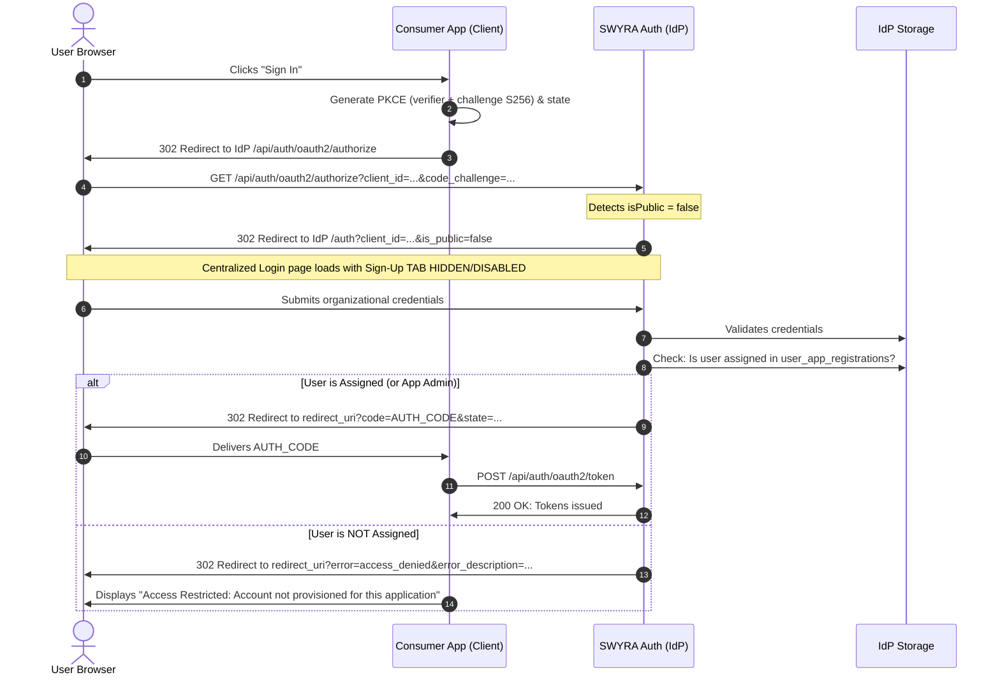

# SWYRA Auth -- Consumer Integration Specification (INTEGRATION.md)

**Standard:** OAuth 2.1 & OpenID Connect (OIDC) Core 1.0  
**Authority:** Normative Integration Contract for Human Engineers and AI Coding Agents  
**Target:** Monorepo & External Consumer Applications  

---

## 1. Executive Summary & Architectural Foundation

SWYRA Auth is a centralized, multi-tenant **OAuth 2.1 and OpenID Connect (OIDC)** Identity Provider (IdP).

### The Prime Directive of Consumer Integration
> **All consumer applications—regardless of tenancy model, access restrictions, or administrative roles—authenticate users through ONE centralized protocol:**  
> **OAuth 2.1 Authorization Code Flow with PKCE (`S256`).**

### Prohibited Patterns
- **No In-App Password Handling:** Consumer applications must **NEVER** collect, render input forms for, handle, proxy, transmit, or store IdP user passwords.
- **No Credential-Relay:** Consumer backends must **NEVER** send `{ email, password, client_id, client_secret }` to `/api/auth/app-admin/login`, `/api/auth/app-admin/verify`, or any custom password-checking endpoint.
- **No Direct Database Access:** Consumer applications are never provided `MONGO_URI` or direct access to the IdP database.
- **No Redundant Auth Frameworks:** Consumer applications must not install duplicate authentication engines (e.g. NextAuth, Auth.js, Passport, Better Auth, Supabase, Lucia) that maintain separate credential stores.

---

## 2. The Four Supported Application Configurations

SWYRA Auth supports four client configurations under a single unified OAuth 2.1 PKCE architecture:

| Configuration | `isPublic` | Description | Login UX | Authorization Rule |
|---|---|---|---|---|
| **A. Public Application** | `true` | Open platform access. Any registered user may authenticate. | Centralized IdP Login with Sign-Up enabled. | Any valid IdP user is granted authorization code. Registered in `user_app_registrations` upon first login. |
| **B. Private Application** | `false` | Enterprise tenant. Only explicitly assigned users may access. | Centralized IdP Login with Sign-Up disabled. | User authenticates at IdP. IdP verifies membership in `user_app_registrations`. Assigned &rarr; Code; Unassigned &rarr; `302 error=access_denied`. |
| **C. Public App + App Admin** | `true` | Open platform access with delegated application administration. | Centralized IdP Login. | Normal users receive standard claims (`role: "user"`). App Admins receive `role: "admin"` and `scoped_client_id: "<clientId>"`. |
| **D. Private App + App Admin** | `false` | Restricted enterprise tenant with delegated application administration. | Centralized IdP Login (Sign-Up disabled). | Administrator must be an explicitly provisioned user of the private app, possess `role: "admin"`, and have `scoped_client_id` matching this client. |

---

## 3. Detailed Architectural Flows

### 3.1 Public Application Flow (`isPublic = true`)


### 3.2 Private Application Flow (`isPublic = false`)


### 3.3 Application Administration Authorization
Application administrators are identities managed within the IdP whose administrative scope is restricted to a specific application:
- **Global Super Admin:** `role: "admin"`, `scoped_client_id: null` (Full platform administration).
- **Application Admin:** `role: "admin"`, `scoped_client_id: "client-xyz"` (Can manage only client `client-xyz`).

The consumer application inspects the cryptographically signed JWT or calls `/api/auth/oauth2/userinfo`:
```typescript
function isApplicationAdmin(claims: { role?: string; scoped_client_id?: string | null }, expectedClientId: string): boolean {
  if (claims.role !== "admin") return false;
  // Super Admin has global privileges; Scoped Admin matches clientId
  return claims.scoped_client_id === null || claims.scoped_client_id === expectedClientId;
}
```

### 3.4 Application Administrator Credential & Identity Lifecycle

Application Administrators are provisioned via the Super Admin API (`POST /api/admin/clients/:clientId/app-admins`) or the Admin Console:
- When an App Admin is created or updated, their identity and credentials are automatically synchronized directly into the centralized IdP `user` and `account` tables.
- The administrator's centralized user record receives:
  - `role: "admin"`
  - `scopedClientId: "<clientId>"`
  - `emailVerified: true`
  - Explicit assignment in `user_app_registrations` (guaranteeing access to private applications).
- **Authentication Location:** Application administrators authenticate exclusively through the **centralized IdP login page** (`${AUTH_ISSUER}/auth` or `${AUTH_ISSUER}/api/auth/oauth2/authorize`).
- **Never In Consumer:** The consumer application NEVER creates a custom administrator password form or relays credentials.

---

## 4. Endpoints Directory

Base URL: `${AUTH_ISSUER}` (Production: `https://oauth21.vercel.app`)

| Protocol Action | HTTP Method | Exact Path | Notes |
|---|---|---|---|
| **OIDC Discovery** | `GET` | `/.well-known/openid-configuration` | Returns discovery metadata & issuer configuration |
| **JWKS Public Keys** | `GET` | `/.well-known/jwks.json` | RS256 RSA public keys for offline signature verification |
| **OAuth Authorization** | `GET` | `/api/auth/oauth2/authorize` | Browser authorization redirect with PKCE `code_challenge` & `state` |
| **Token Exchange** | `POST` | `/api/auth/oauth2/token` | Exchange `authorization_code` or rotate `refresh_token` |
| **UserInfo** | `GET` | `/api/auth/oauth2/userinfo` | Header `Authorization: Bearer <access_token>` |
| **Token Introspection** | `POST` | `/api/auth/oauth2/introspect` | Confidential client token verification |
| **Token Revocation** | `POST` | `/api/auth/oauth2/revoke` | Revoke active token or entire token family |

### 4.1 Token Formats & Claims Specification

SWYRA Auth issues RS256-signed JWTs for both **ID Tokens** and **Access Tokens**. Both can be cryptographically verified offline using standard JOSE / JWT libraries against the public keys published at `/.well-known/jwks.json`.

| Token Type | Format | Signing Alg | Claims Contained | Primary Usage |
|---|---|---|---|---|
| **ID Token** (`id_token`) | RS256 JWT | RS256 | `sub`, `email`, `name`, `iss`, `aud`, `exp`, `iat` | Client-side user identity verification |
| **Access Token** (`access_token`) | RS256 JWT | RS256 | `sub`, `email`, `name`, `role`, `scoped_client_id`, `client_id`, `azp`, `scope`, `iss`, `aud`, `exp`, `iat` | API authorization & offline backend verification |
| **Refresh Token** (`refresh_token`) | Opaque | N/A | Server-managed token family | Rotating session renewal |

#### Access Token Claims Payload
```json
{
  "sub": "6ac330238d040e9eaaee2b42",
  "role": "admin",
  "scoped_client_id": "vIaLkLJZpfMesoHlhJHNGOtnFRTcbzUx",
  "email": "swyra@aws.com",
  "name": "AWS Admin",
  "client_id": "vIaLkLJZpfMesoHlhJHNGOtnFRTcbzUx",
  "azp": "vIaLkLJZpfMesoHlhJHNGOtnFRTcbzUx",
  "scope": "openid profile email",
  "iss": "https://oauth21.vercel.app",
  "aud": "vIaLkLJZpfMesoHlhJHNGOtnFRTcbzUx",
  "iat": 1728100000,
  "exp": 1728100900
}
```

> ⚠️ **Verification Guidance for Consumers & Agents:**
> 1. When verifying either `id_token` or `access_token` offline, pin the algorithm to `RS256` only.
> 2. Validate `iss === process.env.AUTH_ISSUER` and `aud === process.env.CLIENT_ID`.
> 3. If validating `azp` (authorized party), ensure it matches `process.env.CLIENT_ID`.
> 4. To extract tenant admin privileges, read `role` and `scoped_client_id` directly from the verified `access_token` claims or the `/api/auth/oauth2/userinfo` response.

---

## 5. Security Invariants (Normative Rules)

1. **Mandatory PKCE (`S256`):** Every authorization request MUST include `code_challenge` and `code_challenge_method=S256`. Plain PKCE (`code_challenge_method=plain`) is strictly forbidden.
2. **Cryptographic State Parameter:** Every authorization request MUST include a cryptographically random `state` parameter generated with at least 128 bits of entropy (e.g. 16+ bytes hex/base64url). The consumer must verify the state on callback.
3. **Exact Redirect URI Matching:** The `redirect_uri` supplied during `/authorize` and `/token` must match an entry registered in the IdP client record exactly. No wildcarding, regex, or localhost fallbacks in production.
4. **Offline RS256 Verification:** Consumer backends must verify JWT signatures offline against the IdP's JWKS (`/.well-known/jwks.json`) using standard libraries (`jose`, `PyJWKClient`). Algorithms `none`, `HS256`, or unpinned algorithms are strictly rejected.
5. **Issuer & Audience Validation:**
   - `iss` MUST strictly match `${AUTH_ISSUER}`.
   - `aud` MUST strictly match the consumer's `${CLIENT_ID}`.
6. **Fail-Closed Configuration:** All environment variables must fail closed. No expressions like `AUTH_CALLBACK_URL || "http://localhost:3000/callback"`. If configuration is missing, the application must abort startup.
7. **Refresh Token Rotation:** Refresh tokens rotate on every exchange. Replaying an old refresh token instantly revokes the entire token family.

---

## 6. Concrete Framework Integration Recipes

### Recipe 1: Next.js 14+ (App Router) BFF with HttpOnly Cookies

#### Environment Configuration (`.env.local`)
```env
AUTH_ISSUER=https://oauth21.vercel.app
CLIENT_ID=your-registered-client-id
CLIENT_SECRET=your-registered-client-secret
AUTH_CALLBACK_URL=https://your-domain.com/api/auth/callback
SESSION_SECRET=32-random-characters-hex-or-base64
```

#### Login Initiator (`app/api/auth/login/route.ts`)
```typescript
import { NextResponse } from "next/server";
import crypto from "crypto";

export async function GET() {
  const issuer = process.env.AUTH_ISSUER;
  const clientId = process.env.CLIENT_ID;
  const redirectUri = process.env.AUTH_CALLBACK_URL;

  if (!issuer || !clientId || !redirectUri) {
    throw new Error("Missing required OAuth configuration. Failing closed.");
  }

  // 1. Generate PKCE Verifier & Challenge
  const codeVerifier = crypto.randomBytes(32).toString("base64url");
  const codeChallenge = crypto.createHash("sha256").update(codeVerifier).digest("base64url");

  // 2. Generate Cryptographic State
  const state = crypto.randomBytes(16).toString("base64url");

  // 3. Construct Authorization URL
  const authUrl = new URL(`${issuer}/api/auth/oauth2/authorize`);
  authUrl.searchParams.set("client_id", clientId);
  authUrl.searchParams.set("response_type", "code");
  authUrl.searchParams.set("redirect_uri", redirectUri);
  authUrl.searchParams.set("scope", "openid profile email offline_access");
  authUrl.searchParams.set("code_challenge", codeChallenge);
  authUrl.searchParams.set("code_challenge_method", "S256");
  authUrl.searchParams.set("state", state);

  const res = NextResponse.redirect(authUrl.toString(), 302);

  // 4. Store Verifier and State in Secure HttpOnly Cookies
  const isProd = process.env.NODE_ENV === "production";
  res.cookies.set("oauth_verifier", codeVerifier, { httpOnly: true, secure: isProd, sameSite: "lax", maxAge: 600, path: "/" });
  res.cookies.set("oauth_state", state, { httpOnly: true, secure: isProd, sameSite: "lax", maxAge: 600, path: "/" });

  return res;
}
```

#### Consumer Login UI (`app/login/page.tsx`)
> ⚠️ **CRITICAL CONTRACT FOR CONSUMERS & AI AGENTS:**  
> The consumer application must **NEVER** render an email/password form or submit credentials.  
> The consumer's `/login` page must only render a "Sign In" link/button that triggers the OAuth initiator (`GET /api/auth/login`).

```tsx
export default function LoginPage({ searchParams }: { searchParams?: { error?: string; desc?: string } }) {
  const isAccessDenied = searchParams?.error === "access_denied";

  return (
    <main className="flex min-h-screen flex-col items-center justify-center p-4">
      <div className="w-full max-w-md rounded-lg border p-6 shadow-sm">
        <h1 className="text-xl font-semibold mb-2">Welcome</h1>
        <p className="text-sm text-gray-600 mb-6">
          Access is restricted to authorized accounts and designated application administrators.
        </p>

        {isAccessDenied && (
          <div className="mb-4 rounded bg-red-50 p-3 text-sm text-red-700">
            Access denied: Your account is not authorized for this private application. Please contact your administrator.
          </div>
        )}

        {/* Initiates OAuth 2.1 PKCE redirect via GET /api/auth/login */}
        <a
          href="/api/auth/login"
          className="flex w-full items-center justify-center rounded-md bg-blue-600 px-4 py-2 font-medium text-white hover:bg-blue-700"
        >
          Sign In with Corporate SSO
        </a>
      </div>
    </main>
  );
}
```

#### Callback Handler (`app/api/auth/callback/route.ts`)
```typescript
import { NextRequest, NextResponse } from "next/server";
import { createRemoteJWKSet, jwtVerify } from "jose";

let JWKS: ReturnType<typeof createRemoteJWKSet> | null = null;
function getJWKS(issuer: string) {
  if (!JWKS) {
    JWKS = createRemoteJWKSet(new URL(`${issuer}/.well-known/jwks.json`));
  }
  return JWKS;
}

export async function GET(req: NextRequest) {
  const { searchParams } = new URL(req.url);
  const code = searchParams.get("code");
  const state = searchParams.get("state");
  const error = searchParams.get("error");
  const errorDescription = searchParams.get("error_description");

  // Handle access_denied (e.g. unprovisioned private app user)
  if (error) {
    return NextResponse.redirect(new URL(`/login?error=${encodeURIComponent(error)}&desc=${encodeURIComponent(errorDescription || "")}`, req.url));
  }

  const storedState = req.cookies.get("oauth_state")?.value;
  const codeVerifier = req.cookies.get("oauth_verifier")?.value;

  if (!state || !storedState || state !== storedState) {
    return NextResponse.json({ error: "invalid_state", message: "CSRF state verification failed" }, { status: 400 });
  }

  if (!code || !codeVerifier) {
    return NextResponse.json({ error: "invalid_request", message: "Missing authorization code or verifier" }, { status: 400 });
  }

  const issuer = process.env.AUTH_ISSUER!;
  const clientId = process.env.CLIENT_ID!;
  const clientSecret = process.env.CLIENT_SECRET!;
  const redirectUri = process.env.AUTH_CALLBACK_URL!;

  // 1. Exchange Code for Tokens
  const tokenRes = await fetch(`${issuer}/api/auth/oauth2/token`, {
    method: "POST",
    headers: {
      "Content-Type": "application/x-www-form-urlencoded",
      Authorization: `Basic ${Buffer.from(`${clientId}:${clientSecret}`).toString("base64")}`,
    },
    body: new URLSearchParams({
      grant_type: "authorization_code",
      code,
      redirect_uri: redirectUri,
      code_verifier: codeVerifier,
    }),
  });

  if (!tokenRes.ok) {
    const errData = await tokenRes.json().catch(() => ({}));
    return NextResponse.json({ error: "token_exchange_failed", details: errData }, { status: 400 });
  }

  const tokenData = await tokenRes.json();

  // 2. Offline Cryptographic Verification (Access Token & ID Token)
  // Both id_token and access_token are RS256 JWTs. The access_token contains
  // authorization claims (role, scoped_client_id, sub, email, name).
  const { payload } = await jwtVerify(tokenData.access_token || tokenData.id_token, getJWKS(issuer), {
    issuer,
    audience: clientId,
    algorithms: ["RS256"],
  });

  // 3. Establish Session Cookie
  const isProd = process.env.NODE_ENV === "production";
  const sessionRes = NextResponse.redirect(new URL("/dashboard", req.url));
  sessionRes.cookies.set("app_session", JSON.stringify({
    userId: payload.sub,
    email: payload.email,
    role: payload.role || "user",
    scopedClientId: payload.scoped_client_id || null,
  }), {
    httpOnly: true,
    secure: isProd,
    sameSite: "lax",
    path: "/",
    maxAge: 86400,
  });

  sessionRes.cookies.delete("oauth_verifier");
  sessionRes.cookies.delete("oauth_state");

  return sessionRes;
}
```

---

### Recipe 2: Pure React SPA (Vite / CRA) - Public Client (No Secret)

#### Environment Configuration (`.env`)
```env
VITE_AUTH_ISSUER=https://oauth21.vercel.app
VITE_CLIENT_ID=your-public-client-id
VITE_AUTH_CALLBACK_URL=https://your-spa-domain.com/callback
```

#### PKCE Utility (`src/lib/pkce.ts`)
```typescript
export async function generatePkce() {
  const array = new Uint8Array(32);
  crypto.getRandomValues(array);
  const verifier = Array.from(array, (dec) => dec.toString(16).padStart(2, "0")).join("");

  const encoder = new TextEncoder();
  const data = encoder.encode(verifier);
  const hash = await crypto.subtle.digest("SHA-256", data);
  const challenge = btoa(String.fromCharCode(...new Uint8Array(hash)))
    .replace(/\+/g, "-")
    .replace(/\//g, "_")
    .replace(/=+$/, "");

  const stateArray = new Uint8Array(16);
  crypto.getRandomValues(stateArray);
  const state = Array.from(stateArray, (dec) => dec.toString(16).padStart(2, "0")).join("");

  return { verifier, challenge, state };
}
```

#### Login Initiator (`src/pages/Login.tsx`)
```typescript
import React from "react";
import { generatePkce } from "../lib/pkce";

export const Login: React.FC = () => {
  const handleLogin = async () => {
    const issuer = import.meta.env.VITE_AUTH_ISSUER;
    const clientId = import.meta.env.VITE_CLIENT_ID;
    const redirectUri = import.meta.env.VITE_AUTH_CALLBACK_URL;

    if (!issuer || !clientId || !redirectUri) {
      alert("Configuration missing. Check environment variables.");
      return;
    }

    const { verifier, challenge, state } = await generatePkce();

    sessionStorage.setItem("pkce_verifier", verifier);
    sessionStorage.setItem("pkce_state", state);

    const authUrl = new URL(`${issuer}/api/auth/oauth2/authorize`);
    authUrl.searchParams.set("client_id", clientId);
    authUrl.searchParams.set("response_type", "code");
    authUrl.searchParams.set("redirect_uri", redirectUri);
    authUrl.searchParams.set("scope", "openid profile email");
    authUrl.searchParams.set("code_challenge", challenge);
    authUrl.searchParams.set("code_challenge_method", "S256");
    authUrl.searchParams.set("state", state);

    window.location.assign(authUrl.toString());
  };

  return <button onClick={handleLogin}>Log In with SWYRA Auth</button>;
};
```

#### Callback Handler (`src/pages/Callback.tsx`)
```typescript
import React, { useEffect, useState } from "react";

export const Callback: React.FC = () => {
  const [error, setError] = useState<string | null>(null);

  useEffect(() => {
    const params = new URLSearchParams(window.location.search);
    const code = params.get("code");
    const state = params.get("state");
    const err = params.get("error");
    const errDesc = params.get("error_description");

    if (err) {
      setError(`${err}: ${errDesc || "Authorization failed"}`);
      return;
    }

    const storedState = sessionStorage.getItem("pkce_state");
    const verifier = sessionStorage.getItem("pkce_verifier");

    if (!state || !storedState || state !== storedState) {
      setError("State verification failed. CSRF attack detected.");
      return;
    }

    if (!code || !verifier) {
      setError("Missing code or PKCE verifier.");
      return;
    }

    const issuer = import.meta.env.VITE_AUTH_ISSUER;
    const clientId = import.meta.env.VITE_CLIENT_ID;
    const redirectUri = import.meta.env.VITE_AUTH_CALLBACK_URL;

    // Exchange code for tokens (Public client: NO client_secret!)
    fetch(`${issuer}/api/auth/oauth2/token`, {
      method: "POST",
      headers: { "Content-Type": "application/x-www-form-urlencoded" },
      body: new URLSearchParams({
        client_id: clientId,
        grant_type: "authorization_code",
        code,
        redirect_uri: redirectUri,
        code_verifier: verifier,
      }),
    })
      .then((res) => res.json())
      .then((tokens) => {
        if (tokens.error) {
          setError(tokens.error_description || tokens.error);
          return;
        }
        sessionStorage.removeItem("pkce_verifier");
        sessionStorage.removeItem("pkce_state");
        sessionStorage.setItem("access_token", tokens.access_token);
        window.location.assign("/dashboard");
      })
      .catch((e) => setError(e.message));
  }, []);

  if (error) return <div style={{ color: "red" }}>Error: {error}</div>;
  return <div>Authenticating... Please wait.</div>;
};
```

---

### Recipe 3: Python FastAPI Backend - Offline RS256 JWKS Verification

```python
import os
import jwt
from jwt import PyJWKClient
from fastapi import FastAPI, Depends, HTTPException, Security
from fastapi.security import HTTPBearer, HTTPAuthorizationCredentials

app = FastAPI()
security = HTTPBearer()

AUTH_ISSUER = os.environ.get("AUTH_ISSUER")
CLIENT_ID = os.environ.get("CLIENT_ID")

if not AUTH_ISSUER or not CLIENT_ID:
    raise RuntimeError("AUTH_ISSUER and CLIENT_ID must be set. Failing closed.")

JWKS_URL = f"{AUTH_ISSUER}/.well-known/jwks.json"
jwks_client = PyJWKClient(JWKS_URL)

def get_current_user(credentials: HTTPAuthorizationCredentials = Security(security)):
    token = credentials.credentials
    try:
        signing_key = jwks_client.get_signing_key_from_jwt(token)
        payload = jwt.decode(
            token,
            signing_key.key,
            algorithms=["RS256"],
            issuer=AUTH_ISSUER,
            audience=CLIENT_ID,
            options={"require": ["exp", "iss", "aud", "sub"]}
        )
        return payload
    except jwt.PyJWTError as e:
        raise HTTPException(status_code=401, detail=f"Invalid token: {str(e)}")

@app.get("/api/protected-data")
def protected_route(user: dict = Depends(get_current_user)):
    return {"message": "Access granted", "user_id": user["sub"], "role": user.get("role", "user")}
```

---

### Recipe 4: Node.js / Express Backend - Offline RS256 JWKS Verification

```typescript
import express, { Request, Response, NextFunction } from "express";
import { createRemoteJWKSet, jwtVerify } from "jose";

const app = express();

const AUTH_ISSUER = process.env.AUTH_ISSUER;
const CLIENT_ID = process.env.CLIENT_ID;

if (!AUTH_ISSUER || !CLIENT_ID) {
  throw new Error("AUTH_ISSUER and CLIENT_ID are required. Failing closed.");
}

const JWKS = createRemoteJWKSet(new URL(`${AUTH_ISSUER}/.well-known/jwks.json`));

export async function requireAuth(req: Request, res: Response, next: NextFunction) {
  const authHeader = req.headers.authorization;
  if (!authHeader?.startsWith("Bearer ")) {
    return res.status(401).json({ error: "unauthorized", message: "Missing Bearer token" });
  }

  const token = authHeader.substring(7);
  try {
    const { payload } = await jwtVerify(token, JWKS, {
      issuer: AUTH_ISSUER,
      audience: CLIENT_ID,
      algorithms: ["RS256"],
    });

    (req as any).user = payload;
    next();
  } catch (err: any) {
    return res.status(401).json({ error: "invalid_token", message: err.message });
  }
}

app.get("/api/dashboard", requireAuth, (req, res) => {
  const user = (req as any).user;
  res.json({ message: "Welcome to dashboard", userId: user.sub, role: user.role });
});
```

---

## 7. The 10 Golden Rules for AI Agents

1. **NEVER create another authentication system when the centralized IdP is already configured.**  
   Consumer applications never install duplicate auth frameworks (Better Auth, NextAuth, Auth.js, Passport, Supabase, Lucia).
2. **NEVER connect a consumer directly to the IdP's MongoDB for normal authentication.**  
   Consumer applications never receive `MONGO_URI`. All communication is over standard HTTP OAuth 2.1 endpoints.
3. **NEVER copy password/session/token tables from the IdP.**  
   Credentials, session tokens, and refresh token family trees belong exclusively to the IdP.
4. **NEVER expose CLIENT_SECRET to browser code.**  
   Confidential clients keep secrets server-side; public clients (SPAs, mobile apps) do not use secrets.
5. **NEVER put confidential secrets in public environment variables or client storage.**  
   Never put secrets in `NEXT_PUBLIC_*`, `VITE_*`, `REACT_APP_*`, `localStorage`, `sessionStorage`, or frontend source.
6. **NEVER create a localhost production fallback.**  
   Expressions like `AUTH_CALLBACK_URL || "http://localhost:3000/callback"` or `CLIENT_ID || "dev-client"` are strictly forbidden. Missing configuration must fail closed.
7. **NEVER treat NODE_ENV=production as "all OAuth clients are production".**  
   The IdP server runtime environment (`NODE_ENV`) is distinct from the client mode (`isDev`). A production IdP hosts both production and development clients.
8. **NEVER treat isDev as isPublic.**  
   `isDev` governs loopback URI permissions; `isPublic` governs whether the client possesses open or tenant-restricted access.
9. **NEVER treat authentication as application authorization.**  
   OAuth authentication identifies "Who is this user?" via `sub`. The consumer application owns its own business roles and permissions.
10. **NEVER bypass redirect URI / PKCE / state validation.**  
    OAuth 2.1 mandates PKCE (`S256`) and cryptographically random `state` on all flows.

---

## 8. 18 Security Review Questions for Agents & Developers

Before declaring any consumer integration complete, rigorously evaluate:
1. Is the client public or confidential?
2. Is this client development or production?
3. Is the callback URI exactly registered in the IdP?
4. Is the production callback HTTPS?
5. Is localhost used only for explicitly configured development?
6. Is `CLIENT_SECRET` strictly server-side?
7. Is PKCE `S256` enabled on all authorization code flows?
8. Is `state` generated randomly and verified upon callback?
9. Is `iss` validated against `AUTH_ISSUER`?
10. Is `aud` validated against `CLIENT_ID`?
11. Is the JWT cryptographically verified against the IdP JWKS?
12. Is `returnTo` constrained to safe relative paths?
13. Is local application logout distinguished from IdP logout?
14. Is application authorization enforced independently of authentication?
15. Is IdP MongoDB completely untouched?
16. Can authentication fail open on any code path?
17. Is there an environment bypass that could activate in production?
18. Are production and development configurations strictly isolated?

---

## 9. Integration Verification Checklist

Before declaring any consumer integration complete, verify every item:
- [ ] No `MONGO_URI` or direct DB access in consumer codebase.
- [ ] No duplicate auth frameworks installed in consumer dependencies.
- [ ] Authorization redirect uses `/api/auth/oauth2/authorize` (NOT `/auth`).
- [ ] PKCE `code_challenge` (`S256`) and `state` are supplied and validated.
- [ ] `client_secret` is strictly server-side and never exposed to browser bundles.
- [ ] No localhost fallback literals in configuration (`|| "http://localhost..."`).
- [ ] RS256 JWTs are validated offline via `/.well-known/jwks.json`.
- [ ] `aud` and `iss` claims in JWT match consumer `CLIENT_ID` and `AUTH_ISSUER`.
- [ ] Consumer application builds cleanly and tests pass.
- [ ] Linter gate passes: `npm run security:integration-check`.
