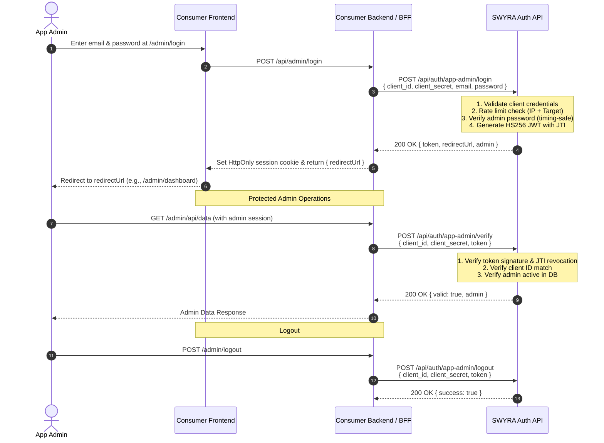

# Consumer Application Integration Guide

All consumer applications authenticate and authorize users through standard **OAuth 2.1 (PKCE + Authorization Code Flow)**.

---

## 1. Client Environment Variables Reference

| Variable | Description | Local Development | Production Example |
|---|---|---|---|
| `AUTH_ISSUER` | Base URL of the Auth Gateway | `http://localhost:5174` | `https://auth.yourdomain.com` |
| `JWKS_URL` | Public keys for offline RS256 JWT validation | `http://localhost:5174/.well-known/jwks.json` | `https://auth.yourdomain.com/.well-known/jwks.json` |
| `CLIENT_ID` | OAuth Client ID from Admin Dashboard | `your_client_id` | `your_client_id` |
| `CLIENT_SECRET` | Plaintext Client Secret (backend confidential clients only) | `your_plaintext_secret` | `your_plaintext_secret` |
| `REDIRECT_URI` | Whitelisted callback route | `http://localhost:3001/api/auth/callback` | `https://app.example.com/api/auth/callback` |

---

## 2. Integration Pattern 1: Full-Stack Next.js 14 (BFF Pattern)

*Example codebase available in `test/next-app/`*

### Step 1: Configure `.env`
```env
AUTH_ISSUER=http://localhost:5174
JWKS_URL=http://localhost:5174/.well-known/jwks.json
CLIENT_ID=qMoXkZwvWnZJRmFhpiTyzLMozZYrwvlF
CLIENT_SECRET=HQEFWhArRpYvjySBrzSbtBBlOpeZDpHY
REDIRECT_URI=http://localhost:3001/api/auth/callback
PORT=3001
```

### Step 2: Initiate OAuth Login
```typescript
// app/login/page.tsx
export function LoginButton() {
  const loginUrl = `${process.env.NEXT_PUBLIC_AUTH_ISSUER}/auth?client_id=${process.env.NEXT_PUBLIC_CLIENT_ID}&redirect_uri=${encodeURIComponent(process.env.NEXT_PUBLIC_REDIRECT_URI!)}&response_type=code&scope=openid+profile+email`;

  return <a href={loginUrl}>Sign in with SWYRA Auth</a>;
}
```

### Step 3: Exchange Code in Route Handler
```typescript
// app/api/auth/callback/route.ts
import { NextResponse } from 'next/server';

export async function GET(request: Request) {
  const { searchParams } = new URL(request.url);
  const code = searchParams.get('code');

  const tokenRes = await fetch(`${process.env.AUTH_ISSUER}/api/auth/oauth2/token`, {
    method: 'POST',
    headers: {
      'Content-Type': 'application/x-www-form-urlencoded',
      Authorization: `Basic ${Buffer.from(`${process.env.CLIENT_ID}:${process.env.CLIENT_SECRET}`).toString('base64')}`,
    },
    body: new URLSearchParams({
      grant_type: 'authorization_code',
      code: code!,
      redirect_uri: process.env.REDIRECT_URI!,
    }),
  });

  const tokens = await tokenRes.json();

  // Set secure HttpOnly session cookie
  const response = NextResponse.redirect(new URL('/dashboard', request.url));
  response.cookies.set('session', tokens.access_token, {
    httpOnly: true,
    secure: process.env.NODE_ENV === 'production',
    sameSite: 'lax',
  });
  return response;
}
```

---

## 3. Integration Pattern 2: Decoupled React SPA + Express Backend

*Example codebase available in `test/react-express-app/`*

### Step 1: Express Verification Middleware (`backend/auth.ts`)
Express verifies incoming Bearer tokens offline using `jose` without any database queries:

```typescript
import { createRemoteJWKSet, jwtVerify } from 'jose';
import type { Request, Response, NextFunction } from 'express';

const jwks = createRemoteJWKSet(new URL(process.env.JWKS_URL!));

export async function requireAuth(req: Request, res: Response, next: NextFunction) {
  const token = req.headers.authorization?.replace('Bearer ', '');
  if (!token) return res.status(401).json({ error: 'unauthorized' });

  try {
    const { payload } = await jwtVerify(token, jwks);

    // Enforce Audience & Client ID binding (Prevent cross-app token replay)
    const tokenClientId = (payload.client_id || payload.azp || payload.aud) as string;
    if (tokenClientId && tokenClientId !== process.env.CLIENT_ID) {
      return res.status(403).json({ error: 'forbidden', message: 'Token not issued for this client' });
    }

    (req as any).user = payload;
    next();
  } catch (err) {
    return res.status(401).json({ error: 'invalid_token' });
  }
}
```

---

## 4. Integration Pattern 3: Standalone React SPA with PKCE

For purely client-side single-page applications without a custom backend:

1. **Generate PKCE Parameters**:
   - Generate random string `code_verifier`.
   - Calculate SHA-256 hash and base64url-encode to produce `code_challenge`.
2. **Authorize Redirect**:
   - Send user to `${AUTH_ISSUER}/auth?client_id=${CLIENT_ID}&redirect_uri=${REDIRECT_URI}&response_type=code&code_challenge=${code_challenge}&code_challenge_method=S256&scope=openid+profile+email`.
3. **Token Exchange**:
   - Make `POST /api/auth/oauth2/token` with `code` and `code_verifier`.
   - Confidential client secrets are **not required** for public SPA PKCE clients.

---

## 5. Per-Application Administrator Authentication & Verification

Each registered OAuth application can have dedicated **Application Administrators** provisioned via the Super Admin Console (`/admin/clients`). Application administrators manage the **consumer application's own administrative portal** (e.g., product management, user moderation, order operations), completely separated from SWYRA Auth's platform administration.

SWYRA Auth exposes high-security, server-to-server endpoints allowing consumer applications to authenticate admins, verify active admin sessions, and revoke tokens.



### 5.1 Endpoint Reference

| Endpoint | Method | Purpose | Auth Required |
|---|---|---|---|
| `/api/auth/app-admin/login` | `POST` | Authenticates an app admin with credentials | `client_id` + `client_secret` in body |
| `/api/auth/app-admin/verify` | `POST` | Verifies admin token signature, active status, and revocation | `client_id` + `client_secret` + Bearer token |
| `/api/auth/app-admin/logout` | `POST` | Revokes admin token and adds JTI to revocation list | `client_id` + `client_secret` + Bearer token |

---

### 5.2 Step 1: Administrator Login (`/api/auth/app-admin/login`)

When an administrator logs into your application's admin panel, your backend relays their credentials along with your confidential `client_id` and `client_secret`.

#### Request:
`POST /api/auth/app-admin/login`  
**Content-Type**: `application/json`

```json
{
  "client_id": "qMoXkZwvWnZJRmFhpiTyzLMozZYrwvlF",
  "client_secret": "HQEFWhArRpYvjySBrzSbtBBlOpeZDpHY",
  "email": "ops-admin@storefront.example.com",
  "password": "AdminSecurePassword@2026!"
}
```

#### Success Response (`200 OK`):
```json
{
  "success": true,
  "token": "eyJhbGciOiJIUzI1NiIsInR5cCI6IkpXVCJ9...",
  "tokenType": "Bearer",
  "expiresIn": 3600,
  "redirectUrl": "https://storefront.example.com/admin/dashboard",
  "admin": {
    "id": "66e74b21d8b2a1a4567e8901",
    "email": "ops-admin@storefront.example.com",
    "name": "Operations Lead",
    "clientId": "qMoXkZwvWnZJRmFhpiTyzLMozZYrwvlF",
    "role": "app_admin",
    "redirectUrl": "https://storefront.example.com/admin/dashboard"
  }
}
```

> [!TIP]
> **Redirect URL Routing**: After a successful login, navigate the administrator to the returned `redirectUrl`. The origin of `redirectUrl` is guaranteed to match your application's registered `allowed_origins` or `redirect_uris`.

#### Error Responses:
- `400 Bad Request`: Missing `client_id`, `client_secret`, `email`, or `password`.
- `401 Unauthorized`: Invalid client credentials (`invalid_client`) or invalid admin credentials (`invalid_credentials`).
- `403 Forbidden`: Admin account is deactivated (`account_disabled`) or application suspended.
- `429 Too Many Requests`: Rate limit exceeded (target-keyed and IP-based defense).

---

### 5.3 Step 2: Protecting Admin Routes (`/api/auth/app-admin/verify`)

Your backend verifies the incoming admin token before allowing access to sensitive administrative endpoints. This ensures that deactivated admins or revoked sessions are rejected immediately.

#### Next.js 14 App Router Verification Handler Example:
```typescript
// app/api/admin/verify-session/route.ts
import { NextResponse } from 'next/server';
import { cookies } from 'next/headers';

export async function GET() {
  const token = cookies().get('app_admin_session')?.value;
  if (!token) {
    return NextResponse.json({ error: 'unauthorized' }, { status: 401 });
  }

  const res = await fetch(`${process.env.AUTH_ISSUER}/api/auth/app-admin/verify`, {
    method: 'POST',
    headers: {
      'Content-Type': 'application/json',
      Authorization: `Bearer ${token}`,
    },
    body: JSON.stringify({
      client_id: process.env.CLIENT_ID,
      client_secret: process.env.CLIENT_SECRET,
    }),
  });

  const data = await res.json();
  if (!res.ok || !data.valid) {
    return NextResponse.json({ error: data.message || 'forbidden' }, { status: res.status });
  }

  return NextResponse.json({ authenticated: true, admin: data.admin });
}
```

#### Express.js Admin Guard Middleware Example:
```typescript
// middleware/requireAppAdmin.ts
import type { Request, Response, NextFunction } from 'express';

export async function requireAppAdmin(req: Request, res: Response, next: NextFunction) {
  const authHeader = req.headers.authorization;
  const token = authHeader?.startsWith('Bearer ') ? authHeader.slice(7) : null;

  if (!token) {
    return res.status(401).json({ error: 'unauthorized', message: 'Missing admin token' });
  }

  try {
    const response = await fetch(`${process.env.AUTH_ISSUER}/api/auth/app-admin/verify`, {
      method: 'POST',
      headers: { 'Content-Type': 'application/json' },
      body: JSON.stringify({
        client_id: process.env.CLIENT_ID,
        client_secret: process.env.CLIENT_SECRET,
        token,
      }),
    });

    const data = await response.json();
    if (!response.ok || !data.valid) {
      return res.status(response.status).json({
        error: data.error || 'forbidden',
        message: data.message || 'Invalid admin session',
      });
    }

    // Attach verified admin to request
    (req as any).admin = data.admin;
    next();
  } catch (err) {
    return res.status(500).json({ error: 'internal_error', message: 'Verification failed' });
  }
}
```

---

### 5.4 Step 3: Administrator Logout & Token Revocation (`/api/auth/app-admin/logout`)

When the administrator logs out, invoke the logout endpoint to revoke the token's unique identifier (`jti`). Even if a revoked token has not reached its 1-hour expiration time, `/verify` will reject it immediately.

#### Express / Next.js Logout Example:
```typescript
export async function logoutAdmin(adminToken: string) {
  const res = await fetch(`${process.env.AUTH_ISSUER}/api/auth/app-admin/logout`, {
    method: 'POST',
    headers: { 'Content-Type': 'application/json' },
    body: JSON.stringify({
      client_id: process.env.CLIENT_ID,
      client_secret: process.env.CLIENT_SECRET,
      token: adminToken,
    }),
  });

  return await res.json();
}
```

---

### 5.5 Step 4: Administrator Two-Factor Authentication (TOTP MFA)

For high-security applications, administrators can configure RFC 6238 TOTP two-factor authentication (Google Authenticator, Microsoft Authenticator, 1Password, etc.).

#### A. Handling MFA During Login
If an administrator has MFA enabled, `POST /api/auth/app-admin/login` will return `mfa_required: true` with a short-lived (5-minute) challenge token instead of the full session token:

```json
{
  "mfa_required": true,
  "mfa_token": "eyJhbGciOiJIUzI1NiIsInR5cCI6IkpXVCJ9...",
  "message": "Two-factor authentication code required"
}
```

When your consumer app receives `mfa_required: true`, prompt the administrator for their 6-digit TOTP code (or emergency backup code) and submit it to:

```http
POST /api/auth/app-admin/mfa/verify-login
Content-Type: application/json

{
  "client_id": "your_client_id",
  "client_secret": "your_client_secret",
  "mfa_token": "eyJhbGciOiJIUzI1Ni...",
  "code": "123456"
}
```

**Success Response (Full 1h Session Token):**
```json
{
  "success": true,
  "token": "eyJhbGciOiJIUzI1Ni...",
  "tokenType": "Bearer",
  "expiresIn": 3600,
  "redirectUrl": "https://app.example.com/admin",
  "usedBackupCode": false,
  "admin": {
    "id": "65e...",
    "email": "admin@example.com",
    "name": "App Admin",
    "clientId": "your_client_id",
    "role": "app_admin",
    "mfa_enabled": true
  }
}
```

#### B. MFA Setup & Management Endpoints

| Endpoint | Method | Required Payload | Description |
|---|---|---|---|
| `/api/auth/app-admin/mfa/setup` | `POST` | `client_id, client_secret, token` | Initiates setup. Returns Base32 `secret`, `otpauth_url` for QR codes, and 8 one-time `backup_codes`. |
| `/api/auth/app-admin/mfa/confirm` | `POST` | `client_id, client_secret, token, code` | Confirms setup with first 6-digit code to activate MFA. |
| `/api/auth/app-admin/mfa/disable` | `POST` | `client_id, client_secret, token, password, code` | Disables MFA (requires admin password and current code). |

---

### 5.6 Cryptographic Token Isolation & Claims

App administrator tokens are signed using a dedicated key derived independently from the identity engine's master secret via HMAC-SHA256 (`APP_ADMIN_JWT_SECRET`). Tokens contain:

```json
{
  "sub": "65e123456789abcdef012345",
  "email": "admin@example.com",
  "name": "App Admin",
  "clientId": "your_client_id",
  "role": "app_admin",
  "iss": "https://auth.yourdomain.com",
  "aud": "your_client_id",
  "jti": "7b2e9d28-3617-48f5-93df-4c3d4c382101",
  "iat": 1710590000,
  "exp": 1710593600
}
```

- **Audience (`aud`) Verification**: Tokens issued for Application A cannot be verified or used by Application B. Even if an attacker steals an admin token from App A, presenting it with App B's client credentials results in an immediate cryptographic rejection (`401 / 403`).
- **Issuer (`iss`) Verification**: Validates the token originates from the authentic identity authority.

---

## 6. Public vs Private Application Modes

Each registered OAuth 2.1 client can operate in one of two isolation modes:

| Mode | `isPublic` | User Access Policy | Self-Registration |
|---|---|---|---|
| **Public Application** *(default)* | `true` | Any registered platform user can sign into this application. User assignment is auto-recorded on first login. | Enabled |
| **Private Application** | `false` | **Strict Isolation**: Only users explicitly provisioned or assigned to this application by an administrator can sign in. | **Disabled** (returns `403 registration_disabled`) |

### Private App User Management API
Administrators can assign and revoke user access to private applications via the Admin API:
- `GET /api/admin/clients/:clientId/users` — List assigned users
- `POST /api/admin/clients/:clientId/users` — Assign an existing user (`{ "email": "user@example.com" }`)
- `DELETE /api/admin/clients/:clientId/users/:userId` — Revoke user access

