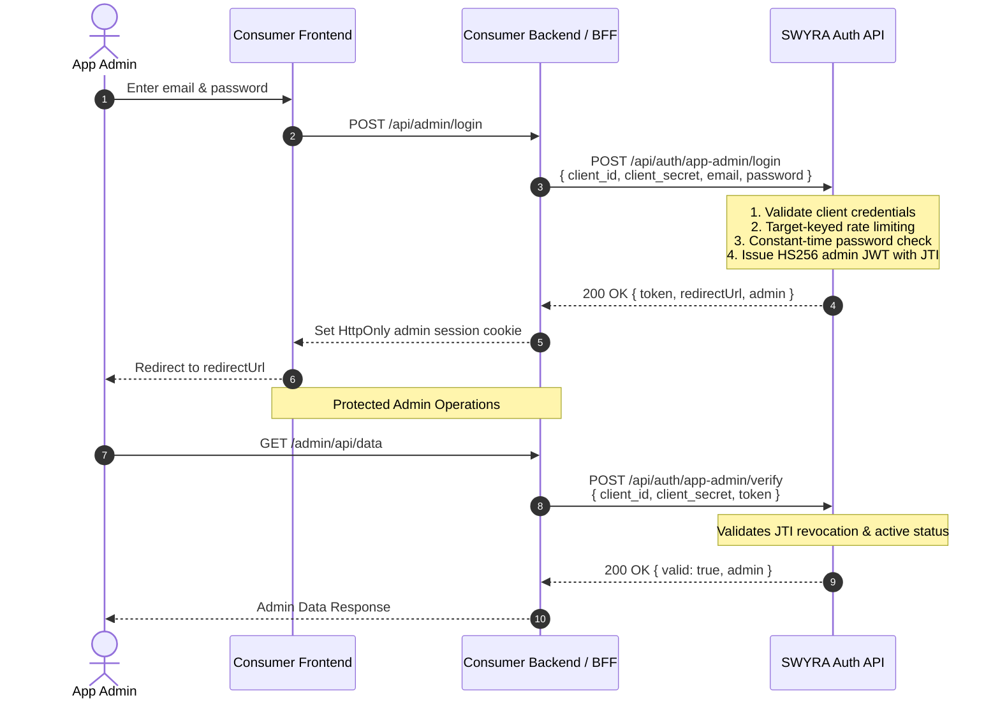

# Consumer Application Integration Guide
**Version:** 2.1.0  
**Protocol:** OAuth 2.1 (PKCE + Authorization Code Grant) & OpenID Connect Core 1.0

This guide provides end-to-end integration instructions, code recipes, and security best practices for connecting any web application or backend service to the **SWYRA Auth Identity Provider (IdP)**.

> [!IMPORTANT]
> If you are an **AI coding agent** (or developing automated integrations), you **MUST** also review the **[AI Agent Integration Contract](file:///home/swyra/projects/OAuth2.1/docs/AI_AGENT_INTEGRATION_CONTRACT.md)** and **[AGENTS.md](file:///home/swyra/projects/OAuth2.1/AGENTS.md)** before writing code.

---

## 1. System Architecture & Identity Boundaries

SWYRA Auth operates as an external, multi-tenant Identity Provider. Consumer applications authenticate users and verify access tokens without ever requiring access to the IdP's database:

```
┌───────────────────────────────┐
│        SWYRA Auth IdP         │
│  - MongoDB Atlas (Private)    │
│  - RS256 Key Pair / JWKS      │
│  - Token Family Rotation Engine│
└──────────────┬────────────────┘
               │  OAuth 2.1 / OIDC (HTTPS)
               ▼
┌───────────────────────────────┐        ┌───────────────────────────────┐
│     Consumer Frontend (SPA)   │◄──────►│     Consumer Backend / API    │
│  - React, Vue, Vite, Mobile   │ Bearer │  - Next.js BFF, FastAPI,      │
│  - Initiates PKCE login flow  │ Cookie │    Express, Go, Django        │
│  - Zero secrets in client code│        │  - Validates RS256 via JWKS   │
└───────────────────────────────┘        └───────────────────────────────┘
```

### Core Invariants:
1. **Zero Database Sharing**: Consumer applications NEVER connect to or query the SWYRA Auth MongoDB cluster.
2. **No Duplicate Identity Engines**: Do not install Better Auth, NextAuth / Auth.js, Passport.js, or Supabase inside the consumer application.
3. **Offline JWT Verification**: Consumer backends validate RS256 Access Tokens locally using cached public keys from `/.well-known/jwks.json`.
4. **PKCE Required**: All OAuth authorization flows must utilize PKCE (`code_challenge` + `code_verifier`) with `code_challenge_method=S256`.

---

## 2. Client Environment Variables Reference

### For Confidential Clients (Next.js BFF, Express, FastAPI, Django)
These variables MUST be stored in server-only environments (e.g. `.env`, AWS Parameter Store, Secrets Manager). **NEVER prefix them with `NEXT_PUBLIC_` or expose them to browsers.**

| Variable | Required | Description | Example Value |
|---|---|---|---|
| `AUTH_ISSUER` | **Yes** | Base URL of the SWYRA Auth IdP | `https://oauth21.vercel.app` |
| `JWKS_URL` | **Yes** | Public RS256 key set endpoint | `https://oauth21.vercel.app/.well-known/jwks.json` |
| `CLIENT_ID` | **Yes** | Unique OAuth 2.1 Client ID | `qMoXkZwvWnZJRmFhpiTyzLMozZYrwvlF` |
| `CLIENT_SECRET` | **Yes** | Plaintext secret for confidential client auth | `HQEFWhArRpYvjySBrzSbtBBlOpeZDpHY` |
| `REDIRECT_URI` | **Yes** | Whitelisted callback URL | `https://app.example.com/api/auth/callback` |

### For Public Clients (Pure React / Vite / Vue / Mobile SPAs)
Public clients cannot protect secrets. **They do not possess a `CLIENT_SECRET`.**

| Variable | Required | Description | Example Value |
|---|---|---|---|
| `VITE_AUTH_ISSUER` | **Yes** | Base URL of the SWYRA Auth IdP | `https://oauth21.vercel.app` |
| `VITE_CLIENT_ID` | **Yes** | Unique OAuth 2.1 Client ID | `qMoXkZwvWnZJRmFhpiTyzLMozZYrwvlF` |
| `VITE_REDIRECT_URI` | **Yes** | Whitelisted callback route | `http://localhost:5173/auth/callback` |

---

## 3. Client Confidentiality vs Application Access Modes

When registering your application in the SWYRA Auth Super Admin Dashboard (`/admin/clients`), you configure two independent settings:

### Dimension 1: OAuth Client Confidentiality
* **Confidential Client**: Deployed on a secure server capable of keeping a `client_secret` confidential (e.g. Next.js App Router, Express, FastAPI, Django). Uses HTTP Basic Auth or request body client credentials during token exchange.
* **Public Client**: Runs in an untrusted client environment (e.g. Browser SPA, mobile app). Uses PKCE S256 and has **no client secret**.

### Dimension 2: Application Access Mode (`isPublic` in IdP Database)
* **Public Application (`isPublic: true`, default)**: Open access. Any user with a registered SWYRA Auth account can log in. The user's association with this application is automatically recorded on first successful login.
* **Private Application (`isPublic: false`)**: Strict multi-tenant isolation. Only users explicitly provisioned or assigned to the application via the Admin API (`POST /api/admin/clients/:clientId/users`) can log in. Unassigned users receive `403 Forbidden` (`registration_disabled`).

---

## 4. Authoritative Protocol Endpoints

All protocol endpoints are rooted at `${AUTH_ISSUER}`:

| Endpoint | Method | Purpose | Protocol Standard |
|---|---|---|---|
| `/.well-known/openid-configuration` | `GET` | Discovery document | RFC 8414 / OIDC Core |
| `/.well-known/jwks.json` | `GET` | Public RS256 verification keys | RFC 7517 |
| `/api/auth/oauth2/authorize` | `GET` | User authorization & login | RFC 6749 / RFC 7636 |
| `/api/auth/oauth2/token` | `POST` | Code & refresh token exchange | RFC 6749 / RFC 7636 |
| `/api/auth/oauth2/userinfo` | `GET` | Authenticated user profile | OpenID Connect Core 1.0 |
| `/api/auth/oauth2/revoke` | `POST` | Revoke tokens & families | RFC 7009 |
| `/api/auth/app-admin/login` | `POST` | App Administrator login | Proprietary REST |
| `/api/auth/app-admin/verify` | `POST` | App Admin session verification | Proprietary REST |
| `/api/auth/app-admin/logout` | `POST` | App Admin session revocation | Proprietary REST |

> [!CAUTION]
> **NEVER redirect users to `/auth` for OAuth login.**  
> The path `/auth` is an internal IdP frontend view. The RFC-compliant OAuth authorization endpoint is **`/api/auth/oauth2/authorize`**.

---

## 5. Integration Recipe 1: Next.js 14+ (App Router) BFF Pattern

The **Backend-For-Frontend (BFF)** pattern is the recommended integration model for Next.js. The server route handlers interact with SWYRA Auth, while the browser receives only secure, encrypted `HttpOnly` session cookies.

### Step 1: Login Route (`app/api/auth/login/route.ts`)
```typescript
import { NextResponse } from 'next/server';
import crypto from 'node:crypto';

export async function GET() {
  // 1. Generate CSRF state and PKCE parameters
  const state = crypto.randomBytes(32).toString('hex');
  const codeVerifier = crypto.randomBytes(32).toString('base64url');
  const codeChallenge = crypto
    .createHash('sha256')
    .update(codeVerifier)
    .digest('base64url');

  // 2. Build authorization URL
  const authUrl = new URL(`${process.env.AUTH_ISSUER}/api/auth/oauth2/authorize`);
  authUrl.searchParams.set('client_id', process.env.CLIENT_ID!);
  authUrl.searchParams.set('redirect_uri', process.env.REDIRECT_URI!);
  authUrl.searchParams.set('response_type', 'code');
  authUrl.searchParams.set('code_challenge', codeChallenge);
  authUrl.searchParams.set('code_challenge_method', 'S256');
  authUrl.searchParams.set('scope', 'openid profile email');
  authUrl.searchParams.set('state', state);

  // 3. Store temporary parameters in short-lived HttpOnly cookies
  const response = NextResponse.redirect(authUrl.toString());
  const cookieOpts = {
    httpOnly: true,
    secure: process.env.NODE_ENV === 'production',
    sameSite: 'lax' as const,
    maxAge: 300, // 5 minutes
    path: '/',
  };
  response.cookies.set('oauth_state', state, cookieOpts);
  response.cookies.set('oauth_verifier', codeVerifier, cookieOpts);

  return response;
}
```

### Step 2: Callback Route (`app/api/auth/callback/route.ts`)
```typescript
import { NextResponse } from 'next/server';
import { cookies } from 'next/headers';
import { createRemoteJWKSet, jwtVerify } from 'jose';

const JWKS = createRemoteJWKSet(
  new URL(`${process.env.AUTH_ISSUER}/.well-known/jwks.json`)
);

export async function GET(request: Request) {
  const { searchParams } = new URL(request.url);
  const code = searchParams.get('code');
  const state = searchParams.get('state');
  const error = searchParams.get('error');

  if (error) {
    return NextResponse.redirect(new URL(`/login?error=${encodeURIComponent(error)}`, request.url));
  }

  const cookieStore = cookies();
  const storedState = cookieStore.get('oauth_state')?.value;
  const codeVerifier = cookieStore.get('oauth_verifier')?.value;

  // Verify CSRF state and verifier presence
  if (!code || !state || !storedState || state !== storedState || !codeVerifier) {
    return NextResponse.json({ error: 'invalid_state', message: 'CSRF validation failed' }, { status: 400 });
  }

  // Exchange code for tokens using Basic Auth
  const basicAuth = Buffer.from(
    `${process.env.CLIENT_ID}:${process.env.CLIENT_SECRET}`
  ).toString('base64');

  const tokenRes = await fetch(`${process.env.AUTH_ISSUER}/api/auth/oauth2/token`, {
    method: 'POST',
    headers: {
      'Content-Type': 'application/x-www-form-urlencoded',
      Authorization: `Basic ${basicAuth}`,
    },
    body: new URLSearchParams({
      grant_type: 'authorization_code',
      code,
      redirect_uri: process.env.REDIRECT_URI!,
      code_verifier: codeVerifier,
    }),
  });

  if (!tokenRes.ok) {
    return NextResponse.json({ error: 'token_exchange_failed' }, { status: 400 });
  }

  const tokens = await tokenRes.json();

  // Validate the access token offline using JWKS
  await jwtVerify(tokens.access_token, JWKS, {
    issuer: process.env.AUTH_ISSUER,
    audience: process.env.CLIENT_ID,
  });

  // Set session cookie and remove transient cookies
  const response = NextResponse.redirect(new URL('/dashboard', request.url));
  response.cookies.delete('oauth_state');
  response.cookies.delete('oauth_verifier');

  response.cookies.set('session_token', tokens.access_token, {
    httpOnly: true,
    secure: process.env.NODE_ENV === 'production',
    sameSite: 'lax',
    maxAge: tokens.expires_in || 3600,
    path: '/',
  });

  return response;
}
```

---

## 6. Integration Recipe 2: Pure React SPA (Vite / CRA) with PKCE

For browser-only Single-Page Applications where no custom backend server exists:

### Step 1: PKCE Helper (`src/lib/pkce.ts`)
```typescript
export async function generatePKCE() {
  const array = new Uint8Array(32);
  crypto.getRandomValues(array);
  const codeVerifier = Array.from(array, d => d.toString(16).padStart(2, '0')).join('');

  const encoder = new TextEncoder();
  const digest = await crypto.subtle.digest('SHA-256', encoder.encode(codeVerifier));
  const codeChallenge = btoa(String.fromCharCode(...new Uint8Array(digest)))
    .replace(/\+/g, '-')
    .replace(/\//g, '_')
    .replace(/=+$/, '');

  const stateArray = new Uint8Array(16);
  crypto.getRandomValues(stateArray);
  const state = Array.from(stateArray, d => d.toString(16).padStart(2, '0')).join('');

  return { codeVerifier, codeChallenge, state };
}
```

### Step 2: Trigger Login (`src/components/LoginButton.tsx`)
```typescript
import { generatePKCE } from '../lib/pkce';

export function LoginButton() {
  const handleLogin = async () => {
    const { codeVerifier, codeChallenge, state } = await generatePKCE();

    sessionStorage.setItem('oauth_verifier', codeVerifier);
    sessionStorage.setItem('oauth_state', state);

    const authUrl = new URL(`${import.meta.env.VITE_AUTH_ISSUER}/api/auth/oauth2/authorize`);
    authUrl.searchParams.set('client_id', import.meta.env.VITE_CLIENT_ID);
    authUrl.searchParams.set('redirect_uri', import.meta.env.VITE_REDIRECT_URI);
    authUrl.searchParams.set('response_type', 'code');
    authUrl.searchParams.set('code_challenge', codeChallenge);
    authUrl.searchParams.set('code_challenge_method', 'S256');
    authUrl.searchParams.set('scope', 'openid profile email');
    authUrl.searchParams.set('state', state);

    window.location.href = authUrl.toString();
  };

  return <button onClick={handleLogin}>Sign In with SWYRA</button>;
}
```

### Step 3: Handle Callback (`src/pages/Callback.tsx`)
```typescript
import { useEffect, useState } from 'react';
import { useNavigate, useSearchParams } from 'react-router-dom';

export function CallbackPage() {
  const [params] = useSearchParams();
  const navigate = useNavigate();
  const [error, setError] = useState<string | null>(null);

  useEffect(() => {
    async function exchange() {
      const code = params.get('code');
      const state = params.get('state');
      const storedState = sessionStorage.getItem('oauth_state');
      const codeVerifier = sessionStorage.getItem('oauth_verifier');

      if (!code || state !== storedState || !codeVerifier) {
        setError('CSRF validation failed or invalid authorization code');
        return;
      }

      // Public client: NO client_secret
      const res = await fetch(`${import.meta.env.VITE_AUTH_ISSUER}/api/auth/oauth2/token`, {
        method: 'POST',
        headers: { 'Content-Type': 'application/x-www-form-urlencoded' },
        body: new URLSearchParams({
          grant_type: 'authorization_code',
          client_id: import.meta.env.VITE_CLIENT_ID,
          code,
          redirect_uri: import.meta.env.VITE_REDIRECT_URI,
          code_verifier: codeVerifier,
        }),
      });

      if (!res.ok) {
        setError('Token exchange failed');
        return;
      }

      const tokens = await res.json();
      sessionStorage.removeItem('oauth_state');
      sessionStorage.removeItem('oauth_verifier');

      sessionStorage.setItem('access_token', tokens.access_token);
      navigate('/dashboard');
    }

    exchange();
  }, [params, navigate]);

  if (error) return <div className="error">{error}</div>;
  return <div>Authenticating...</div>;
}
```

---

## 7. Integration Recipe 3: Python FastAPI Backend (Resource Server)

FastAPI validates incoming `Authorization: Bearer <access_token>` headers offline using `PyJWKClient` and `PyJWT`.

### Step 1: Install Dependencies
```bash
pip install "fastapi>=0.100.0" "uvicorn>=0.23.0" "pyjwt[crypto]>=2.8.0" "requests>=2.31.0"
```

### Step 2: Auth Dependency (`server/auth.py`)
```python
import os
import jwt
from jwt import PyJWKClient
from fastapi import Depends, HTTPException, status
from fastapi.security import HTTPBearer, HTTPAuthorizationCredentials

AUTH_ISSUER = os.environ.get("AUTH_ISSUER", "https://oauth21.vercel.app")
CLIENT_ID = os.environ["CLIENT_ID"]
JWKS_URL = f"{AUTH_ISSUER}/.well-known/jwks.json"

jwks_client = PyJWKClient(JWKS_URL)
security = HTTPBearer()

async def get_current_user(credentials: HTTPAuthorizationCredentials = Depends(security)):
    token = credentials.credentials
    try:
        signing_key = jwks_client.get_signing_key_from_jwt(token)
        payload = jwt.decode(
            token,
            signing_key.key,
            algorithms=["RS256"],
            issuer=AUTH_ISSUER,
            audience=CLIENT_ID,
            options={"require": ["exp", "iss", "aud", "sub"]}
        )
        return payload
    except jwt.ExpiredSignatureError:
        raise HTTPException(
            status_code=status.HTTP_401_UNAUTHORIZED,
            detail="Token has expired"
        )
    except jwt.InvalidTokenError as e:
        raise HTTPException(
            status_code=status.HTTP_401_UNAUTHORIZED,
            detail=f"Invalid token: {str(e)}"
        )
```

### Step 3: Protect Endpoints (`server/main.py`)
```python
from fastapi import FastAPI, Depends
from auth import get_current_user

app = FastAPI()

@app.get("/api/protected-data")
async def protected_data(user: dict = Depends(get_current_user)):
    return {
        "status": "success",
        "user_id": user["sub"],
        "client_id": user["aud"],
        "scope": user.get("scope", "")
    }
```

---

## 8. Integration Recipe 4: Node.js / Express Backend (Resource Server)

### Step 1: Install `jose`
```bash
npm install jose express
```

### Step 2: Express Middleware (`middleware/auth.ts`)
```typescript
import type { Request, Response, NextFunction } from 'express';
import { createRemoteJWKSet, jwtVerify } from 'jose';

const AUTH_ISSUER = process.env.AUTH_ISSUER!;
const CLIENT_ID = process.env.CLIENT_ID!;
const JWKS = createRemoteJWKSet(new URL(`${AUTH_ISSUER}/.well-known/jwks.json`));

export async function requireAuth(req: Request, res: Response, next: NextFunction) {
  const authHeader = req.headers.authorization;
  if (!authHeader?.startsWith('Bearer ')) {
    return res.status(401).json({ error: 'unauthorized', message: 'Missing Bearer token' });
  }

  const token = authHeader.slice(7);

  try {
    const { payload } = await jwtVerify(token, JWKS, {
      issuer: AUTH_ISSUER,
      audience: CLIENT_ID,
      algorithms: ['RS256'],
    });

    (req as any).user = payload;
    next();
  } catch (err: any) {
    return res.status(401).json({ error: 'invalid_token', message: err.message });
  }
}
```

---

## 9. Per-Application Administrator Authentication & TOTP MFA

Each registered OAuth application can have dedicated **Application Administrators** provisioned via the Super Admin Console (`/admin/clients`). Application administrators manage the consumer application's own administrative operations (e.g. products, moderation, billing), completely separated from SWYRA Auth's platform administration.


```mermaid
sequenceDiagram
    autonumber
    actor Admin as App Admin
    participant AppFront as Consumer Frontend
    participant AppBack as Consumer Backend / BFF
    participant IdP as SWYRA Auth API

    Admin->>AppFront: Enter email & password
    AppFront->>AppBack: POST /api/admin/login
    AppBack->>IdP: POST /api/auth/app-admin/login<br/>{ client_id, client_secret, email, password }
    Note over IdP: 1. Validate client credentials<br/>2. Target-keyed rate limiting<br/>3. Constant-time password check<br/>4. Issue HS256 admin JWT with JTI
    IdP-->>AppBack: 200 OK { token, redirectUrl, admin }
    AppBack-->>AppFront: Set HttpOnly admin session cookie
    AppFront-->>Admin: Redirect to redirectUrl

    Note over AppFront,AppBack: Protected Admin Operations
    Admin->>AppBack: GET /admin/api/data
    AppBack->>IdP: POST /api/auth/app-admin/verify<br/>{ client_id, client_secret, token }
    Note over IdP: Validates JTI revocation & active status
    IdP-->>AppBack: 200 OK { valid: true, admin }
    AppBack-->>Admin: Admin Data Response
```

### 9.1 App Admin Endpoint Reference

| Endpoint | Method | Required Payload | Purpose |
|---|---|---|---|
| `/api/auth/app-admin/login` | `POST` | `client_id, client_secret, email, password` | Authenticates administrator credentials |
| `/api/auth/app-admin/verify` | `POST` | `client_id, client_secret, token` | Verifies active status and JTI revocation |
| `/api/auth/app-admin/logout` | `POST` | `client_id, client_secret, token` | Revokes admin token and invalidates JTI |
| `/api/auth/app-admin/mfa/verify-login` | `POST` | `client_id, client_secret, mfa_token, code` | Submits 6-digit TOTP code for MFA login |

### 9.2 Handling TOTP Two-Factor Authentication
If an administrator has MFA enabled:
1. `POST /api/auth/app-admin/login` responds with `200 OK` containing `{ mfa_required: true, mfa_token: "..." }`.
2. The consumer frontend displays a 6-digit TOTP code prompt.
3. The consumer backend submits the code to `POST /api/auth/app-admin/mfa/verify-login`.
4. Upon success, the full 1-hour session token is returned.

---

## 10. Multi-Tenant Private Applications (`isPublic: false`)

When an application is configured as **Private (`isPublic: false`)**, only authorized users can authenticate.

### Managing Assigned Users via the Admin API:
- **List assigned users**:
  `GET /api/admin/clients/:clientId/users` (Super Admin JWT required)
- **Assign user access**:
  `POST /api/admin/clients/:clientId/users`  
  Payload: `{ "email": "employee@company.com" }`
- **Revoke user access**:
  `DELETE /api/admin/clients/:clientId/users/:userId`

If an unassigned user attempts to authenticate through `/api/auth/oauth2/authorize`, SWYRA Auth denies authorization with `HTTP 403 Forbidden` (`registration_disabled`).

---

## 11. Common Mistakes & Troubleshooting

| Issue / Error | Cause | Resolution |
|---|---|---|
| **Login page opens without error on bad client ID** | Authorization URL pointed to `/auth` instead of `/api/auth/oauth2/authorize` | Change login redirect URL to `/api/auth/oauth2/authorize`. |
| **`invalid_request: The redirect_uri is not registered`** | The `redirect_uri` parameter does not exactly match registered values | Register the exact callback URL in Admin Dashboard (`/admin/clients`). |
| **`invalid_grant: PKCE verification failed`** | Mismatch between `code_challenge` and `code_verifier`, or wrong method | Verify `code_challenge_method=S256` and ensure `code_verifier` was saved correctly during redirect. |
| **`invalid_token: jwt audience invalid`** | Resource server did not match the token's `aud` or `client_id` claim | Ensure the backend verifies that `payload.aud === process.env.CLIENT_ID`. |
| **`invalid_client` on token exchange** | Bad `client_id` or `client_secret`, or sent `client_secret` from a public client | Verify credentials; omit secret for public SPA clients. |
| **CORS errors in browser** | Origin is not in the registered `allowed_origins` list for this client | Add the consumer's web origin (e.g. `https://app.example.com`) to the client's Allowed Origins list. |
