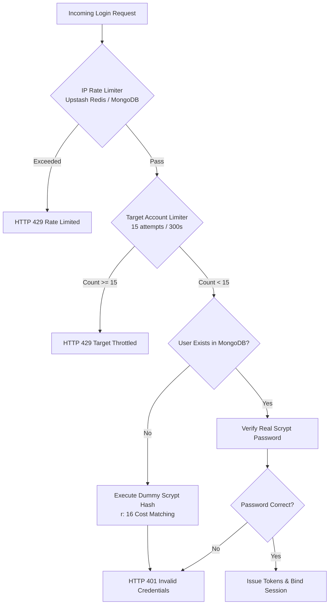

# Security Architecture & Abuse Defense Specification

This document details the security model, attack mitigations, cryptographic guarantees, and operational scope boundaries of SWYRA Auth.

---

## 1. Threat Mitigation Matrix

| Attack Vector | Mitigation Strategy | Verification Standard |
|---|---|---|
| **Credential Stuffing / IP-Rotation Brute Force** | Target-keyed rate limiting (15 attempts / 300s window per account) evaluated before password verification. | Attempt #16 blocked with HTTP 429 across 20 distinct IP addresses. |
| **Account Enumeration / Timing Discrepancies** | Interleaved constant-time dummy scrypt hashing (`N: 16384, r: 16, p: 1, dkLen: 64`) when user account does not exist. | Statistically verified ($p > 0.05$ via Welch's t-test and Mann-Whitney U test). |
| **Token Replay / Refresh Hijacking** | Token Family Rotation with immediate multi-generation revocation upon reuse of consumed tokens. | Fail-closed MongoDB fallback revokes entire token family when stale token is replayed. |
| **Session Fixation** | Session identifiers regenerated and cryptographically signed on authentication; unauthenticated pre-auth tokens destroyed. | Attacker-seeded pre-auth session tokens remain null in database post-login. |
| **Cross-App Token Replay** | Tokens bound to issuing `client_id` via JWT claims (`client_id`, `azp`, `aud`). | Resource servers reject tokens issued for different OAuth clients. |
| **Cross-Site Request Forgery (CSRF)** | Custom CSRF headers and `SameSite=None; Secure; HttpOnly; Partitioned` cookie policies. | Admin routes reject state-changing requests lacking valid origin/headers. |
| **Cross-Origin Telemetry Theft (CORS)** | Dynamic origin reflection strictly validated against database client whitelists with Redis caching. | Unregistered origins receive HTTP 403 or unreflected headers. |
| **SSRF & Open Redirects** | `validateRedirectUri` blocks wildcards, userinfo credentials, and intranet private IPs (`192.168.x`, `10.x`, `169.254.169.254`). | Production mode permits non-HTTPS only on loopback hosts when `isDev: true`. |
| **XML External Entity (XXE)** | Zero XML parser footprint. Server only accepts `application/json` and `application/x-www-form-urlencoded`. | Content-Type enforcement blocks XML entity injection. |

---

## 2. Rate Limiting Architecture & Fail-Safe Guarantees

### Key Rate Limiting Characteristics:
1. **Target-Keyed Rate Limiting**: Keyed by normalized target email (`swyra:rl:target:email:<email>:<window>`). Defends against distributed botnets rotating IP addresses to attack a single target account.
2. **Fail-Open for DDoS Resilience**: If Redis experiences a hard timeout (> 400ms) or outage, rate limiter checks fail open in ~403ms, preventing denial-of-service to legitimate users while MongoDB TTL fallback assumes state tracking.
3. **Fail-Closed for Token Family Revocation**: Token family replay and revocation always query authoritative MongoDB records, ensuring that an attacker replaying a stolen token is caught even during Redis cache outages.

---

## 3. Honest Scope Boundary & DDoS Protection

> [!WARNING]
> **SWYRA Auth's built-in defenses protect application-layer logic** (credential stuffing, scraping, brute-force password cracking, admin-provisioning abuse) **and nothing else.**
> It does not defend against volumetric DDoS attacks (UDP floods, SYN floods, bandwidth saturation). When deploying to production, you are responsible for placing an upstream CDN / WAF in front of your service:
> - Cloudflare (including Free Tier with Turnstile / Bot Management)
> - AWS CloudFront + AWS WAF + AWS Shield
> - GCP Cloud Armor / Azure Front Door

### Optional Datacenter & VPN Friction
If you wish to add friction against traffic originating from hosting provider IP ranges:
- **Step-Up Friction**: Use a maintained IP intelligence list or Cloudflare Turnstile to challenge suspected automated datacenter traffic.
- **Configurable Boundary**: Keep datacenter friction as an optional upstream step-up rather than a hard block to avoid false positives for users on VPNs or iCloud Private Relay.

---

## 4. Password Policy & Cryptographic Configuration

- **Minimum Length**: 12 characters (max 128).
- **Complexity**: Must contain at least 1 uppercase letter, 1 lowercase letter, 1 number, and 1 symbol.
- **Hashing Parameters**: scrypt with `N: 16384, r: 16, p: 1, dkLen: 64, maxmem: 67108864` matching Better Auth internal engine.
- **libuv Scaling**: Running with `UV_THREADPOOL_SIZE=16` allows Node.js worker pools to scale password hashing throughput to > 1,200 req/s on multi-core systems.
