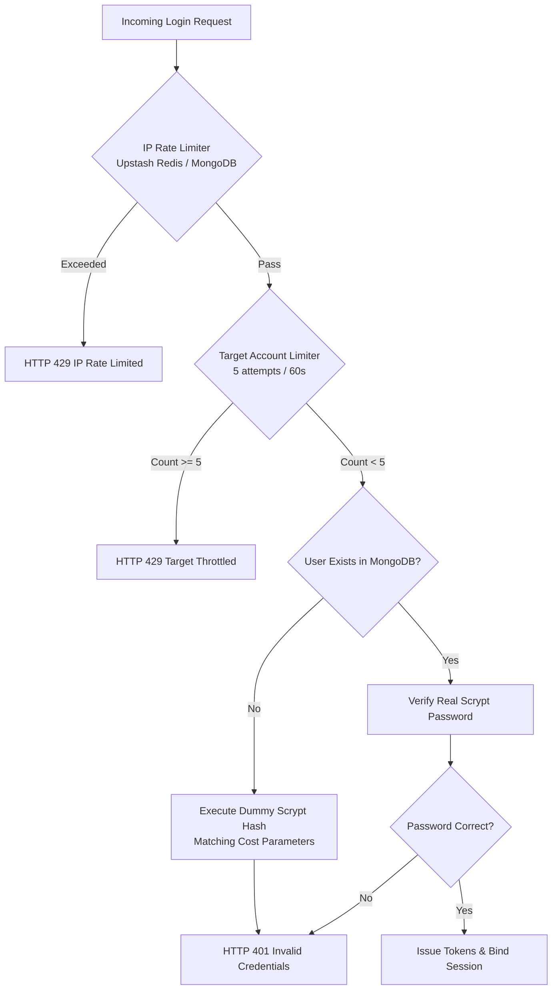

# Security Architecture & Abuse Defense Specification
**Version:** 2.1.0  
**Status:** Authoritative Security Specification

This document details the security model, cryptographic guarantees, threat mitigation mechanisms, and operational scope boundaries of the **SWYRA Auth Identity Provider**.

---

## 1. Threat Mitigation Matrix

| Attack Vector | Mitigation Strategy | Verification Standard |
|---|---|---|
| **Credential Stuffing / IP-Rotation Brute Force** | Target-keyed rate limiting (5 attempts / 60s window per normalized email) evaluated prior to password verification. | Attempt #6 blocked with HTTP 429 across 20 distinct IP addresses. |
| **Account Enumeration / Timing Discrepancies** | Interleaved constant-time dummy scrypt hashing (`N: 16384, r: 16, p: 1, dkLen: 64`) when user account does not exist. | Statistically verified ($p > 0.05$ via Welch's t-test and Mann-Whitney U test). |
| **Token Replay / Refresh Hijacking** | Token Family Rotation with immediate multi-generation revocation upon reuse of consumed tokens. | Fail-closed MongoDB fallback revokes entire token family when stale token is replayed outside grace window. |
| **Concurrent Refresh Token Bursts** | Atomic Compare-And-Swap (CAS) in-flight tracking with a 2-second network hazard grace window. | 5 concurrent refresh requests yield exactly 1 active successor; competing requests fail cleanly without corrupting family state. |
| **Cross-Tenant Token Replay** | Tokens bound to issuing `client_id` via JWT claims (`client_id`, `azp`, `aud`). | Resource servers reject tokens issued for different OAuth clients (`403 Forbidden`). |
| **Session Fixation & Hijacking** | Session identifiers regenerated and cryptographically signed on authentication; unauthenticated pre-auth tokens destroyed. | Attacker-seeded pre-auth session tokens cannot access authenticated sessions post-login. |
| **Cross-Site Request Forgery (CSRF)** | Mandatory cryptographically random `state` parameter in OAuth flows; custom headers and `SameSite=Lax` cookies for stateful endpoints. | State-changing requests lacking valid CSRF state or tokens are rejected. |
| **Cross-Origin Telemetry Theft (CORS)** | Dynamic origin reflection strictly validated against database client whitelists with Redis/memory caching. | Unregistered origins receive HTTP 403 or unreflected CORS headers. |
| **SSRF & Open Redirects** | `validateRedirectUri` blocks wildcards, userinfo credentials, and intranet private IPs (`192.168.x`, `10.x`, `169.254.169.254`). | Production mode permits non-HTTPS only on loopback hosts when `ALLOW_DEV_CLIENTS_IN_PRODUCTION=true`. |
| **Admin Credential Compromise Blast Radius** | App Admin tokens signed with separate HMAC-SHA256 secret (`APP_ADMIN_JWT_SECRET`), bound to `client_id`, with stateful JTI revocation. | Compromise of an App Admin token for App A cannot authenticate against App B. |

---

## 2. Rate Limiting Architecture & Fail-Safe Guarantees


```mermaid
flowchart TD
    Req[Incoming Login Request] --> IPCheck{IP Rate Limiter<br/>Upstash Redis / MongoDB}
    IPCheck -- "Exceeded" --> HTTP429_IP[HTTP 429 IP Rate Limited]
    IPCheck -- "Pass" --> TargetCheck{Target Account Limiter<br/>5 attempts / 60s}
    TargetCheck -- "Count >= 5" --> HTTP429_Target[HTTP 429 Target Throttled]
    TargetCheck -- "Count < 5" --> UserLookup{User Exists in MongoDB?}
    UserLookup -- "No" --> DummyHash[Execute Dummy Scrypt Hash<br/>Matching Cost Parameters]
    UserLookup -- "Yes" --> RealHash[Verify Real Scrypt Password]
    DummyHash --> AuthFail[HTTP 401 Invalid Credentials]
    RealHash --> AuthResult{Password Correct?}
    AuthResult -- "No" --> AuthFail
    AuthResult -- "Yes" --> GenTokens[Issue Tokens & Bind Session]
```

### Key Characteristics:
1. **Target-Keyed Rate Limiting**: Keyed by normalized target email (`swyra:rl:target:email:<email>:<window>`). Defends against distributed botnets rotating thousands of IPs against a single victim account.
2. **Fail-Open for DDoS Resilience**: If Redis experiences a hard timeout (> 400ms) or outage, rate limiter checks fail open in ~403ms, preventing denial-of-service to legitimate users while MongoDB TTL fallback assumes state tracking.
3. **Fail-Closed for Token Family Revocation**: Token family replay and revocation always query authoritative MongoDB records, ensuring that an attacker replaying a stolen token is caught even during Redis cache outages.

---

## 3. Refresh Token Family Rotation & Concurrency Defenses

SWYRA Auth implements RFC 6749 Section 10.4 Token Family Rotation:
- Every refresh operation rotates the refresh token ($R_0 \to R_1$).
- **Single-Flight CAS State**: Concurrent rotation requests are protected by an atomic Compare-And-Swap check in MongoDB (`findOneAndUpdate`). Exactly one request executes the rotation, while competing requests fail closed or are handled within the 2-second in-flight grace window.
- **Immediate Family Invalidation**: When a consumed refresh token ($R_0$) is replayed after the grace window, SWYRA Auth detects malicious token theft and revokes all active tokens in that family immediately.

---

## 4. Per-Application Administrator Cryptographic Isolation

To protect consumer applications against cross-tenant privilege escalation:
1. **Dedicated Signing Secret**: App Admin JWTs are signed with `APP_ADMIN_JWT_SECRET`, physically isolated from the OIDC RSA private keys and Better Auth session secrets.
2. **Audience Constraint**: Every App Admin token contains `aud: client_id`. Backend verification endpoints enforce that the presenting `client_id` matches the token's audience.
3. **Stateful JTI Revocation**: When an admin logs out or an account is disabled, the token's `jti` is permanently stored in the revocation collection.
4. **AES-256-GCM TOTP Encryption**: TOTP secrets are encrypted at rest using `APP_ADMIN_TOTP_KEY`.

---

## 5. Security Verification & Test Suite Gates

The repository contains **11 automated security suites** executing **118 total tests** to verify security invariants:

| Suite Name | Test Count | Environment | Primary Focus |
|---|---|---|---|
| `full-production-adversarial-suite.ts` | 30 | Local / Test Harness | Concurrent refresh bursts, token replay, CAS race conditions, timing attacks |
| `final-adversarial-gate.ts` | 14 | Local / Test Harness | Client credential validation, redirect URI spoofing, PKCE enforcement |
| `direct-backend-access-suite.ts` | 8 | Local / Test Harness | Shielding backend against unauthenticated direct invocations |
| `session-hijacking-suite.ts` | 7 | Local / Test Harness | Session fixation, cookie hijacking, pre-auth token isolation |
| `oauth-transaction-suite.ts` | 8 | Local / Test Harness | Authorization code single-use, code expiration, state validation |
| `credential-compromise-suite.ts` | 8 | Local / Test Harness | Blast radius of stolen credentials and App Admin tokens |
| `cross-tenant-matrix.ts` | 7 | Local / Test Harness | Multi-tenant isolation between App A and App B |
| `production-vs-development-suite.ts` | 9 | Local / Test Harness | Production environment strictness and secret length enforcement |
| `aws-dashboard-integration-suite.ts` | 8 | Local / Test Harness | Real consumer contract validation (App Admin + OAuth flows) |
| `e2e-oidc-interop.test.ts` | 11 | Local / Test Harness | OpenID Connect discovery, JWKS compliance, RS256 token verification |
| `deployed-consumer-suite.ts` | 8 | **Live HTTPS** | Live verification against production IdP and deployed consumer |
| **TOTAL** | **118** | **110 Local + 8 Live** | **100% Pass Rate** |

All tests are executable via:
```bash
npm run test:all-security
```

---

## 6. Honest Scope Boundary & DDoS Protection

> [!WARNING]
> **SWYRA Auth protects application-layer authentication and authorization logic.**  
> It does not mitigate network-layer or volumetric DDoS attacks (e.g. SYN floods, UDP amplification, terabit bandwidth saturation).

In production deployments, you **MUST** deploy an upstream CDN / WAF in front of SWYRA Auth:
- **Cloudflare** (with Turnstile / Bot Management / DDoS Protection)
- **AWS CloudFront + AWS WAF + AWS Shield**
- **Google Cloud Armor / Azure Front Door**
